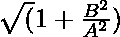

# 计算双曲线偏心率的程序

> 原文:[https://www . geeksforgeeks . org/program-to-find-偏心双曲线/](https://www.geeksforgeeks.org/program-to-find-the-eccentricity-of-a-hyperbola/)

给定两个整数 **A** 和 **B** ，表示方程**(X<sup>2</sup>/A<sup>2</sup>)–(Y<sup>2</sup>/B<sup>2</sup>)= 1**的双曲线[半长半短轴的长度，任务是计算给定双曲线的](https://www.geeksforgeeks.org/plotting-polar-curves-in-python/)[偏心率](https://en.wikipedia.org/wiki/Eccentricity)。

**示例:**

> **输入:** A = 3，B = 2
> **输出:** 1.20185
> **说明:**
> 给定双曲线的偏心率为 1.20185。
> 
> **输入:** A = 6，B = 3
> T3】输出: 1.11803

**方法:**给定的问题可以用公式[求椭圆](https://www.geeksforgeeks.org/program-to-find-the-eccentricity-of-an-ellipse/)的偏心来解决。

[](https://media.geeksforgeeks.org/wp-content/uploads/20210320022154/hyperbola.jpg)

*   半长轴的长度为 **A** 。
*   半短轴的长度为 **B** 。
*   因此，椭圆的偏心率由给出，其中 A > B

因此，想法是将的值打印为椭圆的偏心率。

下面是上述方法的实现:

## C++

```
// C++ program for the above approach

#include <bits/stdc++.h>
using namespace std;

// Function to find the eccentricity
// of a hyperbola
double eccHyperbola(double A, double B)
{
    // Stores the squared ratio
    // of major axis to minor axis
    double r = (double)B * B / A * A;

    // Increment r by 1
    r += 1;

    // Return the square root of r
    return sqrt(r);
}

// Driver Code
int main()
{
    double A = 3.0, B = 2.0;
    cout << eccHyperbola(A, B);

    return 0;
}
```

## Java 语言(一种计算机语言，尤用于创建网站)

```
// Java program for the above approach
import java.util.*;

class GFG{

// Function to find the eccentricity
// of a hyperbola
static double eccHyperbola(double A, double B)
{

    // Stores the squared ratio
    // of major axis to minor axis
    double r = (double)B * B / A * A;

    // Increment r by 1
    r += 1;

    // Return the square root of r
    return Math.sqrt(r);
}

// Driver Code
public static void main(String[] args)
{
    double A = 3.0, B = 2.0;

    System.out.print(eccHyperbola(A, B));
}
}

// This code is contributed by Amit Katiyar
```

## 蟒蛇 3

```
# Python3 program for the above approach
import math

# Function to find the eccentricity
# of a hyperbola

def eccHyperbola(A, B):

    # Stores the squared ratio
    # of major axis to minor axis
    r = B * B / A * A

    # Increment r by 1
    r += 1

    # Return the square root of r
    return math.sqrt(r)

# Driver Code
if __name__ == "__main__":

    A = 3.0
    B = 2.0
    print(eccHyperbola(A, B))

    # This code is contributed by ukasp
```

## C#

```
// C# program for the above approach
using System;

class GFG{

// Function to find the eccentricity
// of a hyperbola
static double eccHyperbola(double A, double B)
{

    // Stores the squared ratio
    // of major axis to minor axis
    double r = (double)B * B / A * A;

    // Increment r by 1
    r += 1;

    // Return the square root of r
    return Math.Sqrt(r);
}

// Driver Code
public static void Main(String[] args)
{
    double A = 3.0, B = 2.0;

    Console.Write(eccHyperbola(A, B));
}
}

// This code is contributed by Princi Singh
```

## java 描述语言

```
<script>

// Javascript program for the above approach

// Function to find the eccentricity
// of a hyperbola
function eccHyperbola(A, B)
{

    // Stores the squared ratio
    // of major axis to minor axis
    let r = B * B / A * A;

    // Increment r by 1
    r += 1;

    // Return the square root of r
    return Math.sqrt(r);
}

// Driver Code
let A = 3.0;
let B = 2.0;

document.write(eccHyperbola(A, B));

// This code is contributed by mohit kumar

</script>
```

**Output:** 

```
2.23607
```

***时间复杂度:**O(1)*
T5**辅助空间:** O(1)