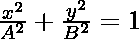
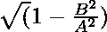
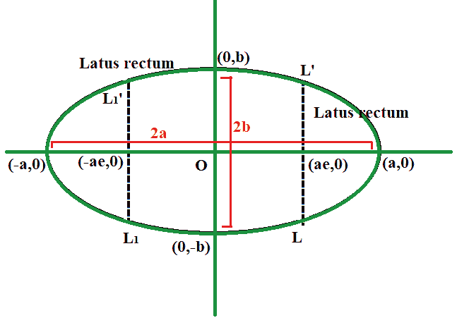

# 求椭圆偏心的程序

> 原文:[https://www . geesforgeks . org/program-to-find-偏心椭圆/](https://www.geeksforgeeks.org/program-to-find-the-eccentricity-of-an-ellipse/)

给定两个正整数 **A** 和 **B** ，表示方程 的[椭圆的](https://www.geeksforgeeks.org/equation-of-ellipse-from-its-focus-directrix-and-eccentricity/)[半长半短轴](https://en.wikipedia.org/wiki/Semi-major_and_semi-minor_axes)的长度，任务是求给定椭圆的偏心率。

**示例:**

> **输入:** A = 12，B = 9
> T3】输出: 0.66
> 
> **输入:** A = 6，B = 3
> T3】输出: 0.87

**方法:**给定问题可基于以下公式求解，计算椭圆的[偏心率，公式如下:](https://en.wikipedia.org/wiki/Eccentricity_(mathematics)#Ellipses)

> 
> 其中，
> A =半长轴长度
> B =半短轴长度

[](https://media.geeksforgeeks.org/wp-content/uploads/20210226214327/ellipse.png)

因此，打印的值作为椭圆的偏心率。

下面是上述方法的实现:

## C++

```
// C++ program for the above approach

#include <bits/stdc++.h>
using namespace std;

// Function to find the
// eccentricity of ellipse
void findEccentricity(double A,
                      double B)
{
    // Store the squares of length of
    // semi-major and semi-minor axis
    double semiMajor = A * A;
    double semiMinor = B * B;

    // Calculate the eccentricity
    double ans = sqrt(1 - semiMinor / semiMajor);

    // Print the result
    cout << fixed << setprecision(2)
         << ans;
}

// Driver Code
int main()
{
    double A = 12, B = 9;
    findEccentricity(A, B);

    return 0;
}
```

## Java 语言(一种计算机语言，尤用于创建网站)

```
// Java program for the above approach
import java.util.*;

class GFG{

// Function to find the
// eccentricity of ellipse
static void findEccentricity(double A, double B)
{
    // Store the squares of length of
    // semi-major and semi-minor axis
    double semiMajor = A * A;
    double semiMinor = B * B;

    // Calculate the eccentricity
    double ans = Math.sqrt(1 - semiMinor / semiMajor);

    // Print the result
    System.out.format("%.2f", ans);
}

// Driver Code
public static void main(String arr[])
{
    double A = 12, B = 9;
    findEccentricity(A, B);
}
}

// This code is contributed by kirti
```

## 蟒蛇 3

```
# Python3 program for the above approach
import math

# Function to find the
# eccentricity of ellipse
def findEccentricity(A, B):

    # Store the squares of length of
    # semi-major and semi-minor axis
    semiMajor = A * A
    semiMinor = B * B

    # Calculate the eccentricity
    ans = math.sqrt(1 - semiMinor / semiMajor)

    # Print the result
    print('%.2f' % ans)

# Driver Code
if __name__ == "__main__":

    A = 12
    B = 9

    findEccentricity(A, B)

# This code is contributed by ukasp
```

## C#

```
// C# program for the above approach
using System;

class GFG{

// Function to find the
// eccentricity of ellipse
static void findEccentricity(double A, double B)
{

    // Store the squares of length of
    // semi-major and semi-minor axis
    double semiMajor = A * A;
    double semiMinor = B * B;

    // Calculate the eccentricity
    double ans = Math.Sqrt(1 - semiMinor / semiMajor);

    // Print the result
    Console.Write(Math.Round(ans, 2));
}

// Driver code
static void Main()
{
    double A = 12, B = 9;

    findEccentricity(A, B);
}
}

// This code is contributed by code_hunt
```

## java 描述语言

```
<script>

// Javascript program for the above approach

// Function to find the
// eccentricity of ellipse
function findEccentricity(A, B)
{
      var semiMajor = A * A;
      var semiMinor = B * B;
      var ans = Math.sqrt(1 - semiMinor / semiMajor)

      return ans.toFixed(2);
}

// Driver Code
var A = 12;
var B = 9;

document.write(findEccentricity(A, B));

// This code is contributed by bunnyram19

</script>
```

**Output:** 

```
0.66
```

***时间复杂度:**O(1)*
T5**辅助空间:** O(1)