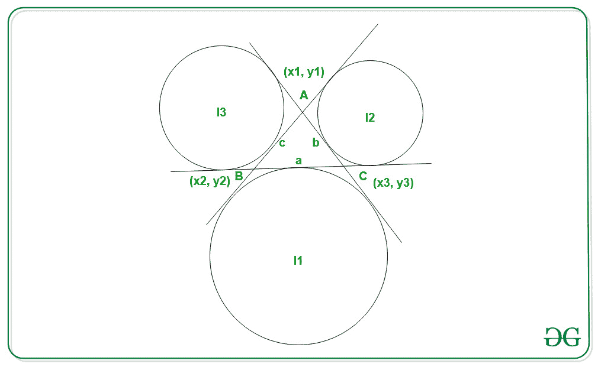

# 寻找三角形交点的程序

> 原文:[https://www . geesforgeks . org/program-to-find-the-excenters-of-a-triangle/](https://www.geeksforgeeks.org/program-to-find-the-excenters-of-a-triangle/)

给定六个代表三角形顶点的整数，比如说 **A(x1，y1)** 、 **B(x2，y2)** 和 **C(x3，y3)** ，任务是找到给定三角形的顶点坐标。

> **Excenter** 是三角形对边的一个内角平分线和两个外角平分线的平分线相交的点。一个三角形中总共有三个顶点。
> 
> [](https://media.geeksforgeeks.org/wp-content/cdn-uploads/20210202120334/Excenter.jpg)

**示例:**

> **输入:** x1 = 0，y1 = 0，x2 = 3，y2 = 0，x3 = 0，y3 = 4
> **输出:**
> 6 6
> -3 3
> 2 -2
> **说明:**三角形外圆的坐标为:(6，6)、(-3，3)、(2，-2)
> 
> **输入:** x1 = 0，y1 = 0，x2 = 12，y2 = 0，x3 = 0，y3 = 5
> **输出:**
> 15 15
> -3 3
> 10 -10

**方法:**利用求三角形偏心的公式可以解决给定的问题。按照以下步骤解决问题:

*   假设三角形的顶点为 **A(x1，y1)** 、 **B(x2，y2)** 和 **C(x3，y3)** 。
*   让边的长度分别为 **AB** 、 **BC** 、 **AC** 为 **c** 、 **a** 和 **b** 。
    因此，求三角形的**交点**坐标的公式为:

> I1 = { (-a*x1 + b*x2 + c*x3) / (-a + b + c)、(-a*y1 +b*y2 + c*y3 ) / (-a + b + c) }

> I2 = {(a * x1–b * x2+c * x3)/(a–b+ c)，(a * y1-b * y2+c * y3)/(a–b+ c)}

> i3 = {(a * x1+b * x2–c * x3/(a+b–c)，(a * y1+b * y2–c * y3)/(a+b–c)}

下面是上述方法的实现:

## C++

```
// C++ program for the above approach

#include <bits/stdc++.h>
using namespace std;

// Function to calculate the
// distance between a pair of points
float distance(int m, int n, int p, int q)
{
    return sqrt(pow(n - m, 2)
                + pow(q - p, 2) * 1.0);
}

// Function to calculate the coordinates
// of the excenters of a triangle
void Excenters(int x1, int y1, int x2,
               int y2, int x3, int y3)
{
    // Length of the sides of the triangle
    float a = distance(x2, x3, y2, y3);
    float b = distance(x3, x1, y3, y1);
    float c = distance(x1, x2, y1, y2);

    // Stores the coordinates of the
    // excenters of the triangle
    vector<pair<float, float> > excenter(4);

    // Applying formula to find the
    // excenters of the triangle

    // For I1
    excenter[1].first
        = (-(a * x1) + (b * x2) + (c * x3))
          / (-a + b + c);
    excenter[1].second
        = (-(a * y1) + (b * y2) + (c * y3))
          / (-a + b + c);

    // For I2
    excenter[2].first
        = ((a * x1) - (b * x2) + (c * x3))
          / (a - b + c);
    excenter[2].second
        = ((a * y1) - (b * y2) + (c * y3))
          / (a - b + c);

    // For I3
    excenter[3].first
        = ((a * x1) + (b * x2) - (c * x3))
          / (a + b - c);
    excenter[3].second
        = ((a * y1) + (b * y2) - (c * y3))
          / (a + b - c);

    // Print the excenters of the triangle
    for (int i = 1; i <= 3; i++) {
        cout << excenter[i].first << " "
             << excenter[i].second
             << endl;
    }
}

// Driver Code
int main()
{
    float x1, x2, x3, y1, y2, y3;
    x1 = 0;
    x2 = 3;
    x3 = 0;
    y1 = 0;
    y2 = 0;
    y3 = 4;

    Excenters(x1, y1, x2, y2, x3, y3);

    return 0;
}
```

## Java 语言(一种计算机语言，尤用于创建网站)

```
// Java program for the above approach
import java.util.*;

class GFG{

static class pair
{
    float first, second;

    pair(float first, float second)
    {
        this.first = first;
        this.second = second;
    }
}

// Function to calculate the
// distance between a pair of points
static float distance(int m, int n,
                      int p, int q)
{
    return (float)Math.sqrt(Math.pow(n - m, 2) +
                            Math.pow(q - p, 2) * 1.0);
}

// Function to calculate the coordinates
// of the excenters of a triangle
static void Excenters(int x1, int y1, int x2,
                      int y2, int x3, int y3)
{

    // Length of the sides of the triangle
    float a = distance(x2, x3, y2, y3);
    float b = distance(x3, x1, y3, y1);
    float c = distance(x1, x2, y1, y2);

    // Stores the coordinates of the
    // excenters of the triangle
    pair[] excenter = new pair[4];

    // Applying formula to find the
    // excenters of the triangle

    // For I1
    excenter[1] = new pair((-(a * x1) + (b * x2) +
                             (c * x3)) / (-a + b + c),
                           (-(a * y1) + (b * y2) +
                             (c * y3)) / (-a + b + c));

    // For I2
    excenter[2] = new pair(((a * x1) - (b * x2) +
                            (c * x3)) / (a - b + c),
                           ((a * y1) - (b * y2) +
                            (c * y3)) / (a - b + c));

    // For I3
    excenter[3] = new pair(((a * x1) + (b * x2) -
                            (c * x3)) / (a + b - c),
                           ((a * y1) + (b * y2) -
                            (c * y3)) / (a + b - c));

    // Print the excenters of the triangle
    for(int i = 1; i <= 3; i++)
    {
        System.out.println((int)excenter[i].first + " " +
                           (int)excenter[i].second);
    }
}

// Driver code
public static void main(String[] args)
{
    int x1, x2, x3, y1, y2, y3;
    x1 = 0;
    x2 = 3;
    x3 = 0;
    y1 = 0;
    y2 = 0;
    y3 = 4;

    Excenters(x1, y1, x2, y2, x3, y3);
}
}

// This code is contributed by offbeat
```

## 蟒蛇 3

```
# Python3 program for the above approach
from math import sqrt

# Function to calculate the
# distance between a pair of points
def distance(m, n, p, q):

    return (sqrt(pow(n - m, 2) +
                 pow(q - p, 2) * 1.0))

# Function to calculate the coordinates
# of the excenters of a triangle
def Excenters(x1, y1, x2, y2, x3, y3):

    # Length of the sides of the triangle
    a = distance(x2, x3, y2, y3)
    b = distance(x3, x1, y3, y1)
    c = distance(x1, x2, y1, y2)

    # Stores the coordinates of the
    # excenters of the triangle
    excenter = [[0, 0] for i in range(4)]

    # Applying formula to find the
    # excenters of the triangle

    # For I1
    excenter[1][0] = ((-(a * x1) + (b * x2) +
                        (c * x3)) // (-a + b + c))
    excenter[1][1] = ((-(a * y1) + (b * y2) +
                        (c * y3)) // (-a + b + c))

    # For I2
    excenter[2][0] = (((a * x1) - (b * x2) +
                       (c * x3)) // (a - b + c))
    excenter[2][1] = (((a * y1) - (b * y2) +
                       (c * y3)) // (a - b + c))

    # For I3
    excenter[3][0] = (((a * x1) + (b * x2) -
                       (c * x3)) // (a + b - c))
    excenter[3][1] = (((a * y1) + (b * y2) -
                       (c * y3)) // (a + b - c))

    # Print the excenters of the triangle
    for i in range(1, 4):
        print(int(excenter[i][0]),
              int(excenter[i][1]))

# Driver Code
if __name__ == '__main__':

    x1 = 0
    x2 = 3
    x3 = 0
    y1 = 0
    y2 = 0
    y3 = 4

    Excenters(x1, y1, x2, y2, x3, y3)

# This code is contributed by mohit kumar 29
```

## C#

```
// C# program for the above approach
using System;

class GFG{

class pair
{
    public float first, second;

    public pair(float first, float second)
    {
        this.first = first;
        this.second = second;
    }
}

// Function to calculate the
// distance between a pair of points
static float distance(int m, int n, int p, int q)
{
    return (float)Math.Sqrt(Math.Pow(n - m, 2) +
                            Math.Pow(q - p, 2) * 1.0);
}

// Function to calculate the coordinates
// of the excenters of a triangle
static void Excenters(int x1, int y1, int x2,
                      int y2, int x3, int y3)
{

    // Length of the sides of the triangle
    float a = distance(x2, x3, y2, y3);
    float b = distance(x3, x1, y3, y1);
    float c = distance(x1, x2, y1, y2);

    // Stores the coordinates of the
    // excenters of the triangle
    pair[] excenter = new pair[4];

    // Applying formula to find the
    // excenters of the triangle

    // For I1
    excenter[1] = new pair((-(a * x1) + (b * x2) +
                             (c * x3)) / (-a + b + c),
                           (-(a * y1) + (b * y2) +
                             (c * y3)) / (-a + b + c));

    // For I2
    excenter[2] = new pair(((a * x1) - (b * x2) +
                            (c * x3)) / (a - b + c),
                           ((a * y1) - (b * y2) +
                            (c * y3)) / (a - b + c));

    // For I3
    excenter[3] = new pair(((a * x1) + (b * x2) -
                            (c * x3)) / (a + b - c),
                           ((a * y1) + (b * y2) -
                            (c * y3)) / (a + b - c));

    // Print the excenters of the triangle
    for (int i = 1; i <= 3; i++)
    {
        Console.WriteLine((int)excenter[i].first + " " +
                          (int)excenter[i].second);
    }
}

// Driver code
static void Main()
{
    int x1, x2, x3, y1, y2, y3;
    x1 = 0;
    x2 = 3;
    x3 = 0;
    y1 = 0;
    y2 = 0;
    y3 = 4;

    Excenters(x1, y1, x2, y2, x3, y3);
}
}

// This code is contributed by abhinavjain194
```

## java 描述语言

```
<script>
// Javascript implementation for the above approach

// Function to calculate the
// distance between a pair of pos
function distance( m,  n,  p,  q)
{
    return Math.sqrt(Math.pow(n - m, 2)
                + Math.pow(q - p, 2) * 1.0);
}

// Function to calculate the coordinates
// of the excenters of a triangle
function Excenters( x1,  y1,  x2, y2,  x3,  y3)
{
    // Length of the sides of the triangle
    var a = distance(x2, x3, y2, y3);
    var b = distance(x3, x1, y3, y1);
    var c = distance(x1, x2, y1, y2);

    // Stores the coordinates of the
    // excenters of the triangle
    var excenter = new Array(4);
    for (var i= 0; i<4;i++)
        excenter[i] = new Array(2);

    // Applying formula to find the
    // excenters of the triangle

    // For I1
    excenter[1][0]
        = (-(a * x1) + (b * x2) + (c * x3))
          / (-a + b + c);
    excenter[1][1]
        = (-(a * y1) + (b * y2) + (c * y3))
          / (-a + b + c);

    // For I2
    excenter[2][0]
        = ((a * x1) - (b * x2) + (c * x3))
          / (a - b + c);
    excenter[2][1]
        = ((a * y1) - (b * y2) + (c * y3))
          / (a - b + c);

    // For I3
    excenter[3][0]
        = ((a * x1) + (b * x2) - (c * x3))
          / (a + b - c);
    excenter[3][1]
        = ((a * y1) + (b * y2) - (c * y3))
          / (a + b - c);

    // Prvar the excenters of the triangle
    for (var i = 1; i <= 3; i++) {
        document.write(excenter[i][0] + " " + excenter[i][1] +"<br>");
    }
}

// Driver Code
var x1, x2, x3, y1, y2, y3;
x1 = 0;
x2 = 3;
x3 = 0;
y1 = 0;
y2 = 0;
y3 = 4;

Excenters(x1, y1, x2, y2, x3, y3);

// This code is contributed by Shubham Singh
</script>
```

**Output:** 

```
6 6
-3 3
2 -2
```

***时间复杂度:**O(1)*
T5**辅助空间:** O(1)