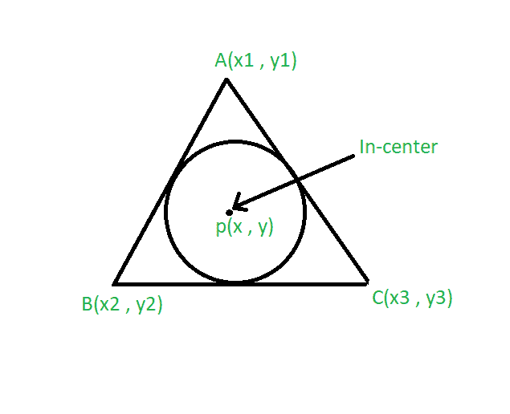
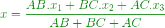
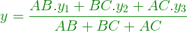

# 寻找三角形燃烧物的程序

> 原文:[https://www . geeksforgeeks . org/program-to-find-the-there-of-a-triangle/](https://www.geeksforgeeks.org/program-to-find-the-incenter-of-a-triangle/)

给定三角形的顶点和边长。三角形内切圆。任务是找到三角形的燃烧物。
**例:**

```
Input: A(2, 2), B(1, 1), C(3, 1) 
        and AB = 2, BC = 1, AC = 1
Output: (2, 1.5)

Input: A(3, 3), B(1, 2), C(2, 2) 
        and AB = 3, BC = 2, AC = 2
Output: (2.5, 2.83)
```



**进场:**

*   接触三角形边的圆心叫做它的燃烧点。
*   假设三角形的顶点是 A(x1，y1)，B(x2，y2)和 C(x3，y3)。
*   设边 AB = a，BC = b，AC = c，则中心坐标由公式给出:





以下是上述方法的实现:

## C++

```
// C++ program to find the
// incenter of a triangle
#include <bits/stdc++.h>
using namespace std;

// Driver code
int main()
{
    // coordinate of the vertices
    float x1 = 2, x2 = 1, x3 = 3;
    float y1 = 2, y2 = 1, y3 = 1;
    float a = 2, b = 1, c = 1;

    // Formula to calculate in-center
    float x = (a * x1 + b *
                   x2 + c * x3) / (a + b + c);
    float y = (a * y1 + b *
                   y2 + c * y3) / (a + b + c);

    // System.out.print(setprecision(3));
    cout << "Incenter = "
         << "(" << x << ", " << y << ")";
    return 0;
}

// This code is contributed by 29AjayKumar
```

## Java 语言(一种计算机语言，尤用于创建网站)

```
// Java program to find the
// incenter of a triangle

import java.util.*;
import java.lang.*;

class GFG {

    // Driver code
    public static void main(String args[])
    {
        // coordinate of the vertices
        float x1 = 2, x2 = 1, x3 = 3;
        float y1 = 2, y2 = 1, y3 = 1;
        float a = 2, b = 1, c = 1;

        // Formula to calculate in-center
        float x
            = (a * x1 + b * x2 + c * x3) / (a + b + c);
        float y
            = (a * y1 + b * y2 + c * y3) / (a + b + c);

        // System.out.print(setprecision(3));
        System.out.println("Incenter= "
                           + "(" + x + ", " + y + ")");
    }
}
```

## 蟒蛇 3

```
# Python3 program to find the
# incenter of a triangle

# Driver code

# coordinate of the vertices
x1 = 2; x2 = 1; x3 = 3;
y1 = 2; y2 = 1; y3 = 1;
a = 2; b = 1; c = 1;

# Formula to calculate in-center
x = (a * x1 + b * x2 + c * x3) / (a + b + c);
y = (a * y1 + b * y2 + c * y3) / (a + b + c);

# System.out.print(setprecision(3));
print("Incenter = (", x, ",", y, ")");

# This code is contributed
# by Akanksha Rai
```

## C#

```
// C# program to find the
// incenter of a triangle

using System;

class GFG
{

    // Driver code
    public static void Main()
    {
        // coordinate of the vertices
        float x1 = 2, x2 = 1, x3 = 3;
        float y1 = 2, y2 = 1, y3 = 1;
        float a = 2, b = 1, c = 1;

        // Formula to calculate in-center
        float x
            = (a * x1 + b * x2 + c * x3) / (a + b + c);
        float y
            = (a * y1 + b * y2 + c * y3) / (a + b + c);

        // System.out.print(setprecision(3));
        Console.WriteLine("Incenter= "
                        + "(" + x + ", " + y + ")");
    }
}

// This code is contributed by vt_m.
```

## java 描述语言

```
<script>
      // JavaScript program to find the
      // incenter of a triangle
      // Driver code
      // coordinate of the vertices
      var x1 = 2,
        x2 = 1,
        x3 = 3;
      var y1 = 2,
        y2 = 1,
        y3 = 1;
      var a = 2,
        b = 1,
        c = 1;

      // Formula to calculate in-center
      var x = (a * x1 + b * x2 + c * x3) / (a + b + c);
      var y = (a * y1 + b * y2 + c * y3) / (a + b + c);

      document.write(
        "Incenter = " + "(" + x.toFixed(1) + ", " + y.toFixed(1) + ")"
      );
    </script>
```

**Output:** 

```
Incenter= (2.0, 1.5)
```