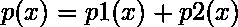
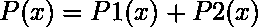
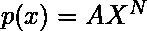
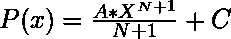

# 求给定多项式不定积分的程序

> 原文:[https://www . geesforgeks . org/program-to-find-不定积分-给定多项式/](https://www.geeksforgeeks.org/program-to-find-the-indefinite-integration-of-the-given-polynomial/)

给定一个多项式字符串 **str** ，任务是对给定的字符串进行积分，积分后打印字符串。

**注意:**输入格式是术语和“+”符号之间有空白。

**示例:**

> **输入:**str = " 4X<sup>3</sup>+3X<sup>1</sup>+2X<sup>2</sup>"
> **输出:**X<sup>4</sup>+(3/2)X<sup>2</sup>+(2/3)X<sup>3</sup>+C
> 
> **输入:**str = " 5X<sup>3</sup>+7X<sup>1</sup>+2X<sup>2</sup>+1X<sup>0</sup>"
> **输出:**(5/4)X<sup>4</sup>+(7/2)X<sup>2</sup>+(2/3)X<sup>3</sup>+X<sup>q</sup>+C

**方法:**思路是观察当给定方程由多个多项式组成时，给定多项式的积分。

也知道的不定积分是。

因此，我们拆分给定的字符串，并整合其中的每个项。

下面是上述方法的实现:

```
// C++ program to find the indefinite
// integral of the given polynomial

#include "bits/stdc++.h"
#define MOD (1e9 + 7);
using ll = int64_t;
using ull = uint64_t;
#define ll long long
using namespace std;

// Function to perform the integral
// of each term
string inteTerm(string pTerm)
{
    // Get the coefficient
    string coeffStr = "", S = "";
    int i;

    // Loop to iterate and get the
    // Coefficient
    for (i = 0; pTerm[i] != 'x'; i++)
        coeffStr.push_back(pTerm[i]);
    long long coeff
        = atol(coeffStr.c_str());

    string powStr = "";

    // Loop to find the power
    // of the term
    for (i = i + 2; i != pTerm.size(); i++)
        powStr.push_back(pTerm[i]);

    long long power
        = atol(powStr.c_str());
    string a, b;
    ostringstream str1, str2;

    // For ax^n, we find a*x^(n+1)/(n+1)
    str1 << coeff;
    a = str1.str();
    power++;
    str2 << power;
    b = str2.str();
    S += "(" + a + "/" + b + ")X^" + b;

    return S;
}

// Function to find the indefinite
// integral of the given polynomial
string integrationVal(string& poly)
{

    // We use istringstream to get the
    // input in tokens
    istringstream is(poly);

    string pTerm, S = "";

    // Loop to iterate through
    // every term
    while (is >> pTerm) {

        // If the token = '+' then
        // continue with the string
        if (pTerm == "+") {
            S += " + ";
            continue;
        }

        if (pTerm == "-") {
            S += " - ";
            continue;
        }

        // Otherwise find
        // the integration of
        // that particular term
        else
            S += inteTerm(pTerm);
    }
    return S;
}

// Driver code
int main()
{
    string str
        = "5x^3 + 7x^1 + 2x^2 + 1x^0";
    cout << integrationVal(str)
         << " + C ";
    return 0;
}
```

**Output:**

```
(5/4)X^4 + (7/2)X^2 + (2/3)X^3 + (1/1)X^1 + C

```