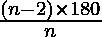
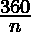
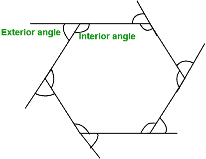

# 求正多边形内外角的程序

> 原文:[https://www . geesforgeks . org/program-to-find-内外角正多边形/](https://www.geeksforgeeks.org/program-to-find-the-interior-and-exterior-angle-of-a-regular-polygon/)

给定正多边形的边数 n。任务是找出多边形的内角和外角。
**例** :

```
Input : n = 6
Output : Interior angle: 120
         Exterior angle: 60

Input : n = 10
Output: Interior angle: 144
        Exterior angle: 36
```

**内角:**多边形内部相邻两条边之间的角度称为内角。
**求内角公式:**
内角= 
**外角:**多边形任意一条边与其相邻边的延长线形成的角称为外角。
外角= 



求正多边形内角和外角的程序:

## C++

```
// CPP program to find the interior and
// exterior angle of a given polygon
#include <iostream>
using namespace std;

// function to find the interior and
// exterior angle
void findAngle(int n)
{
    int interiorAngle, exteriorAngle;

    // formula to find the interior angle
    interiorAngle = (n - 2) * 180 / n;

    // formula to find the exterior angle
    exteriorAngle = 360 / n;

    // Displaying the output
    cout << "Interior angle: " << interiorAngle << endl;

    cout << "Exterior angle: " << exteriorAngle;
}

// Driver code
int main()
{
    int n = 10;

    // Function calling
    findAngle(n);
    return 0;
}
```

## Java 语言(一种计算机语言，尤用于创建网站)

```
// Java program to find the interior and
// exterior angle of a given polygon
import java.io.*;

class GFG {

    // function to find the interior and
    // exterior angle
    static void findAngle(int n)
    {
        int interiorAngle, exteriorAngle;

        // formula to find the interior angle
        interiorAngle = (n - 2) * 180 / n;

        // formula to find the exterior angle
        exteriorAngle = 360 / n;

        // Displaying the output
        System.out.println("Interior angle: " + interiorAngle);

        System.out.println("Exterior angle: " + exteriorAngle);
    }

    // Driver code
    public static void main (String[] args)
    {
        int n = 10;

        // Function calling
        findAngle(n);
    }
}
```

## 蟒蛇 3

```
# Python3 program to find
# the interior and exterior
# angle of a given polygon

# function to find
# the interior and
# exterior angle
def findAngle(n):

    # formula to find the
    # interior angle
    interiorAngle = int((n - 2) * 180 / n)

    # formula to find
    # the exterior angle
    exteriorAngle = int(360 / n)

    # Displaying the output
    print("Interior angle: " ,
            interiorAngle )

    print("Exterior angle: " ,
           exteriorAngle )

# Driver code
n = 10

# Function calling
findAngle(n)

# This code is contributed
# by Smitha
```

## C#

```
// C# program to find the
// interior and exterior
// angle of a given polygon
using System;

class GFG
{

    // function to find
    // the interior and
    // exterior angle
    static void findAngle(int n)
    {
        int interiorAngle,
            exteriorAngle;

        // formula to find
        // the interior angle
        interiorAngle = (n - 2) * 180 / n;

        // formula to find
        // the exterior angle
        exteriorAngle = 360 / n;

        // Displaying the output
        Console.Write("Interior angle: " +
                    interiorAngle + "\n");

        Console.Write("Exterior angle: " +
                           exteriorAngle);
    }

    // Driver code
    public static void Main ()
    {
        int n = 10;

        // Function calling
        findAngle(n);
    }
}

// This code is contributed
// by Smitha
```

## 服务器端编程语言（Professional Hypertext Preprocessor 的缩写）

```
<?php
// PHP program to find the
// interior and exterior
// angle of a given polygon

// function to find the
// interior and exterior
// angle
function findAngle($n)
{
    $interiorAngle;
    $exteriorAngle;

    // formula to find
    // the interior angle
    $interiorAngle = ($n - 2) *
                      180 / $n;

    // formula to find
    // the exterior angle
    $exteriorAngle = 360 /$n;

    // Displaying the output
    echo "Interior angle: " ,
          $interiorAngle, "\n" ;

    echo "Exterior angle: " ,
          $exteriorAngle;
}

// Driver code
$n = 10;

// Function calling
findAngle($n);

// This code is contributed
// by inder_verma.
?>
```

## java 描述语言

```
<script>
// JavaScript program to find the interior and
// exterior angle of a given polygon

// function to find the interior and
// exterior angle
function findAngle(n)
{
    let interiorAngle, exteriorAngle;

    // formula to find the interior angle
    interiorAngle = Math.floor((n - 2) * 180 / n);

    // formula to find the exterior angle
    exteriorAngle = Math.floor(360 / n);

    // Displaying the output
    document.write("Interior angle: " + interiorAngle + "<br>");

    document.write("Exterior angle: " + exteriorAngle);
}

// Driver code
    let n = 10;

    // Function calling
    findAngle(n);

// This code is contributed by Surbhi Tyagi.
</script>
```

**Output:** 

```
Interior angle: 144
Exterior angle: 36
```