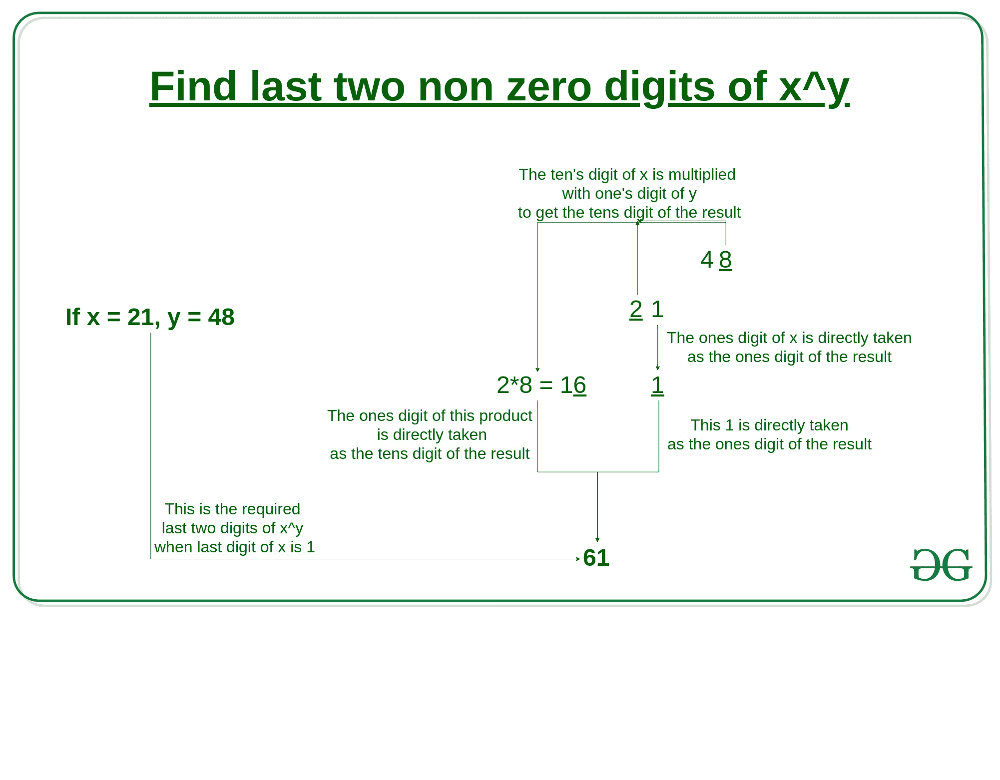
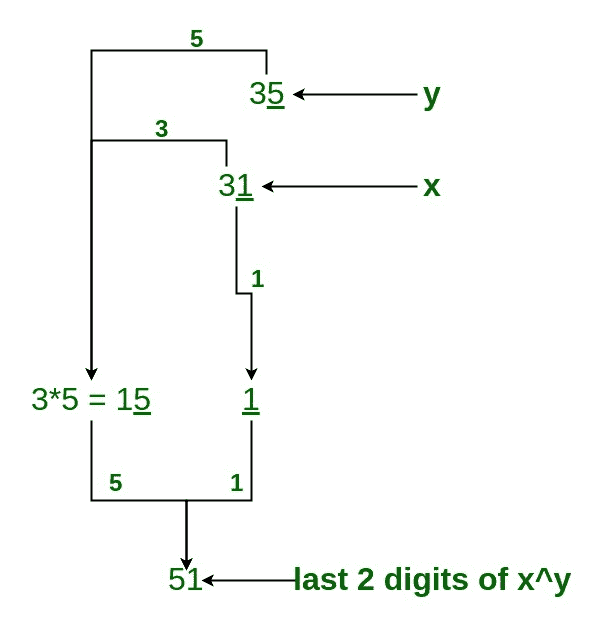
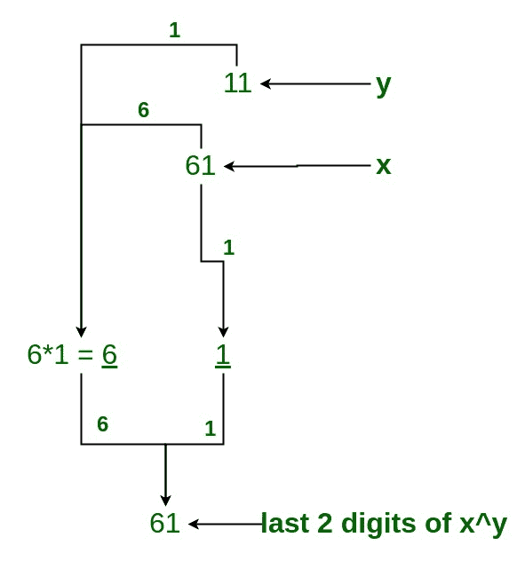
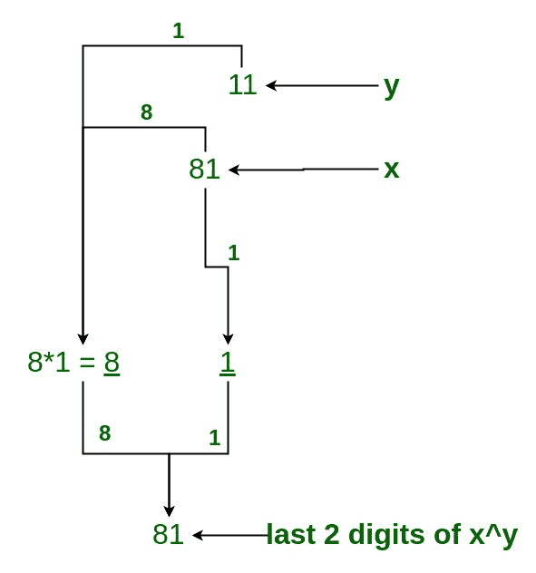
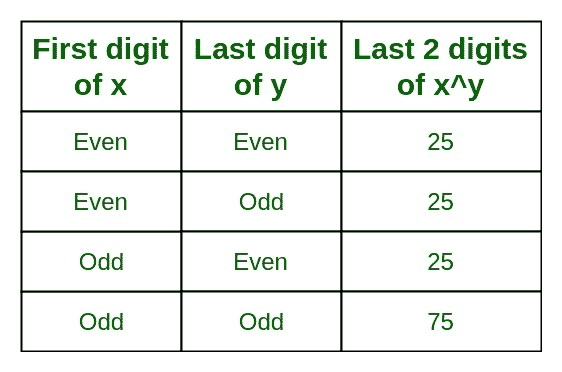

# 程序找到 x^y 的最后两位数字

> 原文:[https://www . geesforgeks . org/program-to-find-最后两位数的-xy/](https://www.geeksforgeeks.org/program-to-find-the-last-two-digits-of-xy/)

**任务是找到 x^y.的最后两位数字**

由于可以结束的数字是 0-9，因此**这个问题可以分为 5 种情况:**

1.  <u>**Case 1: when x ends with 1**</u>

    为了找到一个数字的最后两位数字，当数字以 1 结尾时，我们必须执行如下步骤，如图所示。

    **例:21^48**

    

    所以，21^48 的最后两位数是 81。

    **例:31^35**
    

    所以，31^35 的最后两位数是 51。

2.  <u>**Case 2: when x ends with 3, 7, 9**</u>

    为了找到数字的最后两位，当数字以 3，7，9 结尾时，我们必须应用循环性概念将最后一位转换为 1。

    **3 的循环度:**

    > 3^1 = 3
    > 3^2 = 9
    > 3^3 = 7
    > 3^4 = 1

    **7 的循环度:**

    > 7^1 = 7
    > 7^2 = 9
    > 7^3 = 3
    > 7^4 = 1

    **9 的循环度:**

    > 9^1 = 9
    > 9^2 = 1

    **例 1: 23^34**
    **解:**

    *   23^34 的最后一位是 3，所以我们用 3 的循环性。
    *   3^4 给 1，所以我们拿 23^4
    *   ((23)^4)^8 * (23)^2
    *   last two digit of (23)^4) is 41, so we take (41)^8 and solve according to the given diagram.

        

    *   所以 41)^8 的最后一位是 21。
    *   求解(23)^2，23)^2 的最后一位数字是 29。
    *   现在将 41)^8 的最后一位数字(即 21)乘以 23)^2 的最后一位数字(即 29
    *   即 21 * 29 = 609
    *   所以，23^34 的最后两位非零数字是 09。

    **例 2: 37^45**
    **解:**

    *   37^45 的最后一位数字是 7，所以我们使用 7 的循环性。
    *   7^4 给 1，所以我们拿 37^4
    *   ((37)^4)^11 * (37)^1
    *   last two digit of (37)^4) is 61, so we take (61)^11 and solve according to the diagram.

        

    *   所以 61)^11 的最后一位是 61。
    *   求解(37)^1，37)^1 的最后一位数字是 37。
    *   现在将 61)^11 的最后一位数字(即 61)乘以 37)^1 的最后一位数字(即 37
    *   即 61 * 37 = 2257
    *   所以，37^45 的最后两位非零数字是 57。

    **例 3: 59^22**
    **解:**

    *   59^22 的最后一位数字是 9，所以我们使用 9 的循环性。
    *   9^2 给 1，所以我们拿 59^2
    *   ((59)^2)^11
    *   last two digit of (59)^2 is 81, so we take (81)^11 and solve according to the diagram.

        

    *   所以 81)^11 的最后一位是 81。
    *   所以，59^22 的最后两位非零数字是 81。
3.  <u>**Case 3: when x ends with 2, 4, 6, 8**</u>

    因为找到一个数字的最后一个数字以 2，4，6，8 结尾；我们使用数字 76，这是一种幻数，因为它的平方、立方等包含最后 2 位数字，即 76。

    **举个例子**:

    > 76 的平方= 5776，其最后两位数=76
    > 76 的立方= 438976，其最后两位数= 76

    所以我们举两个例子:

    1.  如果(2^10)^even 电力)那么它总是返回 76。
    2.  如果(2^10)^odd 权力)那么它总是返回 24。

    **查找最后两位数字的步骤**

    *   首先，将给定的数字转换成这些格式，如果(2^10)^power.根据问题，这里的功率将是奇数或偶数。
    *   现在，检查功率将是奇数或偶数。
    *   如果幂是奇数，那么它的值将是 24。
    *   如果功率是偶数，那么它的值将是 76。

    **示例**

    **示例 1:** 查找 2^453.的最后 2 位数字

    **解决方案:**

    *   **第 1 步:-转换**T2】2^453 =(2^10)^45 * 2^3
    *   **第二步:-奇次方所以我们取 24**
        = 24 * 8
        = 192

    所以，2^453 的最后两位非零数字是 92。

    **示例 2:** 查找 4^972.的最后 2 位数字

    **解决方案:**

    *   **第一步:-转换**T2】4^972 =(2^2)^972
        = 2^1944
        =(2^10)^194 * 2^4
    *   **第二步:-连电所以，我们取 76**
        = 76 * 16
        = 1216

    所以，4^972 的最后两位非零数字是 16。

    **示例 3:** 查找 6^600.的最后 2 位数字

    **解决方案:**

    *   **第 1 步:-** 转换
        6^600 =(2)^600 *(3)^600
        =(2^10)^60 *(3)^4)^150 {适用于(3)^600}
    *   **第二步:-** (2^10)^60 有偶数幂，所以我们把 76 作为最后一位数字
    *   **步骤 3:-** 求解((3)^4)^150，我们得到 01 作为最后一位数字
    *   **第 4 步:-**2^10)^60 的最后一位数字(即 76)乘以(3)^4)^150 的最后一位数字(即 01
    *   **第 5 步:-** 即 76 * 01 = 76

    所以，6^600 的最后两个非零值是 76。

    **示例 4:** 查找 8^330.的最后 2 位数字

    **解决方案:**

    *   **第一步:-转换**T2】8^33 =(2^3)^110
        =(2)^330
    *   **第二步:-** (2^10)^33 有奇数次幂，所以我们把 24 作为最后一位数字

    所以，8^330 的最后两位非零数字是 24。

4.  <u>**Case 4: when x ends with 5**</u>

    为了找到数字的最后两位，当数字以 5 结尾时，我们必须遵循下面给出的表格。

    

    **示例 1:** 查找 25^25.的最后 2 位数字

    **解决方案:**

    *   数字的第一位是 2，即偶数
    *   幂的最后一位是 5，即奇数
    *   现在，奇偶组合给出最后一个数字是 25

    所以，25^25 的最后两位非零数字是 25。

    **示例 2:** 查找 25^222.的最后 2 位数字

    **解决方案:**

    *   数字的第一位是 2，即偶数
    *   幂的最后一位是 2，即偶数
    *   现在，偶数组合给出的最后一位数字是 25

    所以，25^222 的最后两位非零数字是 25。

    **示例 3:** 查找 165^222.的最后 2 位数字

    **解决方案:**

    *   数字的第一位是 1，即奇数
    *   幂的最后一位是 2，即偶数
    *   现在，奇偶组合给出的最后一位数字是 25

    所以，165^222 的最后两位非零数字是 25。

    **示例 4:** 查找 165^221.的最后 2 位数字

    **解决方案:**

    *   数字的第一位是 1，即奇数
    *   幂的最后一位是 1，即奇数
    *   现在，奇-奇组合给出的最后一位数字是 75

    所以，165^221 的最后两位非零数字是 75。

5.  <u>**Case 5: when x ends with 0**</u>

    为了找到一个数字的最后两位数字，当数字以 0 结尾时，我们必须检查下一位数字，并根据该数字计算最后一位数字。

    **示例:**查找 150^221.的最后 2 位数字

    **解决方案:**

    *   150 最后一个数字是 0，所以我们检查下一个数字，即 5，并应用案例 4
    *   数字的第一位是 1，即奇数
    *   幂的最后一位是 1，即奇数
    *   现在，奇-奇组合给出的最后一位数字是 75

    所以，165^221 的最后两位非零数字是 75。