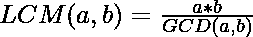

# 求两个素数 LCM 的程序

> 原文:[https://www . geesforgeks . org/program-to-find-the-LCM-of-two-prime-numbers/](https://www.geeksforgeeks.org/program-to-find-the-lcm-of-two-prime-numbers/)

给定两个[素数](https://www.geeksforgeeks.org/prime-numbers/) **N** 和 **M** ，任务是找到两个给定素数的[最小公倍数(LCM)](https://www.geeksforgeeks.org/program-to-find-lcm-of-two-numbers/) 。
**举例:**

> **输入:** N = 3，M = 7
> **输出:** 21
> **说明:**
> 大于等于 3 和 7 的最小数是 3 和 7 的倍数是 21。
> 
> **输入:** N = 5，M = 5
> **输出:** 5
> **说明:**
> 大于等于 5 和 5 的最小数是 5 和 5 的倍数是 5。

**方法:**众所周知，两个数的乘积等于它们的[最大公约数(GCD)](https://www.geeksforgeeks.org/euclidean-algorithms-basic-and-extended/) 和[最小公倍数(LCM)](https://www.geeksforgeeks.org/program-to-find-lcm-of-two-numbers/) 的乘积。所以，两个给定素数的 LCM 可以由:给出。
由于 GCD 两个不同的质数是 1，因此，如果两个给定的数相同，那么 LCM 就是数本身。

下面是上述方法的实现:

## C++

```
// C++ Program to find LCM of two
// prime numbers
#include <bits/stdc++.h>
using namespace std;

// Function to return the LCM of two
// prime numbers
int findLCMPrime(int a, int b)
{
    // If the two numbers are equal
    // then return any one of a and b
    if (a == b) {
        return a;
    }

    // Else return product of numbers
    return a * b;
}

// Driver code
int main()
{
    // Given two numbers
    int a = 3, b = 5;

    // Function Call
    cout << findLCMPrime(a, b);
    return 0;
}
```

## Java 语言(一种计算机语言，尤用于创建网站)

```
// Java Program to find LCM of two
// prime numbers
class GFG{

// Function to return the LCM of two
// prime numbers
static int findLCMPrime(int a, int b)
{
    // If the two numbers are equal
    // then return any one of a and b
    if (a == b)
    {
        return a;
    }

    // Else return product of numbers
    return a * b;
}

// Driver code
public static void main (String[] args)
{
    // Given two numbers
    int a = 3, b = 5;

    // Function Call
    System.out.println(findLCMPrime(a, b));
}
}

// This code is contributed by AnkitRai01
```

## 蟒蛇 3

```
# Python3 program to find LCM of two
# prime numbers

# Function to return the LCM of two
# prime numbers
def findLCMPrime(a, b):

    # If the two numbers are equal
    # then return any one of a and b
    if (a == b):
        return a;

    # Else return product of the numbers
    return a * b;

# Driver code
if __name__ == "__main__":

    # Given two numbers
    a = 3; b = 5;

    # Function Call
    print(findLCMPrime(a, b));

# This code is contributed by AnkitRai01
```

## C#

```
// C# program to find LCM of two prime numbers
using System;

class GFG{

// Function to return the LCM of two
// prime numbers
static int findLCMPrime(int a, int b)
{

    // If the two numbers are equal
    // then return any one of a and b
    if (a == b)
    {
        return a;
    }

    // Else return product of numbers
    return a * b;
}

// Driver code
public static void Main (string[] args)
{

    // Given two numbers
    int a = 3, b = 5;

    // Function Call
    Console.WriteLine(findLCMPrime(a, b));
}
}

// This code is contributed by AnkitRai01
```

## java 描述语言

```
<script>

// Javascript Program to find LCM of two
// prime numbers

// Function to return the LCM of two
// prime numbers
function findLCMPrime(a, b)
{

    // If the two numbers are equal
    // then return any one of a and b
    if (a == b)
    {
        return a;
    }

    // Else return product of numbers
    return a * b;
}

// Driver code

// Given two numbers
let a = 3, b = 5;

// Function Call
document.write(findLCMPrime(a, b));

// This code is contributed by Akshit Saxena

</script>
```

**Output**

```
15
```

**时间复杂度:***O(1)*
T5】辅助空间: *O(1)*