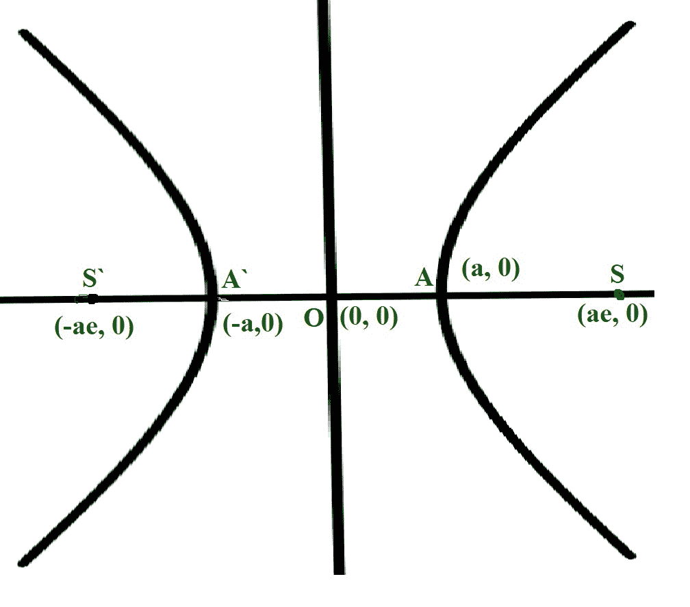

# 计算双曲线直肠长度的程序

> 原文:[https://www . geeksforgeeks . org/program-to-find-the-length-of-latus-直肠-of-a-双曲线/](https://www.geeksforgeeks.org/program-to-find-the-length-of-latus-rectum-of-a-hyperbola/)

给定两个整数 **A** 和 **B** ，代表一条[双曲线](https://www.geeksforgeeks.org/hyperbolic-functions/)的[半长轴和半短轴](https://en.wikipedia.org/wiki/Semi-major_and_semi-minor_axes)的长度，任务是求双曲线的[舌部直肠的长度。](https://www.geeksforgeeks.org/class-11-ncert-solutions-chapter-11-conic-section-exercise-11-4/)

**示例:**

> **输入:** A = 3，B = 2
> T3】输出: 2.66666
> 
> **输入:** A = 6，B = 3
> T3】输出: 3

**逼近:**双曲线的[直肠是垂直于长轴的焦弦，直肠的长度等于(短轴长度) <sup>2</sup> /(长轴长度)。](https://en.wikipedia.org/wiki/Hyperbola#Semi-latus_rectum)

> [](https://media.geeksforgeeks.org/wp-content/uploads/20210320022154/hyperbola.jpg)

按照以下步骤解决给定的问题:

*   求双曲线长轴的长度并存储在变量中，比如**main**。
*   求双曲线短轴的长度，存储在变量中，比如**次**。
*   完成上述步骤后，打印**(小*小)/大**的值作为直肠的合成长度。

下面是上述方法的实现:

## C++

```
// C++ program for the above approach

#include <iostream>
using namespace std;

// Function to calculate the length of
// the latus rectum of a hyperbola
double lengthOfLatusRectum(double A,
                           double B)
{
    // Store the length of major axis
    double major = 2.0 * A;

    // Store the length of minor axis
    double minor = 2.0 * B;

    // Store the length of the
    // latus rectum
    double latus_rectum = (minor * minor)
                          / major;

    // Return the length of the
    // latus rectum
    return latus_rectum;
}

// Driver Code
int main()
{
    double A = 3.0, B = 2.0;
    cout << lengthOfLatusRectum(A, B);

    return 0;
}
```

## Java 语言(一种计算机语言，尤用于创建网站)

```
// Java program for the above approach
import java.io.*;

class GFG{

// Function to calculate the length of
// the latus rectum of a hyperbola
static double lengthOfLatusRectum(double A,
                                  double B)
{

    // Store the length of major axis
    double major = 2.0 * A;

    // Store the length of minor axis
    double minor = 2.0 * B;

    // Store the length of the
    // latus rectum
    double latus_rectum = (minor * minor) / major;

    // Return the length of the
    // latus rectum
    return latus_rectum;
}

// Driver Code
public static void main(String[] args)
{
    double A = 3.0, B = 2.0;

    System.out.println(lengthOfLatusRectum(A, B));
}}

// This code is contributed by Dharanendra L V.
```

## 蟒蛇 3

```
# Python program for the above approach

# Function to calculate the length of
# the latus rectum of a hyperbola
def lengthOfLatusRectum(A,B):

    # Store the length of major axis
    major = 2.0 * A

    # Store the length of minor axis   
    minor = 2.0 * B

    # Store the length of the
    # latus rectum
    latus_rectum = (minor * minor) / major

    # Return the length of the
    # latus rectum
    return latus_rectum

# Driver Code
A = 3.0
B = 2.0
print(round(lengthOfLatusRectum(A, B),5))

# This code is contributed by avanitrachhadiya2155
```

## C#

```
// C# program for the above approach
using System;
class GFG
{

// Function to calculate the length of
// the latus rectum of a hyperbola
static double lengthOfLatusRectum(double A,
                           double B)
{

    // Store the length of major axis
    double major = 2.0 * A;

    // Store the length of minor axis
    double minor = 2.0 * B;

    // Store the length of the
    // latus rectum
    double latus_rectum = (minor * minor)
                          / major;

    // Return the length of the
    // latus rectum
    return latus_rectum;
}

// Driver Code
public static void Main ()
{
    double A = 3.0, B = 2.0;
    Console.WriteLine(lengthOfLatusRectum(A, B));

}}

// This code is contributed by ukasp.
```

## java 描述语言

```
<script>

// Javascript program for the above approach

// Function to calculate the length of
// the latus rectum of a hyperbola
function lengthOfLatusRectum(A, B)
{

    // Store the length of major axis
    var major = 2.0 * A;

    // Store the length of minor axis
    var minor = 2.0 * B;

    // Store the length of the
    // latus rectum
    var latus_rectum = (minor * minor) / major;

    // Return the length of the
    // latus rectum
    return latus_rectum;
}

// Driver Code
var A = 3.0, B = 2.0;

document.write(lengthOfLatusRectum(A, B));

// This code is contributed by 29AjayKumar

</script>
```

**Output:** 

```
2.66667
```

***时间复杂度:**O(1)*
T5**辅助空间:** O(1)