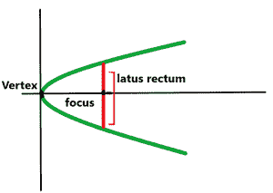

# 求抛物线直肠长度的程序

> 原文:[https://www . geeksforgeeks . org/program-to-find-latus-直肠的长度-抛物线/](https://www.geeksforgeeks.org/program-to-find-the-length-of-latus-rectum-of-a-parabola/)

给定 **a、b、**和**c****X<sup>2</sup>**、 **X** 的系数，以及抛物线一般方程中的常数项，任务就是求抛物线的 [Latus 直肠的长度。](https://en.wikipedia.org/wiki/Parabola)

**示例:**

> **输入:**a =**T3】3，b = 5，c = 1
> T5】输出:**0.3333333
> 
> **输入:** a = 4，b = 0，c = 4
> T3】输出: 0.25

**方法:**给定的问题可以基于以下观察来解决:

> **观察:**
> 
> *   抛物线的直肠是与轴线垂直的直线，位于抛物线的焦点处，其长度等于焦点与抛物线顶点之间距离的 4 倍。
> 
> 
> 
> *   因此，任务简化为使用公式找到焦点和抛物线顶点之间的距离:
>     *   

按照以下步骤解决问题:

*   初始化两个变量，说**顶点**和**焦点**存储抛物线顶点和焦点的坐标。
*   [求抛物线的顶点和焦点的坐标](https://www.geeksforgeeks.org/finding-vertex-focus-directrix-parabola/)并存入相应的变量。
*   初始化一个变量，说**长度**，设置为 **4** 乘以抛物线顶点到焦点的距离。
*   打印长度值作为答案。

下面是上述方法的实现:

## C++

```
// C++ program for the above approach

#include <bits/stdc++.h>
using namespace std;

// Function to calculate distance
// between two points
float distance(float x1, float y1,
               float x2, float y2)
{
    // Calculating distance
    return sqrt((x2 - x1) * (x2 - x1)
                + (y2 - y1) * (y2 - y1));
}

// Function to calculate length of
// the latus rectum of a parabola
float lengthOfLatusRectum(float a,
                          float b, float c)
{
    // Stores the co-ordinates of
    // the vertex of the parabola
    pair<float, float> vertex
        = { (-b / (2 * a)),
            (((4 * a * c) - (b * b)) / (4 * a)) };

    // Stores the co-ordinates of
    // the focus of parabola
    pair<float, float> focus
        = { (-b / (2 * a)),
            (((4 * a * c) - (b * b) + 1) / (4 * a)) };

    // Print the distance between focus and vertex
    cout << 4 * distance(
                    focus.first, focus.second,
                    vertex.first, vertex.second);
}

// Driver Code
int main()
{
    // Given a, b & c
    float a = 3, b = 5, c = 1;

    // Function call
    lengthOfLatusRectum(a, b, c);

    return 0;
}
```

## Java 语言(一种计算机语言，尤用于创建网站)

```
// Java program for the above approach
class GFG{
  static class pair
  {
    float first;
    float second;
    public pair(float first, float second) 
    {
      this.first = first;
      this.second = second;
    }   
  }

  // Function to calculate distance
  // between two points
  static float distance(float x1, float y1,
                        float x2, float y2)
  {

    // Calculating distance
    return (float) Math.sqrt((x2 - x1) * (x2 - x1)
                             + (y2 - y1) * (y2 - y1));
  }

  // Function to calculate length of
  // the latus rectum of a parabola
  static void lengthOfLatusRectum(float a,
                                  float b, float c)
  {

    // Stores the co-ordinates of
    // the vertex of the parabola
    pair vertex
      = new pair( (-b / (2 * a)),
                 (((4 * a * c) - (b * b)) / (4 * a)) );

    // Stores the co-ordinates of
    // the focus of parabola
    pair focus
      = new pair( (-b / (2 * a)),
                 (((4 * a * c) - (b * b) + 1) / (4 * a)) );

    // Print the distance between focus and vertex
    System.out.print(4 * distance(
      (float)focus.first, (float)focus.second,
      (float)vertex.first, (float)vertex.second));
  }

  // Driver Code
  public static void main(String[] args)
  {

    // Given a, b & c
    float a = 3, b = 5, c = 1;

    // Function call
    lengthOfLatusRectum(a, b, c);

  }
}

// This code is contributed by 29AjayKumar
```

## 蟒蛇 3

```
# Python 3 program for the above approach
from math import sqrt

# Function to calculate distance
# between two points
def distance(x1, y1, x2, y2):

    # Calculating distance
    return sqrt((x2 - x1) * (x2 - x1) + (y2 - y1) * (y2 - y1))

# Function to calculate length of
# the latus rectum of a parabola
def lengthOfLatusRectum(a, b, c):

    # Stores the co-ordinates of
    # the vertex of the parabola
    vertex =  [(-b / (2 * a)), (((4 * a * c) - (b * b)) / (4 * a))]

    # Stores the co-ordinates of
    # the focus of parabola
    focus = [(-b / (2 * a)), (((4 * a * c) - (b * b) + 1) / (4 * a))]

    # Print the distance between focus and vertex
    print("{:.6f}".format(4 * distance(focus[0], focus[1], vertex[0], vertex[1])))

# Driver Code
if __name__  == "__main__":

    # Given a, b & c
    a = 3
    b = 5
    c = 1

    # Function call
    lengthOfLatusRectum(a, b, c)

    # This code is contributed by bgangwar59.
```

## C#

```
// C# program for the above approach
using System;

public class GFG{
  class pair
  {
    public float first;
    public float second;
    public pair(float first, float second) 
    {
      this.first = first;
      this.second = second;
    }   
  }

  // Function to calculate distance
  // between two points
  static float distance(float x1, float y1,
                        float x2, float y2)
  {

    // Calculating distance
    return (float) Math.Sqrt((x2 - x1) * (x2 - x1)
                             + (y2 - y1) * (y2 - y1));
  }

  // Function to calculate length of
  // the latus rectum of a parabola
  static void lengthOfLatusRectum(float a,
                                  float b, float c)
  {

    // Stores the co-ordinates of
    // the vertex of the parabola
    pair vertex
      = new pair( (-b / (2 * a)),
                 (((4 * a * c) - (b * b)) / (4 * a)) );

    // Stores the co-ordinates of
    // the focus of parabola
    pair focus
      = new pair( (-b / (2 * a)),
                 (((4 * a * c) - (b * b) + 1) / (4 * a)) );

    // Print the distance between focus and vertex
    Console.Write(4 * distance(
      (float)focus.first, (float)focus.second,
      (float)vertex.first, (float)vertex.second));
  }

  // Driver Code
  public static void Main(String[] args)
  {

    // Given a, b & c
    float a = 3, b = 5, c = 1;

    // Function call
    lengthOfLatusRectum(a, b, c);

  }
}

// This code is contributed by 29AjayKumar
```

## java 描述语言

```
<script>
    // Javascript program for the above approach

    // Function to calculate distance
    // between two points
    function distance(x1, y1, x2, y2)
    {
        // Calculating distance
        return Math.sqrt((x2 - x1) * (x2 - x1)
                    + (y2 - y1) * (y2 - y1));
    }

    // Function to calculate length of
    // the latus rectum of a parabola
    function lengthOfLatusRectum(a, b, c)
    {
        // Stores the co-ordinates of
        // the vertex of the parabola
        let vertex
            = [ (-b / (2 * a)),
                (((4 * a * c) - (b * b)) / (4 * a)) ];

        // Stores the co-ordinates of
        // the focus of parabola
        let focus
            = [ (-b / (2 * a)),
                (((4 * a * c) - (b * b) + 1) / (4 * a)) ];

        // Print the distance between focus and vertex
        document.write((4 * distance(
                        focus[0], focus[1],
                        vertex[0], vertex[1])).toFixed(6));
    }

    // Given a, b & c
    let a = 3, b = 5, c = 1;

    // Function call
    lengthOfLatusRectum(a, b, c);

 // This code is contributed by divyeshrabadiya07.
</script>
```

**Output:** 

```
0.333333
```

***时间复杂度:**O(1)*
T5**辅助空间:** O(1)