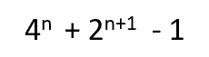
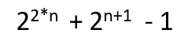

# 程序查找第 n 个基尼亚号

> 原文:[https://www . geesforgeks . org/program-to-find-the-n-kynea-number/](https://www.geeksforgeeks.org/program-to-find-the-nth-kynea-number/)

给定一个正整数 n，任务是找到第 n 个 Kynea 数。
[**基纳数**](https://en.wikipedia.org/wiki/Kynea_number) **:** 在数学中，基纳数是一个正整数，其形式为:



其中 n 是正整数。
第 n 个基尼亚号的等价公式为:


前几个 Kynea 号是:

> 7, 23, 79, 287, 1087, 4223, 16639, 66047, 263167, 1050623, 4198399, … ..

**例:**

```
Input: 2
Output: 23
    Putting n = 2 in formula,
    = 42 + 2 2+1 - 1
    = 16 + 8 -1
    = 23  
```

**方法 1:** 一个简单的解决方法是通过将 *n* 的值放入公式
中来找出*n*的数字


以下是上述方法的实现:

## C++

```
// CPP code to find nth Kynea number

#include <bits/stdc++.h>
using namespace std;

// Function to calculate nth kynea number
long nthKyneaNumber(int n)
{

    // Calculate nth kynea number
    // using formula ((2^n + 1)^2 ) -2

    // Firstly calculate 2^n + 1
    n = (1 << n) + 1;

    // Now calculate (2^n + 1)^2
    n = n * n;

    // Now calculate ((2^n + 1)^2 ) - 2
    n = n - 2;

    // return nth Kynea number
    return n;
}

// Driver Program
int main()
{
    int n = 8;

    // print nth kynea number
    cout << nthKyneaNumber(n);

    return 0;
}
```

## Java 语言(一种计算机语言，尤用于创建网站)

```
// JAVA code to find nth Kynea number

class GFG {

    // Function to calculate nth kynea number
    static long nthKyneaNumber(int n)
    {

        // Calculate nth kynea number
        // using formula ((2^n + 1)^2 ) -2

        // Firstly calculate 2^n + 1
        n = (1 << n) + 1;

        // Now calculate (2^n + 1)^2
        n = n * n;

        // Now calculate ((2^n + 1)^2 ) - 2
        n = n - 2;

        // return nth Kynea number
        return n;
    }

    // Driver Program
    public static void main(String[] args)
    {
        int n = 2;

        // print nth kynea number
        System.out.println(nthKyneaNumber(n));
    }
}
```

## 计算机编程语言

```
# Python code to find nth Kynea number

# Function to calculate nth kynea number
def nthKyneaNumber( n):

    # Calculate nth kynea number
    # using formula ((2 ^ n + 1)^2 ) -2

    # Firstly calculate 2 ^ n + 1
    n = ( 1 << n) + 1

    # Now calculate (2 ^ n + 1)^2
    n = n * n

    # Now calculate ((2 ^ n + 1)^2 ) - 2
    n = n-2

    # return nth Kynea number
    return n

# Driver Code
n = 2

# print nth kynea number
print(nthKyneaNumber(n))
```

## C#

```
// C# code to find nth Kynea number

using System;
class GFG {

    // Function to calculate nth kynea number
    static long nthKyneaNumber(int n)
    {

        // Calculate nth kynea number
        // using formula ((2^n + 1)^2 ) -2

        // Firstly calculate 2^n + 1
        n = (1 << n) + 1;

        // Now calculate (2^n + 1)^2
        n = n * n;

        // Now calculate ((2^n + 1)^2 ) - 2
        n = n - 2;

        // return nth Kynea number
        return n;
    }

    // Driver Program
    public static void Main()
    {
        int n = 2;

        // print nth kynea number
        Console.WriteLine(nthKyneaNumber(n));
    }
}
```

## 服务器端编程语言（Professional Hypertext Preprocessor 的缩写）

```
<?php
// PHP code to find nth Kynea number

// Function to calculate nth kynea number
function nthKyneaNumber($n)
{

    // Calculate nth kynea number
    // using formula ((2^n + 1)^2 ) -2

    // Firstly calculate 2^n + 1
    $n = (1 << $n) + 1;

    // Now calculate (2^n + 1)^2
    $n = $n * $n;

    // Now calculate ((2^n + 1)^2 ) - 2
    $n = $n - 2;

    // return nth Kynea number
    return $n;
}

// Driver Code
$n = 8;

// print nth kynea number
echo nthKyneaNumber($n);

// This code is contributed
// by Akanksha Rai(Abby_akku)
```

## java 描述语言

```
<script>

// Javascript code to find nth Kynea number

// Function to calculate nth kynea number
function nthKyneaNumber(n)
{

    // Calculate nth kynea number
    // using formula ((2^n + 1)^2 ) -2

    // Firstly calculate 2^n + 1
    n = (1 << n) + 1;

    // Now calculate (2^n + 1)^2
    n = n * n;

    // Now calculate ((2^n + 1)^2 ) - 2
    n = n - 2;

    // return nth Kynea number
    return n;
}

// Driver Code
let n = 8;

// print nth kynea number
document.write( nthKyneaNumber(n));

// This code is contributed by bobby

</script>
```

**Output:** 

```
66047
```

**方法 2:** 该解决方案基于这样一个事实，即每个 Kynea 数在其二进制表示中都遵循特定的模式。第 n 个 Kynea 数可以用二进制表示为单个前导 1，后面紧跟 n-1 个连续 0，后面紧跟 n+1 个连续 1 .
**示例:**

```
23 is 2nd kynea number
It can be represented in binary as 10111 
(Single leading one, followed by n - 1 ( i.e 2-1=1 ) consecutive 0's, 
followed by n + 1 ( i.e 2 + 1 = 3 ) consecutive 1's.)
```

<figure class="table">

| n | 第 n 个基尼亚号码 | 二进制表示法 |
| --- | --- | --- |
| one | seven | One hundred and eleven |
| Two | Twenty-three | Ten thousand one hundred and eleven |
| three | Seventy-nine | One million one thousand one hundred and eleven |
| four | Two hundred and eighty-seven | One hundred million eleven thousand one hundred and eleven |
| five | One thousand and eighty-seven | Ten billion one hundred and eleven thousand one hundred and eleven |
| six | Four thousand two hundred and twenty-three | 1000001111111 |

观察上表中 Kynea 数的二进制模式，第 n 个 Kynea 数可以很容易地用公式
计算出来



**例:**

```
Input: n = 3
Output: 79
    Using formula,
    = 26 + 24 -1
    = 64 + 15 
    = 79      
```

以下是上述方法的实施

## C++

```
// CPP code to find nth Kynea number

#include <bits/stdc++.h>
using namespace std;

// Function to calculate nth kynea number
long nthKyneaNumber(int n)
{

    // Calculate nth kynea number
    return ((1 << (2 * n)) + (1 << (n + 1)) - 1);
}

// Driver Program
int main()
{
    int n = 2;

    // print nth kynea number
    cout << nthKyneaNumber(n);

    return 0;
}
```

## Java 语言(一种计算机语言，尤用于创建网站)

```
// JAVA code to find nth Kynea number

class GFG {

    // Function to calculate nth kynea number
    static long nthKyneaNumber(int n)
    {

        // Calculate nth kynea number
        return ((1 << (2 * n)) + (1 << (n + 1)) - 1);
    }

    // Driver Program
    public static void main(String[] args)
    {
        int n = 2;

        // print nth kynea number
        System.out.println(nthKyneaNumber(n));
    }
}
```

## 计算机编程语言

```
# Python code to find nth Kynea number

# Function to calculate nth kynea number
def nthKyneaNumber( n):

    # Calculate nth kynea number   
    return (( 1 << (2 * n)) + ( 1 << (n + 1)) -1 )

# Driver Code
n = 2

# print nth kynea number
print(nthKyneaNumber(n))
```

## C#

```
// C# code to find nth Kynea number

using System;
class GFG {

    // Function to calculate nth kynea number
    static long nthKyneaNumber(int n)
    {

        // Calculate nth kynea number
        return ((1 << (2 * n)) + (1 << (n + 1)) - 1);
    }

    // Driver Program
    public static void Main()
    {
        int n = 2;

        // print nth kynea number
        Console.WriteLine(nthKyneaNumber(n));
    }
}
```

## 服务器端编程语言（Professional Hypertext Preprocessor 的缩写）

```
<?php
// PHP code to find nth Kynea number

// Function to calculate
// nth kynea number
function nthKyneaNumber($n)
{

    // Calculate nth kynea number
    return ((1 << (2 * $n)) +
            (1 << ($n + 1)) - 1);
}

// Driver Code
$n = 2;

// print nth kynea number
echo nthKyneaNumber($n);

// This code is contributed
// by anuj_67
?>
```

## java 描述语言

```
<script>

// Javascript code to find nth Kynea number

// Function to calculate
// nth kynea number
function nthKyneaNumber(n)
{
    // Calculate nth kynea number
    return ((1 << (2 * n)) +
            (1 << (n + 1)) - 1);
}

// Driver Code
let n = 2;

// print nth kynea number
document.write( nthKyneaNumber(n));

// This code is contributed by bobby

</script>
```

**Output:** 

```
23
```

</figure>