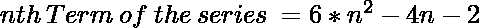
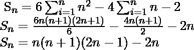

# 程序寻找数列 0，14，40，78，124 的第 n 项，…

> 原文:[https://www . geesforgeks . org/program-to-find-the-n-term-of-series-0-14-40-78-124/](https://www.geeksforgeeks.org/program-to-find-the-nth-term-of-the-series-0-14-40-78-124/)

给定一个数字 n，任务是编写一个程序来找到下面系列的第 n 项:

> 0、14、40、78、124……(N 项)

**例:**

```
Input: N = 4
Output: 78
For N = 4
Sum(upto 4 terms) = ( 6 * n * n - 4 * n - 2) 
                  = ( 6 * 4 * 4 - 4 * 4 - 2) 
                  =  78
Input: N = 10
Output: 557
```

**方法:**本系列的广义第 n 项:

下面是所需的实现:

## C++

```
// CPP program to find the N-th term of the series
// 0, 14, 40, 78, 124 ...
#include <iostream>
#include <math.h>
using namespace std;

// calculate sum upto Nth term of series
int nthTerm(int n)
{
    return 6 * pow(n, 2) - 4 * n - 2;
}

// Driver code
int main()
{
    int N = 4;

    cout << nthTerm(N);

    return 0;
}
```

## Java 语言(一种计算机语言，尤用于创建网站)

```
// Java program to find the N-th term of the series
// 0, 14, 40, 78, 124 ...
import java.util.*;
class solution
{

// calculate sum up to Nth term of series
static int nthTerm(int n)
{

    //return the final sum
    return 6 * (int)Math.pow(n, 2) - 4 * n - 2;
}

// Driver code
public static void main(String arr[])
{
    int N = 4;

    System.out.println(nthTerm(N));

}
}
//This code is contributed by Surendra_Gangwar
```

## 蟒蛇 3

```
# Python3 program to find
# the N-th term of the series
# 0, 14, 40, 78, 124 ...

# calculate sum upto Nth
# term of series
def nthTerm(n):
    return int(6 * pow(n, 2) - 4 * n - 2)

# Driver code
N = 4
print(nthTerm(N))

# This code is contributed
# by Shrikant13
```

## C#

```
// C# program to find the
// N-th term of the series
// 0, 14, 40, 78, 124 ...
using System;

class GFG
{

// calculate sum up to Nth
// term of series
static int nthTerm(int n)
{

    //return the final sum
    return 6 * (int)Math.Pow(n, 2) -
                        4 * n - 2;
}

// Driver code
public static void Main()
{
    int N = 4;

    Console.WriteLine(nthTerm(N));
}
}

// This code is contributed
// by inder_verma
```

## 服务器端编程语言（Professional Hypertext Preprocessor 的缩写）

```
<?php
// PHP program to find the
// N-th term of the series
// 0, 14, 40, 78, 124 ...

// calculate sum upto
// Nth term of series
function nthTerm($n)
{
    return 6 * pow($n, 2) - 4 * $n - 2;
}

// Driver code
$N = 4;

echo nthTerm($N);

// This code is contributed by
// Akanksha Rai(Abby_akku)
```

## java 描述语言

```
<script>
// JavaScript program to find the N-th term of the series
// 0, 14, 40, 78, 124 ...

// calculate sum upto Nth term of series
function nthTerm( n)
{
    return 6 * Math.pow(n, 2) - 4 * n - 2;
}
// Driver code

    let N = 4;
   document.write( nthTerm(N) );

// This code contributed by aashish1995

</script>
```

**Output:** 

```
78
```

**时间复杂度:** O(1)
**注:**上述系列的 Sum up n 项(Sn)为:
