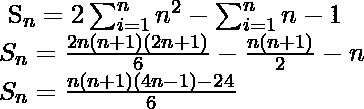

# 求数列 0，5，14，27，44 的第 n 项的程序，…..

> 原文:[https://www . geesforgeks . org/program-to-find-the-n-term-of-series-0-5-14-27-44/](https://www.geeksforgeeks.org/program-to-find-the-nth-term-of-the-series-0-5-14-27-44/)

给定一个数字 n，任务是编写一个程序来寻找下面系列中的第 n 项:

> 0，5，14，27，44 …(第 n 项)

**例:**

```
Input: N = 4
Output: 27
For N = 4,
Nth term = ( 2 * N * N - N - 1 ) 
         = ( 2 * 4 * 4 - 4 - 1 ) 
         = 27

Input: N = 10
Output: 188
```

**方法:**本系列的广义第 n 项:

```
Nth Term: 2 * N * N - N - 1 
```

下面是需要的实现:

## C++

```
// CPP program to find N-th term of the series:
// 0, 5, 14, 27, 44 ...
#include <iostream>
#include <math.h>
using namespace std;

// Calculate Nth term of series
int nthTerm(int n)
{
    return 2 * pow(n, 2) - n - 1;
}

// Driver code
int main()
{
    int N = 4;

    cout << nthTerm(N);

    return 0;
}
```

## Java 语言(一种计算机语言，尤用于创建网站)

```
// Java program to find N-th term of the series:
// 0, 5, 14, 27, 44 ...
import java.util.*;

class solution
{

// Calculate Nth term of series
static int nthTerm(int n)
{
    return 2 *(int)Math.pow(n, 2) - n - 1;
}

// Driver code
public static void main(String arr[])
{
    int N = 4;

    System.out.println(nthTerm(N));
}
}
//This code is contributed by Surendra_Gangwar
```

## 蟒蛇 3

```
# Python 3 program to find
# N-th term of the series:
# 0, 5, 14, 27, 44 ...

# Calculate Nth term of series
def nthTerm(n):

    return 2 * pow(n, 2) - n - 1

# Driver code
if __name__ == "__main__":
    N = 4

    print(nthTerm(N))

# This code is contributed
# by ChitraNayal
```

## C#

```
// C# program to find
// N-th term of the series:
// 0, 5, 14, 27, 44 ...
using System;
class GFG
{

// Calculate Nth term of series
static int nthTerm(int n)
{
    return 2 * (int)Math.Pow(n, 2) - n - 1;
}

// Driver code
static public void Main ()
{
    int N = 4;

    Console.Write(nthTerm(N));
}
}

// This code is contributed by Raj
```

## 服务器端编程语言（Professional Hypertext Preprocessor 的缩写）

```
<?php
// PHP program to find
// N-th term of the series:
// 0, 5, 14, 27, 44 ...

// Calculate Nth term of series
function nthTerm($n)
{
    return 2 * pow($n, 2) - $n - 1;
}

// Driver code
$N = 4;

echo nthTerm($N);

// This code is contributed
// by Akanksha Rai(Abby_akku)
?>
```

## java 描述语言

```
<script>
// JavaScript program to find N-th term of the series:
// 0, 5, 14, 27, 44 ...

// Calculate Nth term of series
function nthTerm( n)
{
    return 2 * Math.pow(n, 2) - n - 1;
}

// Driver code

    let N = 4;
   document.write( nthTerm(N) );

// This code contributed by aashish1995

</script>
```

**Output:** 

```
27
```

**时间复杂度:** O(1)
**注:**上述系列的 Sum up n 项(Sn)为:
