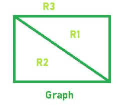

# 程序，用于在平面图

中查找区域数

> 原文： [https://www.geeksforgeeks.org/program-to-find-the-number-of-region-in-planar-graph/](https://www.geeksforgeeks.org/program-to-find-the-number-of-region-in-planar-graph/)

给定两个整数`V`和`E`，它们表示[平面图](https://www.geeksforgeeks.org/mathematics-planar-graphs-graph-coloring/)的顶点和边的数量。 任务是找到该平面图的区域数。

**平面图**：平面图是其中没有边彼此相交的图，或者可以在没有边相交的平面上绘制的图称为平面图。

**区域**：当绘制平面图而没有边线交叉时，图的边线和顶点将平面分成多个区域。

**示例**：

> **输入**：V = 4，E = 5
> **输出**：R = 3
> 
> 
> **输入**：V = 3，E = 3
> **输出**：R = 2

**方法**：欧拉发现平面图中的区域数是顶点数和图中边数的函数，即


下面是上述方法的实现：

## C++

```cpp

// C++ implementation of the approach 
#include <bits/stdc++.h> 
using namespace std; 

// Function to return the number 
// of regions in a Planar Graph 
int Regions(int Vertices, int Edges) 
{ 
    int R = Edges + 2 - Vertices; 

    return R; 
} 

// Driver code 
int main() 
{ 
    int V = 5, E = 7; 

    cout << Regions(V, E); 

    return 0; 
} 

```