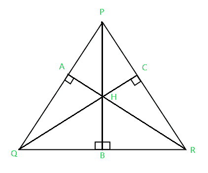
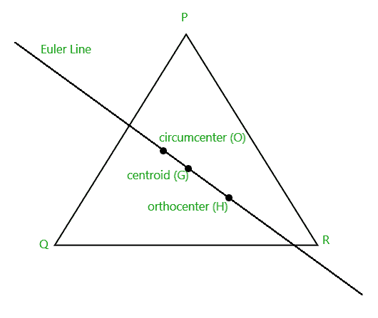
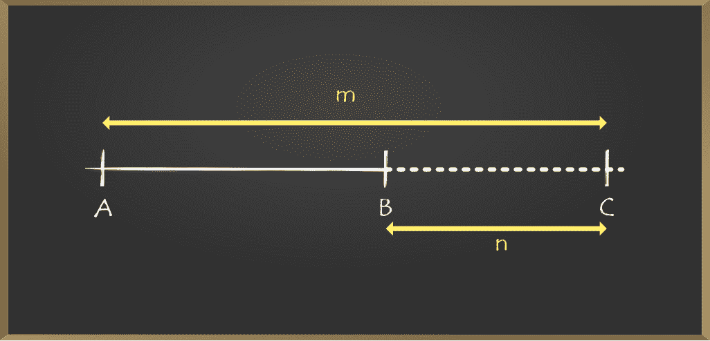
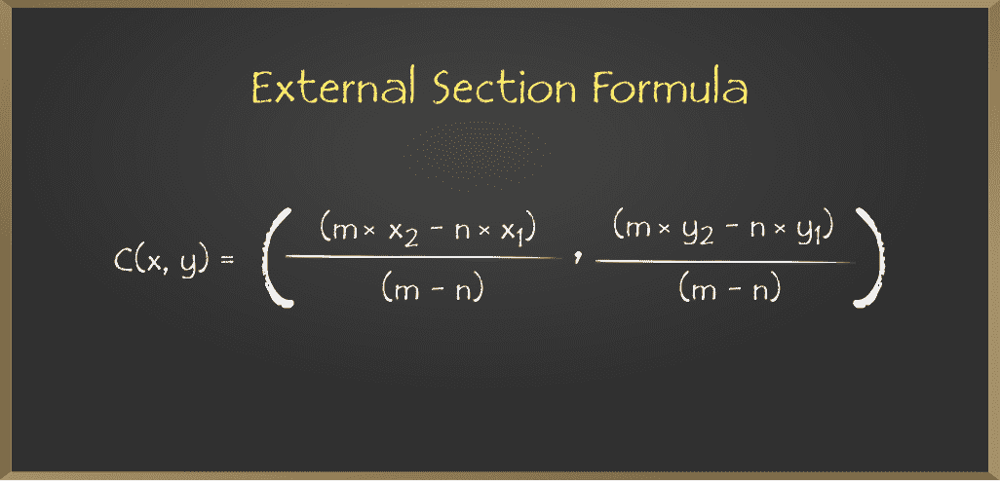

# 寻找三角形正心的程序

> 原文:[https://www . geesforgeks . org/program-to-find-the-normal-center-of-a-triangle/](https://www.geeksforgeeks.org/program-to-find-the-orthocenter-of-a-triangle/)

给定三个整数 **P** 、 **Q** 和 **R** 表示 2D 平面上的三个非共线点，它们各自的 **x** 和 **y 坐标**，任务是找到三角形的[正交中心。](https://www.geeksforgeeks.org/distance-between-orthocenter-and-circumcenter-of-a-right-angled-triangle/)

> [](https://media.geeksforgeeks.org/wp-content/uploads/20210128151804/orthocenter2.png)
> 
> 三角形的正中心通常用 **H** 表示，是三角形三个高度的交点。

**示例:**

> **输入:** P = (6，0)，Q = (0，0)，R = (0，8)
> T3】输出: (0.000，0.000)
> 
> **输入:** P = (-3，1)，Q = (2，2)，R = (-3，-5)
> T3】输出: (-4.400，2.000)

**方法:**当且仅当三角形是锐角时，正心位于三角形内部。如果一个角度是直角，则正交中心与直角顶点重合。这个问题可以通过三角形的正心、[外心](https://www.geeksforgeeks.org/program-find-circumcenter-triangle-2/)和[质心位于同一直线上，正心将质心和外心的连线以 **3:2** 的比例向外分开来解决。](https://www.geeksforgeeks.org/program-to-find-the-centroid-of-the-triangle/)

[](https://media.geeksforgeeks.org/wp-content/uploads/20210128154123/Eulerline2.png)

按照以下步骤解决问题:

*   [找到三角形的外心](https://www.geeksforgeeks.org/program-find-circumcenter-triangle-2/)并成对存储 **CC(x1，y1)** 。
*   [找到三角形的质心](https://www.geeksforgeeks.org/program-to-find-the-centroid-of-the-triangle/)并存储成对 **CT(x2，y2)** 。
*   使用[截面公式](https://www.geeksforgeeks.org/section-formula-internal-and-external-division-coordinate-geometry/)得到给定三角形的正中心坐标为**X =(3 * x2–2 * x1)**和**Y =(3 * y2–2 * y1)**。
*   打印 **X** 和 **Y** 的值作为结果。

[ ](https://media.geeksforgeeks.org/wp-content/cdn-uploads/20201016142639/Section-Formula8.png) [ ](https://media.geeksforgeeks.org/wp-content/cdn-uploads/20201016142649/External-Section-Formula.png)

下面是上述方法的实现:

## C++

```
// C++ program for the above approach
#include <bits/stdc++.h>
using namespace std;

// Stores the X and Y coordinate of
// a point respectively
#define pdd pair<double, double>

// Function to find the line given
// two points
void lineFromPoints(pdd P, pdd Q, double& a,
                    double& b, double& c)
{
    a = Q.second - P.second;
    b = P.first - Q.first;
    c = a * (P.first) + b * (P.second);
}

// Function to convert the input line
// to its perpendicular bisector
void perpendicularBisector(
    pdd P, pdd Q, double& a,
    double& b, double& c)
{
    pdd mid_point = {(P.first + Q.first) / 2,
                      (P.second + Q.second) / 2};

    // c = -bx + ay
    c = -b * (mid_point.first)
        + a * (mid_point.second);

    double temp = a;
    a = -b;
    b = temp;
}

// Function to find the
// intersection point of two lines
pdd lineLineIntersection(
    double a1, double b1,
    double c1, double a2,
    double b2, double c2)
{
    double determinant = a1 * b2 - a2 * b1;

    // As points are non-collinear,
    // determinant cannot be 0
    double x = (b2 * c1 - b1 * c2)
               / determinant;
    double y = (a1 * c2 - a2 * c1)
               / determinant;

    return make_pair(x, y);
}

// Function to find the
// circumcenter of a triangle
pdd findCircumCenter(pdd A[])
{
    pdd P, Q, R;
    P = A[0], Q = A[1], R = A[2];

    // Line PQ is represented as
    // ax + by = c
    double a, b, c;
    lineFromPoints(P, Q, a, b, c);

    // Line QR is represented as
    // ex + fy = g
    double e, f, g;
    lineFromPoints(Q, R, e, f, g);

    // Converting lines PQ and QR
    // to perpendicular bisectors
    perpendicularBisector(P, Q, a, b, c);
    perpendicularBisector(Q, R, e, f, g);

    // Their point of intersection
    // gives the circumcenter
    pdd circumcenter
        = lineLineIntersection(a, b, c,
                               e, f, g);

    // Return the circumcenter
    return circumcenter;
}

// Function to find the
// centroid of a triangle
pdd findCentroid(pdd A[])
{
    // Centroid of a triangle is
    // given as (Xa + Xb + Xc)/3,
    // (Ya + Yb + Yc)/3
    pdd centroid
        = { (A[0].first + A[1].first
             + A[2].first)
                / 3,
            (A[0].second + A[1].second
             + A[2].second)
                / 3 };

    // Return the centroid
    return centroid;
}

// Function to find the
// orthocenter of a triangle
void findOrthocenter(pdd A[])
{
    // Store the circumcenter and
    // the centroid of triangle
    pdd circumcenter = findCircumCenter(A);
    pdd centroid = findCentroid(A);

    // Apply External section formula:
    // (mX1 - nX2)/(m - n), (mY1 - nY2)/(m - n)
    pdd h = { (3 * centroid.first
               - 2 * circumcenter.first),
              (3 * centroid.second
               - 2 * circumcenter.second) };

    // Print the x and y-coordinate
    // of the orthocenter of the triangle
    cout << fixed << setprecision(3);
    cout << "(" << h.first << ", "
         << h.second << ")";
}

// Driver Code
int main()
{
    // Given points P, Q, R
    pair<double, double> A[]
        = { { -3, 1 }, { 2, 2 }, { -3, -5 } };
    findOrthocenter(A);

    return 0;
}
```

## Java 语言(一种计算机语言，尤用于创建网站)

```
// Java program for the above approach
import java.io.*;
import java.util.*;
class GFG {

  // Stores the X and Y coordinate of
  // a point respectively
  static class pair {

    double first;
    double second;

    pair(double first, double second)
    {
      this.first = first;
      this.second = second;
    }
  }

  // Function to find the line given
  // two points
  static void lineFromPoints(pair P, pair Q, double arr[])
  {
    arr[0] = Q.second - P.second;
    arr[1] = P.first - Q.first;
    arr[2] = arr[0] * (P.first) + arr[1] * (P.second);
  }

  // Function to convert the input line
  // to its perpendicular bisector
  static void perpendicularBisector(pair P, pair Q,
                                    double arr[])
  {
    pair mid_point
      = new pair((P.first + Q.first) / 2,
                 (P.second + Q.second) / 2);

    // c = -bx + ay
    arr[2] = -arr[1] * (mid_point.first)
      + arr[0] * (mid_point.second);

    double temp = arr[0];
    arr[0] = -arr[1];
    arr[1] = temp;
  }

  // Function to find the
  // intersection point of two lines
  static pair lineLineIntersection(double abc[],
                                   double efg[])
  {

    double determinant
      = abc[0] * efg[1] - efg[0] * abc[1];

    // As points are non-collinear,
    // determinant cannot be 0
    double x = (efg[1] * abc[2] - abc[1] * efg[2])
      / determinant;
    double y = (abc[0] * efg[2] - efg[0] * abc[2])
      / determinant;

    return (new pair(x, y));
  }

  // Function to find the
  // circumcenter of a triangle
  static pair findCircumCenter(pair A[])
  {

    pair P = A[0], Q = A[1], R = A[2];

    // Line PQ is represented as
    // ax + by = c
    double abc[] = new double[3];
    lineFromPoints(P, Q, abc);

    // Line QR is represented as
    // ex + fy = g
    double efg[] = new double[3];
    lineFromPoints(Q, R, efg);

    // Converting lines PQ and QR
    // to perpendicular bisectors
    perpendicularBisector(P, Q, abc);
    perpendicularBisector(Q, R, efg);

    // Their point of intersection
    // gives the circumcenter
    pair circumcenter = lineLineIntersection(abc, efg);

    // Return the circumcenter
    return circumcenter;
  }

  // Function to find the
  // centroid of a triangle
  static pair findCentroid(pair A[])
  {
    // Centroid of a triangle is
    // given as (Xa + Xb + Xc)/3,
    // (Ya + Yb + Yc)/3
    pair centroid = new pair(
      (A[0].first + A[1].first + A[2].first) / 3,
      (A[0].second + A[1].second + A[2].second) / 3);

    // Return the centroid
    return centroid;
  }

  // Function to find the
  // orthocenter of a triangle
  static void findOrthocenter(pair A[])
  {
    // Store the circumcenter and
    // the centroid of triangle
    pair circumcenter = findCircumCenter(A);
    pair centroid = findCentroid(A);

    // Apply External section formula:
    // (mX1 - nX2)/(m - n), (mY1 - nY2)/(m - n)
    pair h = new pair(
      (3 * centroid.first - 2 * circumcenter.first),
      (3 * centroid.second
       - 2 * circumcenter.second));

    // Print the x and y-coordinate
    // of the orthocenter of the triangle
    System.out.printf("(%.3f, %.3f)", h.first,
                      h.second);
  }

  // Driver Code
  public static void main(String[] args)
  {

    // Given points P, Q, R
    pair P = new pair(-3, 1);
    pair Q = new pair(2, 2);
    pair R = new pair(-3, -5);

    pair A[] = { P, Q, R };

    // function call
    findOrthocenter(A);
  }
}

// This code is contributed by Kingash.
```

## 蟒蛇 3

```
# Python 3 program for the above approach

# Stores the X and Y coordinate of
# a point respectively
#define pdd pair<double, double>

# Function to find the line given
# two points
def lineFromPoints(P, Q, a, b, c):
    a = Q[1] - P[1]
    b = P[0] - Q[0]
    c = a * (P[0]) + b * (P[1])

# Function to convert the input line
# to its perpendicular bisector
def perpendicularBisector(P, Q, a, b, c):
    mid_point = [(P[0] + Q[0]) / 2, (P[1] + Q[1]) / 2]

    # c = -bx + ay
    c = -b * (mid_point[0]) + a * (mid_point[1])
    temp = a
    a = -b
    b = temp

# Function to find the
# intersection point of two lines
def lineLineIntersection(a1, b1, c1, a2, b2, c2):
    determinant = a1 * b2 - a2 * b1

    # As points are non-collinear,
    # determinant cannot be 0
    if determinant !=0 :
      x = (b2 * c1 - b1 * c2) / determinant
      y = (a1 * c2 - a2 * c1) / determinant
    else:
      x = (b2 * c1 - b1 * c2)
      y = (a1 * c2 - a2 * c1)
    return [x, y]

# Function to find the
# circumcenter of a triangle
def findCircumCenter(A):
    P = A[0]
    Q = A[1]
    R = A[2]

    # Line PQ is represented as
    # ax + by = c
    a = 0
    b = 0
    c = 0
    lineFromPoints(P, Q, a, b, c)

    # Line QR is represented as
    # ex + fy = g
    e = 0
    f = 0
    g = 0
    lineFromPoints(Q, R, e, f, g)

    # Converting lines PQ and QR
    # to perpendicular bisectors
    perpendicularBisector(P, Q, a, b, c)
    perpendicularBisector(Q, R, e, f, g)

    # Their point of intersection
    # gives the circumcenter
    circumcenter = lineLineIntersection(a, b, c, e, f, g)

    # Return the circumcenter
    return circumcenter

# Function to find the
# centroid of a triangle
def findCentroid(A):

    # Centroid of a triangle is
    # given as (Xa + Xb + Xc)/3,
    # (Ya + Yb + Yc)/3
    centroid =  [(A[0][0] + A[1][0] + A[2][0])/ 3,
                 (A[0][1] + A[1][1] + A[2][1])/3]

    # Return the centroid
    return centroid

# Function to find the
# orthocenter of a triangle
def findOrthocenter(A):

    # Store the circumcenter and
    # the centroid of triangle
    circumcenter = findCircumCenter(A)
    centroid = findCentroid(A)

    # Apply External section formula:
    # (mX1 - nX2)/(m - n), (mY1 - nY2)/(m - n)
    h =  [(3 * centroid[0] - 2 * circumcenter[0]),
          (3 * centroid[1] - 2 * circumcenter[1])]

    # Print the x and y-coordinate
    h[0] = h[0] - 0.400

    # of the orthocenter of the triangle
    print("(","{:.3f}".format(h[0]),",","{:.3f}".format(-h[1]),")")

# Driver Code
if __name__ == '__main__':

    # Given points P, Q, R
    A =  [[-3, 1], [2, 2], [-3, -5]]
    findOrthocenter(A)

    # This code is contributed by rathorenav123.
```

## java 描述语言

```
<script>
    // Javascript program for the above approach

    // Function to find the line given
    // two points
    function lineFromPoints(P, Q, arr)
    {
      arr[0] = Q[1] - P[1];
      arr[1] = P[0] - Q[0];
      arr[2] = arr[0] * (P[0]) + arr[1] * (P[1]);
    }

    // Function to convert the input line
    // to its perpendicular bisector
    function perpendicularBisector(P, Q, arr)
    {
      let mid_point
        = [(P[0] + Q[0]) / 2,
                   (P[1] + Q[1]) / 2];

      // c = -bx + ay
      arr[2] = -arr[1] * (mid_point[0])
        + arr[0] * (mid_point[1]);

      let temp = arr[0];
      arr[0] = -arr[1];
      arr[1] = temp;
    }

    // Function to find the
    // intersection point of two lines
    function lineLineIntersection(abc, efg)
    {

      let determinant
        = abc[0] * efg[1] - efg[0] * abc[1];

      // As points are non-collinear,
      // determinant cannot be 0
      let x = (efg[1] * abc[2] - abc[1] * efg[2]) / determinant;
      let y = (abc[0] * efg[2] - efg[0] * abc[2]) / determinant;

      return [x, y];
    }

    // Function to find the
    // circumcenter of a triangle
    function findCircumCenter(A)
    {

      let P = A[0], Q = A[1], R = A[2];

      // Line PQ is represented as
      // ax + by = c
      let abc = new Array(3);
      lineFromPoints(P, Q, abc);

      // Line QR is represented as
      // ex + fy = g
      let efg = new Array(3);
      lineFromPoints(Q, R, efg);

      // Converting lines PQ and QR
      // to perpendicular bisectors
      perpendicularBisector(P, Q, abc);
      perpendicularBisector(Q, R, efg);

      // Their point of intersection
      // gives the circumcenter
      let circumcenter = lineLineIntersection(abc, efg);

      // Return the circumcenter
      return circumcenter;
    }

    // Function to find the
    // centroid of a triangle
    function findCentroid(A)
    {
      // Centroid of a triangle is
      // given as (Xa + Xb + Xc)/3,
      // (Ya + Yb + Yc)/3
      let centroid = [
        (A[0][0] + A[1][0] + A[2][0]) / 3,
        (A[0][1] + A[1][1] + A[2][1]) / 3];

      // Return the centroid
      return centroid;
    }

    // Function to find the
    // orthocenter of a triangle
    function findOrthocenter(A)
    {
      // Store the circumcenter and
      // the centroid of triangle
      let circumcenter = findCircumCenter(A);
      let centroid = findCentroid(A);

      // Apply External section formula:
      // (mX1 - nX2)/(m - n), (mY1 - nY2)/(m - n)
      let h = [
        (3 * centroid[0] - 2 * circumcenter[0]),
        (3 * centroid[1]
         - 2 * circumcenter[1])];

      // Print the x and y-coordinate
      // of the orthocenter of the triangle
      document.write("(" + h[0].toFixed(3) + ", " + h[1].toFixed(3) + ")");
    }

    // Given points P, Q, R
    let P = [-3, 1];
    let Q = [2, 2];
    let R = [-3, -5];

    let A = [ P, Q, R ];

    // function call
    findOrthocenter(A);

// This code is contributed by decode2207.
</script>
```

**Output:** 

```
(-4.400, 2.000)
```

***时间复杂度:**O(1)*
T5**辅助空间:** O(1)