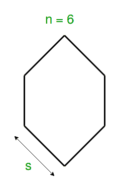
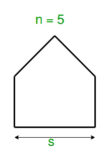

# 计算正多边形周长的程序

> 原文:[https://www . geesforgeks . org/program-to-find-a-period-of-a-regular-polygon/](https://www.geeksforgeeks.org/program-to-find-the-perimeter-of-a-regular-polygon/)

给定一个正多边形的边数和边长，任务是找出这个多边形的周长。

**示例:**

```
Input: n = 7, s = 10
Output: Perimeter : 70
Since the sides are 7,
Hence the given polygon is Heptagon.
Therefore. Perimeter = 7*10 = 70

Input: n = 5, s = 2.5
Output: Perimeter : 12.5
Since the sides are 5,
Hence the given polygon is Pentagon.
Therefore. Perimeter = 5*2.5 = 12.5
```

**逼近:**在几何学中，正多边形是一个所有边都相等的封闭图形。它是一个二维图形。

> **正多边形的周长=边数*每条边的长度**





下面是上述方法的实现:

## C++

```
// C++ program to find the
// perimeter of a regular polygon

#include <iostream>
using namespace std;

// Function to calculate the perimeter
float Perimeter(float s, int n)
{
    float perimeter = 1;

    // Calculate Perimeter
    perimeter = n * s;

    return perimeter;
}

// driver code
int main()
{

    // Get the number of sides
    int n = 5;

    // Get the length of side
    float s = 2.5, peri;

    // find perimeter
    peri = Perimeter(s, n);

    cout << "Perimeter of Regular Polygon"
         << " with " << n << " sides of length "
         << s << " = " << peri << endl;

    return 0;
}
```

## C

```
// C program to find the
// perimeter of a regular polygon

#include <stdio.h>

// Function to calculate the perimeter
float Perimeter(float s, int n)
{
    float perimeter = 1;

    // Calculate Perimeter
    perimeter = n * s;

    return perimeter;
}

// driver code
int main()
{

    // Get the number of sides
    int n = 5;

    // Get the length of side
    float s = 2.5, peri;

    // find perimeter
    peri = Perimeter(s, n);

    printf("Perimeter of Regular Polygon\n"
           " with %d sides of length %f = %f\n",
           n, s, peri);

    return 0;
}
```

## Java 语言(一种计算机语言，尤用于创建网站)

```
// Java program to find the
// perimeter of a regular polygon

class GFG {

    // Function to calculate the perimeter
    static double Perimeter(double s, int n)
    {
        double perimeter = 1;

        // Calculate Perimeter
        perimeter = n * s;

        return perimeter;
    }

    // Driver method
    public static void main(String[] args)
    {

        // Get the number of sides
        int n = 5;

        // Get the length of side
        double s = 2.5, peri;

        // find perimeter
        peri = Perimeter(s, n);

        System.out.println("Perimeter of Regular Polygon"
                           + " with " + n + " sides of length "
                           + s + " = " + peri);
    }
}
```

## 蟒蛇 3

```
# Python3 program to find the
# perimeter of a regular polygon

# Function to calculate the perimeter
def Perimeter(s, n):
    perimeter = 1
    # Calculate Perimeter
    perimeter = n * s

    return perimeter

# driver code
if __name__== '__main__':
    # Get the number of sides
    n = 5

    #Get the length of side
    s = 2.5
    # find perimeter
    peri = Perimeter(s, n)

    print("Perimeter of Regular Polygon with"
          ,n,"sides of length",s,"=",peri)

# This code is contributed by
# SURENDRA_GANGWAR
```

## C#

```
// C# program to find the
// perimeter of a regular polygon
using System;

class GFG
{
// Function to calculate the perimeter
static double Perimeter(double s, int n)
{
    double perimeter = 1;

    // Calculate Perimeter
    perimeter = n * s;

    return perimeter;
}

// Driver Code
static public void Main ()
{
    // Get the number of sides
    int n = 5;

    // Get the length of side
    double s = 2.5, peri;

    // find perimeter
    peri = Perimeter(s, n);

    Console.WriteLine("Perimeter of Regular Polygon" +
                      " with " + n + " sides of length " +
                        s + " = " + peri);
}
}

// This code is contributed by Sachin
```

## 服务器端编程语言（Professional Hypertext Preprocessor 的缩写）

```
<?php
// PHP program to find the
// perimeter of a regular polygon

// Function to calculate the perimeter
function Perimeter($s, $n)
{
    $perimeter = 1;

    // Calculate Perimeter
    $perimeter = $n * $s;

    return $perimeter;
}

    // driver code

    // Get the number of sides
    $n = 5;

    // Get the length of side
    $s = 2.5;

    // find perimeter
    $peri = Perimeter($s, $n);

    echo "Perimeter of Regular Polygon"
         ," with ", $n," sides of length "
         ,$s," = ",$peri;

// This code is contributed by ANKITRAI1
?>
```

## java 描述语言

```
<script>

// Javascript program to find the
// perimeter of a regular polygon

// Function to calculate the perimeter
function Perimeter(s, n)
{
    var perimeter = 1;

    // Calculate Perimeter
    perimeter = n * s;

    return perimeter;
}

// Driver code

// Get the number of sides
var n = 5;

// Get the length of side
var s = 2.5, peri;

// find perimeter
peri = Perimeter(s, n);

document.write("Perimeter of Regular Polygon<br/>" +
               " with " + n + " sides of length " +
               s.toFixed(6) + " = " + peri.toFixed(6));

// This code is contributed by gauravrajput1

</script>
```

**Output:** 

```
Perimeter of Regular Polygon 
with 5 sides of length 2.500000 = 12.500000
```