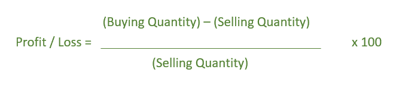

# N 项 CP 等于 M 项 SP 时求盈亏的程序

> 原文:[https://www . geeksforgeeks . org/program-to-find-on-items-CP 等于-sp-of-m-items/](https://www.geeksforgeeks.org/program-to-find-the-profit-or-loss-when-cp-of-n-items-is-equal-to-sp-of-m-items/)

给定、表示 N 件的**成本价等于 M 件**的**售价。任务是确定利润或亏损百分比。**

**示例:**

```
Input:  N = 8, M = 9
Output: Loss = -11.11%

Input:  N = 8, M = 5
Output: Profit = 60%
```

**公式:-**



下面是上述方法的实现:

## C++

```
// C++ implementation of above formula
#include <bits/stdc++.h>
using namespace std;

// Function to calculate
// Profit or loss
void profitLoss(int N, int M)
{
    if (N == M)
        cout << "No Profit nor Loss";
    else {

        float result = 0.0;

        result = float(abs(N - M)) / M;

        if (N - M < 0)
            cout << "Loss = -" << result * 100 << "%";
        else
            cout << "Profit = " << result * 100 << "%";
    }
}

// Driver Code
int main()
{
    int N = 8, M = 9;

    profitLoss(N, M);

    return 0;
}
```

## Java 语言(一种计算机语言，尤用于创建网站)

```
// Java implementation of above formula
public class GFG{

    // Function to calculate
    // Profit or loss
    static void profitLoss(int N, int M)
    {
        if (N == M)
            System.out.print("No Profit nor Loss");
        else {

            float result = 0;

            result = (float)(Math.abs(N - M))/ M;

            if (N - M < 0)
                System.out.print("Loss = -" + result * 100 +"%");
            else
                System.out.print("Profit = " + result * 100 + "%");
        }
    }

    // Driver Code
     public static void main(String []args){

        int N = 8, M = 9;

        profitLoss(N, M);

     }
     // This code is contributed by ANKITRAI1
}
```

## 蟒蛇 3

```
# Python 3 implementation of above formula

# Function to calculate Profit or loss
def profitLoss(N, M):
    if (N == M):
        print("No Profit nor Loss")
    else:
        result = 0.0

        result = float(abs(N - M)) / M

        if (N - M < 0):
            print("Loss = -",'{0:.6}' .
                   format(result * 100), "%")
        else:
            print("Profit = ",'{0:.6}' .
                   format(result * 100), "%")

# Driver Code
if __name__ == '__main__':
    N = 8
    M = 9

    profitLoss(N, M)

# This code is contributed by
# Sanjit_Prasad
```

## C#

```
// C# implementation of above formula
using System;

class GFG
{
// Function to calculate
// Profit or loss
static void profitLoss(int N, int M)
{
    if (N == M)
        Console.Write("No Profit nor Loss");
    else
    {
        float result = 0;

        result = (float)(Math.Abs(N - M))/ M;

        if (N - M < 0)
            Console.Write("Loss = -" +
                           result * 100 +"%");
        else
            Console.Write("Profit = " +
                           result * 100 + "%");
    }
}

// Driver Code
static public void Main ()
{
    int N = 8, M = 9;

    profitLoss(N, M);
}
}

// This code is contributed by ajit.
```

## 服务器端编程语言（Professional Hypertext Preprocessor 的缩写）

```
<?php
// PHP implementation of above formula

// Function to calculate
// Profit or loss
function profitLoss($N, $M)
{
    if ($N == $M)
        echo "No Profit nor Loss";
    else
    {

        $result = 0.0;

        $result = (abs($N - $M)) / $M;

        if ($N - $M < 0)
            echo "Loss = -",
                  $result * 100, "%";
        else
            echo "Profit = ",
                  $result * 100, "%";
    }
}

// Driver Code
$N = 8;
$M = 9;
profitLoss($N, $M);

// This code is contributed
// by Sach_Code
?>
```

## java 描述语言

```
<script>

// Javascript implementation of above formula

// Function to calculate
// Profit or loss
function profitLoss(N, M)
{
    if (N == M)
        document.write( "No Profit nor Loss");
    else
    {
        var result = 0.0;

        result = (Math.abs(N - M)) / M;

        if (N - M < 0)
            document.write("Loss = -" +
              result.toFixed(6) * 100 + "%");
        else
            document.write("Profit = " +
               result.toFixed(6) * 100 + "%");
    }
}

// Driver Code
var N = 8, M = 9;

profitLoss(N, M);

// This code is contributed by rutvik_56

</script>
```

**Output:** 

```
Loss = -11.1111%
```