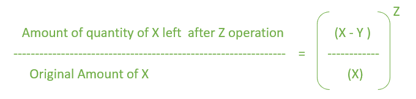

# 程序查找混合物更换后的数量

> 原文:[https://www . geesforgeks . org/program-to-find-the-quantity-after-hybrid-replacement/](https://www.geeksforgeeks.org/program-to-find-the-quantity-after-mixture-replacement/)

给定一个装有 X 升牛奶的容器。Y 升牛奶被抽出，换成 Y 升水。这个操作做 Z 次。任务是找出容器中剩余的牛奶量。
**例:**

```
Input: X = 10 liters, Y = 2 liters, Z = 2 times
Output: 6.4 liters

Input: X = 25 liters, Y = 6 liters, Z = 3 times
Output: 10.97 liters
```

**公式:-**



**下面是需要的实现:**

## C++

```
// C++ implementation using above formula
#include <bits/stdc++.h>
using namespace std;

// Function to calculate the Remaining amount.
float Mixture(int X, int Y, int Z)
{
    float result = 0.0, result1 = 0.0;

    // calculate Right hand Side(RHS).
    result1 = ((X - Y) / (float)X);
    result = pow(result1, Z);

    // calculate Amount left by
    // multiply it with original value.
    result = result * X;

    return result;
}

// Driver Code
int main()
{
    int X = 10, Y = 2, Z = 2;

    cout << Mixture(X, Y, Z) << " litres";
    return 0;
}
```

## Java 语言(一种计算机语言，尤用于创建网站)

```
// Java code using above Formula.
import java.io.*;

class GFG
{
// Function to calculate the
// Remaining amount.
static double Mixture(int X, int Y, int Z)
{
    double result1 = 0.0, result = 0.0;

    // calculate Right hand Side(RHS).
    result1 = ((X - Y) / (float)X);
    result = Math.pow(result1, Z);

    // calculate Amount left by
    // multiply it with original value.
    result = result * X;

    return result;
}

// Driver Code
public static void main(String[] args)
{
    int X = 10, Y = 2, Z = 2;

    System.out.println((float)Mixture(X, Y, Z) +
                                     " litres");
}
}

// This code is contributed
// by Naman_Garg
```

## 蟒蛇 3

```
# Python 3 implementation using
# above formula

# Function to calculate the
# Remaining amount.
def Mixture(X, Y, Z):

    result = 0.0
    result1 = 0.0

    # calculate Right hand Side(RHS).
    result1 = ((X - Y) / X)
    result = pow(result1, Z)

    # calculate Amount left by
    # multiply it with original value.
    result = result * X

    return result

# Driver Code
if __name__ == "__main__":
    X = 10
    Y = 2
    Z = 2

    print("{:.1f}".format(Mixture(X, Y, Z)) +
                                   " litres")

# This code is contributed by ChitraNayal
```

## C#

```
// C# code using above Formula.
using System;

class GFG
{
// Function to calculate the
// Remaining amount.
static double Mixture(int X,
                      int Y, int Z)
{
    double result1 = 0.0, result = 0.0;

    // calculate Right hand Side(RHS).
    result1 = ((X - Y) / (float)X);
    result = Math.Pow(result1, Z);

    // calculate Amount left by
    // multiply it with original value.
    result = result * X;

    return result;
}

// Driver Code
public static void Main()
{
    int X = 10, Y = 2, Z = 2;

    Console.WriteLine((float)Mixture(X, Y, Z) +
                                    " litres");
}
}

// This code is contributed
// by Akanksha Rai(Abby_akku)
```

## 服务器端编程语言（Professional Hypertext Preprocessor 的缩写）

```
<?php
// PHP implementation of above formula

// Function to calculate the
// Remaining amount.
function Mixture($X, $Y, $Z)
{
    $result = 0.0;
    $result1 = 0.0;

    // calculate Right hand Side(RHS).
    $result1 = (($X - $Y) / $X);
    $result = pow($result1, $Z);

    // calculate Amount left by
    // multiply it with original value.
    $result = $result * $X;

    return $result;
}

// Driver Code
$X = 10;
$Y = 2;
$Z = 2;
echo Mixture($X, $Y, $Z), " litres";

// This code is contributed
// by Sanjit_Prasad
?>
```

## java 描述语言

```
<script>

// Javascript implementation using above formula

// Function to calculate the Remaining amount.
function Mixture(X, Y, Z)
{
    var result = 0.0, result1 = 0.0;

    // calculate Right hand Side(RHS).
    result1 = ((X - Y) / X);
    result = Math.pow(result1, Z);

    // calculate Amount left by
    // multiply it with original value.
    result = result * X;

    return result;
}

// Driver Code
var X = 10, Y = 2, Z = 2;
document.write( Mixture(X, Y, Z).toFixed(1) + " litres");

</script>
```

**Output:** 

```
6.4 litres
```