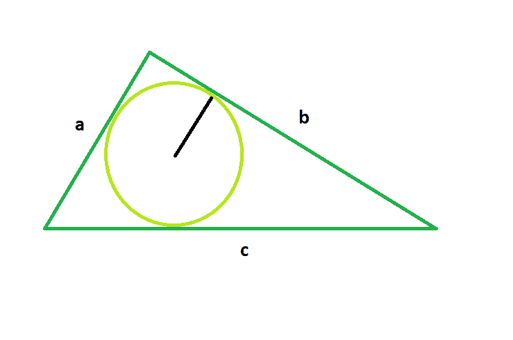

# 求三角形内圆半径的程序

> 原文:[https://www . geesforgeks . org/program-to-find-the-radius-in circle-of-the-triangle/](https://www.geeksforgeeks.org/program-to-find-the-radius-of-the-incircle-of-the-triangle/)

给定一个圆，它是边为 **a** 、 **b <** 和 **c** 的三角形的内圆，任务是找出这个内圆的半径。

**示例:**

```
Input: a = 2, b = 2, c = 3
Output: 0.566947

Input: a = 3, b = 4, c = 5
Output: 1
```



**进场:**

> **内圆半径=三角形面积/三角形周长的一半**
> 其中:
> 三角形面积= √(p*(p-a)*(p-b)*(p-c)
> 三角形周长= (a + b + c)

下面是上述方法的实现:

## C++

```
// C++ Program to find the radius
// of the incircle of the given triangle

#include <bits/stdc++.h>
using namespace std;

// Function to find the radius
// of the incircle
float findRadiusOfIncircle(float a, float b, float c)
{

    // the sides cannot be negative
    if (a < 0 || b < 0 || c < 0)
        return -1;

    // semi-perimeter of the circle
    float p = (a + b + c) / 2;

    // area of the triangle
    float area = sqrt(p * (p - a) * (p - b) * (p - c));

    // Radius of the incircle
    float radius = area / p;

    // Return the radius
    return radius;
}

// Driver code
int main()
{

    // Get the sides of the triangle
    float a = 2, b = 2, c = 3;

    // Find the radius of the incircle
    cout << findRadiusOfIncircle(a, b, c)
         << endl;

    return 0;
}
```

## Java 语言(一种计算机语言，尤用于创建网站)

```
// Java Program to find the radius
// of the incircle of the given triangle
import java.io.*;

class GFG {

// Function to find the radius
// of the incircle
static float findRadiusOfIncircle(float a, float b, float c)
{

    // the sides cannot be negative
    if (a < 0 || b < 0 || c < 0)
        return -1;

    // semi-perimeter of the circle
    float p = (a + b + c) / 2;

    // area of the triangle
    float area = (float)Math.sqrt(p * (p - a) * (p - b) * (p - c));

    // Radius of the incircle
    float radius = area / p;

    // Return the radius
    return radius;
}

// Driver code

    public static void main (String[] args) {

    // Get the sides of the triangle
    float a = 2, b = 2, c = 3;

    // Find the radius of the incircle
    System.out.println( findRadiusOfIncircle(a, b, c));

    }
}
 // This code is contributed by ajit
```

## 蟒蛇 3

```
# Python Program to find the radius
# of the incircle of the given triangle

# from math lib. import everything
from math import *

# Function to find the radius
# of the incircle
def findRadiusOfIncircle(a, b, c) :

    # the sides cannot be negative
    if (a < 0 or b < 0 or c < 0) :
        return -1

    # semi-perimeter of the circle
    p = (a + b + c) / 2

    # area of the triangle
    area = sqrt(p * (p - a) *
               (p - b) * (p - c))

    # Radius of the incircle
    radius = area / p

    # Return the radius
    return radius

# Driver code    
if __name__ == "__main__" :

    # Get the sides of the triangle
    a, b, c = 2, 2, 3

    # Find the radius of the incircle
    print(round(findRadiusOfIncircle(a, b, c), 6))

# This code is contributed by ANKITRAI1
```

## C#

```
// C# Program to find the radius
// of the incircle of the given triangle
using System;

class GFG
{

// Function to find the radius
// of the incircle
public static float findRadiusOfIncircle(float a,
                                         float b,
                                         float c)
{

    // the sides cannot be negative
    if (a < 0 || b < 0 || c < 0)
        return -1;

    // semi-perimeter of the circle
    float p = (a + b + c) / 2;

    // area of the triangle
    float area = (float)Math.Sqrt(p * (p - a) *
                          (p - b) * (p - c));

    // Radius of the incircle
    float radius = area / p;

    // Return the radius
    return (float)(radius);
}

// Driver code
public static void Main()
{

    // Get the sides of the triangle
    float a = 2, b = 2, c = 3;

    // Find the radius of the incircle
    Console.WriteLine(findRadiusOfIncircle(a, b, c));
}
}

// This code is contributed
// by Shivi_Aggarwal
```

## 服务器端编程语言（Professional Hypertext Preprocessor 的缩写）

```
<?php
// PHP Program to find the radius
// of the incircle of the given triangle

// Function to find the radius
// of the incircle
function findRadiusOfIncircle($a, $b, $c)
{

    // the sides cannot be negative
    if ($a < 0 || $b < 0 || $c < 0)
        return -1;

    // semi-perimeter of the circle
    $p = ($a + $b + $c) / 2;

    // area of the triangle
    $area = sqrt($p * ($p - $a) *
                ($p - $b) * ($p - $c));

    // Radius of the incircle
    $radius = $area / $p;

    // Return the radius
    return $radius;
}

// Driver code

// Get the sides of the triangle
$a = 2; $b = 2; $c = 3;

// Find the radius of the incircle
echo findRadiusOfIncircle($a, $b, $c) . "\n";

// This code is contributed
// by Akanksha Rai(Abby_akku)
```

## java 描述语言

```
<script>

// javascript Program to find the radius
// of the incircle of the given triangle

// Function to find the radius
// of the incircle
function findRadiusOfIncircle(a , b , c)
{

    // the sides cannot be negative
    if (a < 0 || b < 0 || c < 0)
        return -1;

    // semi-perimeter of the circle
    var p = (a + b + c) / 2;

    // area of the triangle
    var area = Math.sqrt(p * (p - a) * (p - b) * (p - c));

    // Radius of the incircle
    var radius = area / p;

    // Return the radius
    return radius;
}

// Driver code

// Get the sides of the triangle
var a = 2, b = 2, c = 3;

// Find the radius of the incircle
document.write( findRadiusOfIncircle(a, b, c).toFixed(6));

// This code contributed by shikhasingrajput

</script>
```

**Output:** 

```
0.566947
```