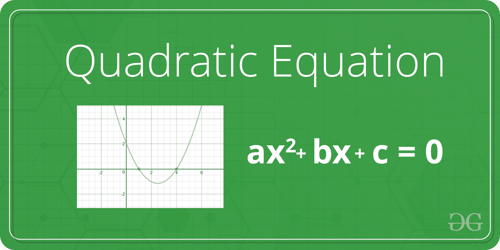

# 求二次方程根的程序

> 原文:[https://www . geesforgeks . org/program-to-find-the-root-of-secondary-equation/](https://www.geeksforgeeks.org/program-to-find-the-roots-of-quadratic-equation/)

给定一个形式为 ax <sup>2</sup> + bx + c 的二次方程，求它的根。



**示例:**

```
Input  :  a = 1, b = -2, c = 1
Output :  Roots are real and same
          1

Input  :  a = 1, b = 7, c = 12
Output :  Roots are real and different
          -3, -4

Input  :  a = 1, b = 1, c = 1
Output :  Roots are complex 
          -0.5 + i1.73205
          -0.5 - i1.73205  
```

下面是求二次方程根的直接公式。


有以下重要案例。

```
If b*b < 4*a*c, then roots are complex
(not real).
For example roots of x2 + x + 1, roots are
-0.5 + i1.73205 and -0.5 - i1.73205

If b*b == 4*a*c, then roots are real 
and both roots are same.
For example, roots of x2 - 2x + 1 are 1 and 1

If b*b > 4*a*c, then roots are real 
and different.
For example, roots of x2 - 7x - 12 are 3 and 4
```

下面是上面公式的实现。

## C

```
/* C program to find roots of a quadratic equation */
#include <math.h>
#include <stdio.h>
#include <stdlib.h>

// Prints roots of quadratic equation ax*2 + bx + x
void findRoots(int a, int b, int c)
{
    // If a is 0, then equation is not quadratic, but
    // linear
    if (a == 0) {
        printf("Invalid");
        return;
    }

    int d = b * b - 4 * a * c;
    double sqrt_val = sqrt(abs(d));

    if (d > 0) {
        printf("Roots are real and different \n");
        printf("%f\n%f", (double)(-b + sqrt_val) / (2 * a),
               (double)(-b - sqrt_val) / (2 * a));
    }
    else if (d == 0) {
        printf("Roots are real and same \n");
        printf("%f", -(double)b / (2 * a));
    }
    else // d < 0
    {
        printf("Roots are complex \n");
        printf("%f + i%f\n%f - i%f", -(double)b / (2 * a),
               sqrt_val/(2 * a), -(double)b / (2 * a), sqrt_val/(2 * a);
    }
}

// Driver code
int main()
{
    int a = 1, b = -7, c = 12;

    // Function call
    findRoots(a, b, c);
    return 0;
}
```

## C++

```
/* C++ program to find roots of a quadratic equation */
#include <bits/stdc++.h>
using namespace std;

// Prints roots of quadratic equation ax*2 + bx + x
void findRoots(int a, int b, int c)
{
    // If a is 0, then equation is not quadratic, but
    // linear
    if (a == 0) {
        cout << "Invalid";
        return;
    }

    int d = b * b - 4 * a * c;
    double sqrt_val = sqrt(abs(d));

    if (d > 0) {
        cout << "Roots are real and different \n";
        cout << (double)(-b + sqrt_val) / (2 * a) << "\n"
             << (double)(-b - sqrt_val) / (2 * a);
    }
    else if (d == 0) {
        cout << "Roots are real and same \n";
        cout << -(double)b / (2 * a);
    }
    else // d < 0
    {
        cout << "Roots are complex \n";
        cout << -(double)b / (2 * a) << " + i" << sqrt_val
             << "\n"
             << -(double)b / (2 * a) << " - i" << sqrt_val;
    }
}

// Driver code
int main()
{
    int a = 1, b = -7, c = 12;

    // Function call
    findRoots(a, b, c);
    return 0;
}
```

## Java 语言(一种计算机语言，尤用于创建网站)

```
// Java program to find roots
// of a quadratic equation

import java.io.*;
import static java.lang.Math.*;
class Quadratic {

    // Prints roots of quadratic
    // equation ax * 2 + bx + x
    static void findRoots(int a, int b, int c)
    {
        // If a is 0, then equation is not
        // quadratic, but linear

        if (a == 0) {
            System.out.println("Invalid");
            return;
        }

        int d = b * b - 4 * a * c;
        double sqrt_val = sqrt(abs(d));

        if (d > 0) {
            System.out.println(
                "Roots are real and different \n");

            System.out.println(
                (double)(-b + sqrt_val) / (2 * a) + "\n"
                + (double)(-b - sqrt_val) / (2 * a));
        }
        else if (d == 0) {
            System.out.println(
                "Roots are real and same \n");

            System.out.println(-(double)b / (2 * a) + "\n"
                               + -(double)b / (2 * a));
        }
        else // d < 0
        {
            System.out.println("Roots are complex \n");

            System.out.println(-(double)b / (2 * a) + " + i"
                               + sqrt_val + "\n"
                               + -(double)b / (2 * a)
                               + " - i" + sqrt_val);
        }
    }

    // Driver code
    public static void main(String args[])
    {

        int a = 1, b = -7, c = 12;

        // Function call
        findRoots(a, b, c);
    }
}

// This code is contributed by Sumit Kumar.
```

## 蟒蛇 3

```
# Python program to find roots
# of a quadratic equation
import math

# Prints roots of quadratic equation
# ax*2 + bx + x

def findRoots(a, b, c):

    # If a is 0, then equation is
    # not quadratic, but linear
    if a == 0:
        print("Invalid")
        return -1
    d = b * b - 4 * a * c
    sqrt_val = math.sqrt(abs(d))

    if d > 0:
        print("Roots are real and different ")
        print((-b + sqrt_val)/(2 * a))
        print((-b - sqrt_val)/(2 * a))
    elif d == 0:
        print("Roots are real and same")
        print(-b / (2*a))
    else:  # d<0
        print("Roots are complex")
        print(- b / (2*a), " + i", sqrt_val)
        print(- b / (2*a), " - i", sqrt_val)

# Driver Program
a = 1
b = -7
c = 12

# Function call
findRoots(a, b, c)

# This code is contributed by Sharad Bhardwaj.
```

## C#

```
// C# program to find roots
// of a quadratic equation
using System;

class Quadratic {

    // Prints roots of quadratic
    // equation ax * 2 + bx + x
    void findRoots(int a, int b, int c)
    {

        // If a is 0, then equation is
        // not quadratic, but linear

        if (a == 0) {
            Console.Write("Invalid");
            return;
        }

        int d = b * b - 4 * a * c;
        double sqrt_val = Math.Abs(d);

        if (d > 0) {
            Console.Write(
                "Roots are real and different \n");

            Console.Write(
                (double)(-b + sqrt_val) / (2 * a) + "\n"
                + (double)(-b - sqrt_val) / (2 * a));
        }

        // d < 0
        else {
            Console.Write("Roots are complex \n");

            Console.Write(-(double)b / (2 * a) + " + i"
                          + sqrt_val + "\n"
                          + -(double)b / (2 * a) + " - i"
                          + sqrt_val);
        }
    }

    // Driver code
    public static void Main()
    {
        Quadratic obj = new Quadratic();
        int a = 1, b = -7, c = 12;

        // Function call
        obj.findRoots(a, b, c);
    }
}

// This code is contributed by nitin mittal.
```

## 服务器端编程语言（Professional Hypertext Preprocessor 的缩写）

```
<?php
// PHP program to find roots
// of a quadratic equation

// Prints roots of quadratic
// equation ax*2 + bx + x
function findRoots($a, $b, $c)
{
    // If a is 0, then equation is
    // not quadratic, but linear
    if ($a == 0)
    {
        echo "Invalid";
        return;
    }

    $d = $b * $b - 4 * $a * $c;
    $sqrt_val = sqrt(abs($d));

    if ($d > 0)
    {
        echo "Roots are real and ".
                    "different \n";
        echo (-$b + $sqrt_val) / (2 * $a) , "\n",
             (-$b - $sqrt_val) / (2 * $a);
    }
    else if ($d == 0)
    {
        echo "Roots are real and same \n";
        echo -$b / (2 * $a);
    }

    // d < 0
    else
    {
        echo "Roots are complex \n";
        echo -$b / (2 * $a) , " + i" ,
              $sqrt_val, "\n" , -$b / (2 * $a),
                             " - i", $sqrt_val;
    }
}

// Driver code
$a = 1; $b = -7 ;$c = 12;

// Function call
findRoots($a, $b, $c);

// This code is contributed
// by nitin mittal.
?>
```

## java 描述语言

```
<script>

// JavaScript program to find roots
// of a quadratic equation

    // Prints roots of quadratic
    // equation ax * 2 + bx + x
    function findRoots(a, b, c)
    {
        // If a is 0, then equation is not
        // quadratic, but linear

        if (a == 0) {
            document.write("Invalid");
            return;
        }

        let d = b * b - 4 * a * c;
        let sqrt_val = Math.sqrt(Math.abs(d));

        if (d > 0) {
            document.write(
                "Roots are real and different \n" + "<br/>");

            document.write(
                (-b + sqrt_val) / (2 * a) + "<br/>"
                + (-b - sqrt_val) / (2 * a));
        }
        else if (d == 0) {
            document.write(
                "Roots are real and same \n" + "<br/>");

            document.write(-b / (2 * a) + "<br/>"
                               + -b / (2 * a)) ;
        }
        else // d < 0
        {
            document.write("Roots are complex \n");

            document.write(-b / (2 * a) + " + i"
                               + sqrt_val + "<br/>"
                               + -b / (2 * a)
                               + " - i" + sqrt_val);
        }
    }

// Driver Code

        let a = 1, b = -7, c = 12;

        // Function call
        findRoots(a, b, c);

</script>
```

**Output**

```
Roots are real and different 
4.000000
3.000000
```

This article is contributed by **Dheeraj Gupta**. Please write comments if you find anything incorrect, or hare more information about the topic discussed above.