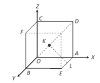

# 求立方体对角线与边斜最短距离的程序

> 原文:[https://www . geeksforgeeks . org/program-to-find-cube 的对角线与边之间的最短距离-skew/](https://www.geeksforgeeks.org/program-to-find-the-shortest-distance-between-diagonal-and-edge-skew-of-a-cube/)

给定一个整数 **A** ，表示一个立方体的长度，任务是找出一个立方体的对角线与它的一条边斜交之间的最短距离，即下图中的 **KL** 。



**示例:**

> **输入:** A = 2
> **输出:** 1.4142
> **说明:**
> KL 的长度= A/√2
> KL 的长度= 2 / 1.41 = 1.4142
> 
> **输入:**A = 3
> T3】输出: 2.1213

**方法:**解决问题的思路基于以下数学公式:

> 让我们画一条从 K 到立方体下表面的垂线作为 Q.
> 利用三角形 QKL 中的勾股定理，
> 
> KL <sup>2</sup> =等级 <sup>2</sup> + QL <sup>2</sup>
> 
> l<sup>2</sup>=(a/2)<sup>2</sup>+(a/2)<sup>2</sup>
> 
> l <sup>2</sup> = 2 * (a/2) <sup>2</sup>
> 
> **l = a / sqrt(2)**

下面是上述方法的实现:

## C++

```
// C++ program for the above approach

#include <bits/stdc++.h>
using namespace std;

// Function to find the shortest distance
// between the diagonal of a cube and
// an edge skew to it
float diagonalLength(float a)
{
    // Stores the required distance
    float L = a / sqrt(2);

    // Print the required distance
    cout << L;
}

// Driver Code
int main()
{
    // Given side of the cube
    float a = 2;

    // Function call to find the shortest
    // distance between the diagonal of a
    // cube and an edge skew to it
    diagonalLength(a);

    return 0;
}
```

## Java 语言(一种计算机语言，尤用于创建网站)

```
// Java program for the above approach

class GFG {

    // Function to find the shortest
    // distance between the diagonal of a
    // cube and an edge skew to it
    static void diagonalLength(float a)
    {
        // Stores the required distance
        float L = a / (float)Math.sqrt(2);

        // Print the required distance
        System.out.println(L);
    }

    // Driver Code
    public static void main(String[] args)
    {
        // Given side of the cube
        float a = 2;

        // Function call to find the shortest
        // distance between the diagonal of a
        // cube and an edge skew to it
        diagonalLength(a);
    }
}
```

## 蟒蛇 3

```
# Python3 program for the above approach

from math import sqrt

# Function to find the shortest
# distance between the diagonal of a
# cube and an edge skew to it
def diagonalLength(a):

    # Stores the required distance
    L = a / sqrt(2)

    # Print the required distance
    print(L)

# Given side of the cube
a = 2

# Function call to find the shortest
# distance between the diagonal of a
# cube and an edge skew to it
diagonalLength(a)
```

## C#

```
// C# program for the above approach

using System;
class GFG {

    // Function to find the shortest
    // distance between the diagonal of a
    // cube and an edge skew to it
    static void diagonalLength(float a)
    {
        // Stores the required distance
        float L = a / (float)Math.Sqrt(2);

        // Print the required distance
        Console.Write(L);
    }

    // Driver Code
    public static void Main()
    {
        // Given side of the cube
        float a = 2;

        // Function call to find the shortest
        // distance between the diagonal of a
        // cube and an edge skew to it
        diagonalLength(a);
    }
}
```

## 服务器端编程语言（Professional Hypertext Preprocessor 的缩写）

```
<?php
// PHP program for the above approach

// Function to find the shortest
// distance between the diagonal of a
// cube and an edge skew to it
function diagonalLength($a)
{
    // Stores the required distance
    $L = $a / sqrt(2);

    # Print the required distance
    echo $L;
}

// Given side of the cube
$a = 2;

// Function call to find the shortest
// distance between the diagonal of a
// cube and an edge skew to it
diagonalLength($a);

?>
```

## java 描述语言

```
<script>
// javascript program for the above approach

// Function to find the shortest distance
// between the diagonal of a cube and
// an edge skew to it
function diagonalLength( a)
{

    // Stores the required distance
    let L = a / Math.sqrt(2);

    // Print the required distance
     document.write( L.toFixed(5));
}

// Driver Code

    // Given side of the cube
    let a = 2;

    // Function call to find the shortest
    // distance between the diagonal of a
    // cube and an edge skew to it
    diagonalLength(a);

// This code is contributed by todaysgaurav

</script>
```

**Output:** 

```
1.41421
```

***时间复杂度:**O(1)*
T5**辅助空间:** O(1)