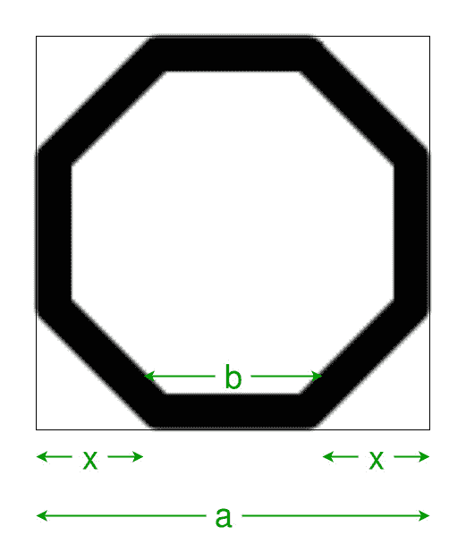

# 程序寻找正方形内接的八边形的边

> 原文:[https://www . geeksforgeeks . org/program-to-find-the-side-of-the-the-the-the-octagon-in-square/](https://www.geeksforgeeks.org/program-to-find-the-side-of-the-octagon-inscribed-within-the-square/)

给定一个边长为 a 的正方形，任务是找出可在其中内接的最大八边形的边长。
**例:**

```
Input: a = 4
Output: 1.65685

Input: a = 5
Output: 2.07107
```



**接近** :

> = >从图中可以看出，**八边形的边长= b**
> = >同样由于多边形是规则的，因此**2 * x+b = a**t5】=>从直角三角形中，**x^2+x^2 = b^2**t8 =>遂， **x = b/√2** ，
> = > So， **√2b + b = a**

以下是上述方法的实现:

## C++

```
// C++ Program to find the side of the octagon
// which can be inscribed within the square

#include <bits/stdc++.h>
using namespace std;

// Function to find the side
// of the octagon
float octaside(float a)
{

    // side cannot be negative
    if (a < 0)
        return -1;

    // side of the octagon
    float s = a / (sqrt(2) + 1);
    return s;
}

// Driver code
int main()
{

    // Get he square side
    float a = 4;

    // Find the side length of the square
    cout << octaside(a) << endl;

    return 0;
}
```

## Java 语言(一种计算机语言，尤用于创建网站)

```
// Java Program to find the side of the octagon
// which can be inscribed within the square

import java.io.*;

class GFG {

// Function to find the side
// of the octagon
static double octaside(double a)
{

    // side cannot be negative
    if (a < 0)
        return -1;

    // side of the octagon
    double s = a / (Math.sqrt(2) + 1);
    return s;
}

// Driver code

    public static void main (String[] args) {

    // Get he square side
    double a = 4;

    // Find the side length of the square
    System.out.println( octaside(a));

    }
}
//This Code  is contributed by ajit
```

## 蟒蛇 3

```
# Python 3 Program to find the side
# of the octagon which can be
# inscribed within the square
from math import sqrt

# Function to find the side
# of the octagon
def octaside(a):

    # side cannot be negative
    if a < 0:
        return -1

    # side of the octagon
    s = a / (sqrt(2) + 1)
    return s

# Driver code
if __name__ == '__main__':

    # Get he square side
    a = 4

    # Find the side length of the square
    print("{0:.6}".format(octaside(a)))

# This code is contributed
# by Surendra_Gangwar
```

## C#

```
// C# Program to find the side
// of the octagon which can be
// inscribed within the square
using System;

class GFG
{

// Function to find the side
// of the octagon
static double octaside(double a)
{

    // side cannot be negative
    if (a < 0)
        return -1;

    // side of the octagon
    double s = a / (Math.Sqrt(2) + 1);
    return s;
}

// Driver code
static public void Main ()
{
    // Get he square side
    double a = 4;

    // Find the side length
    // of the square
    Console.WriteLine( octaside(a));
}
}

// This code is contributed
// by akt_mit
```

## 服务器端编程语言（Professional Hypertext Preprocessor 的缩写）

```
<?php
// PHP  Program to find the side of the octagon
// which can be inscribed within the square

// Function to find the side
// of the octagon
function octaside($a)
{

    // side cannot be negative
    if ($a < 0)
        return -1;

    // side of the octagon
     $s = $a / (sqrt(2) + 1);
    return $s;
}

// Driver code

    // Get he square side
    $a = 4;

    // Find the side length of the square
    echo  octaside($a);

// This code is contributed by ajit
?>
```

## java 描述语言

```
<script>
// javascript Program to find the side of the octagon
// which can be inscribed within the square

// Function to find the side
// of the octagon
function octaside(a)
{

    // side cannot be negative
    if (a < 0)
        return -1;

    // side of the octagon
    var s = a / (Math.sqrt(2) + 1);
    return s;
}

// Driver code

// Get he square side
var a = 4;

// Find the side length of the square
document.write( octaside(a).toFixed(5));

// This code is contributed by shikhasingrajput
</script>
```

**Output:** 

```
1.65685
```