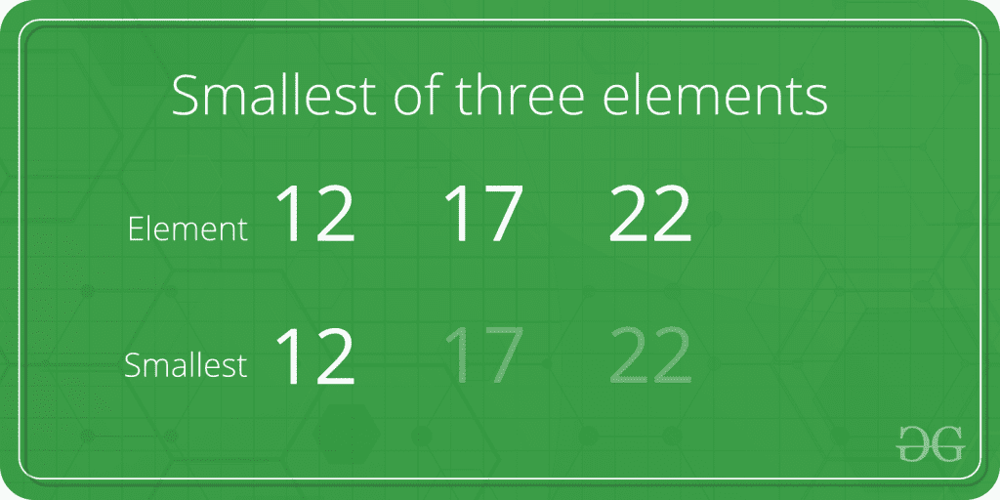

# 程序寻找三个元素中最小的元素

> 原文:[https://www . geesforgeks . org/program-to-find-三元素中最小的元素/](https://www.geeksforgeeks.org/program-to-find-the-smallest-element-among-three-elements/)

给定三个数字。任务是在给定的三个数字中找出最小的。



**例:**

```
Input: first = 15, second = 16, third = 10
Output: 10

Input: first = 5, second = 3, third = 6
Output: 3
```

**进场:**

1.  检查第一个元素是否小于第二个和第三个元素。如果是，那么打印出来。
2.  否则，检查第二个元素是否小于第一个和第三个元素。如果是，那么打印出来。
3.  否则第三个是最小的元素，打印出来。

以下是上述方法的实现:

## C++

```
// C++ implementation to find
// the smallest of three elements
#include <bits/stdc++.h>
using namespace std;

int main()
{
    int a = 5, b = 7, c = 10;

    if (a <= b && a <= c)
        cout << a << " is the smallest";

    else if (b <= a && b <= c)
        cout << b << " is the smallest";

    else
        cout << c << " is the smallest";

    return 0;
}
```

## Java 语言(一种计算机语言，尤用于创建网站)

```
// Java implementation to find
// the smallest of three elements

import java.io.*;

class GFG {

    public static void main (String[] args) {
            int a = 5, b = 7, c = 10;

    if (a <= b && a <= c)
        System.out.println( a + " is the smallest");

    else if (b <= a && b <= c)
        System.out.println( b + " is the smallest");

    else
        System.out.println( c + " is the smallest");

    }
}
// This code is contributed by shs..
```

## 蟒蛇 3

```
# Python implementation to find
# the smallest of three elements

a, b, c = 5, 7, 10

if(a <= b and a <= c):
    print(a, "is the smallest")

elif(b <= a and b <= c):
    print(b, "is the smallest")
else:
    print(c, "is the smallest")

# This code is contributed
# by 29AjayKumar
```

## C#

```
// C# implementation to find
// the smallest of three elements
using System;

class GFG
{
static public void Main ()
{
int a = 5, b = 7, c = 10;
if (a <= b && a <= c)
    Console.WriteLine( a + " is the smallest");

else if (b <= a && b <= c)
    Console.WriteLine( b + " is the smallest");

else
    Console.WriteLine( c + " is the smallest");
}
}

// This code is contributed by jit_t
```

## 服务器端编程语言（Professional Hypertext Preprocessor 的缩写）

```
<?php
// PHP implementation to find
// the smallest of three elements

// Driver Code
$a = 5; $b = 7; $c = 10;

if ($a <= $b && $a <= $c)
    echo $a . " is the smallest";

else if ($b <= $a && $b <= $c)
    echo $b . " is the smallest";

else
    echo $c . " is the smallest";

// This code is contributed
// by Akanksha Rai
```

## java 描述语言

```
<script>
    // Javascript implementation to find
    // the smallest of three elements

    let a = 5, b = 7, c = 10;
    if (a <= b && a <= c)
        document.write( a + " is the smallest");

    else if (b <= a && b <= c)
        document.write( b + " is the smallest");

    else
        document.write( c + " is the smallest");

</script>
```

**Output:** 

```
5 is the smallest
```

**时间复杂度:** O(1)