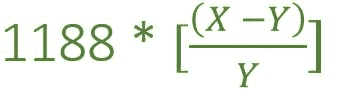

# 根据声速计算列车速度的程序

> 原文:[https://www . geeksforgeeks . org/program-to-find-火车速度按声音速度计算/](https://www.geeksforgeeks.org/program-to-find-the-speed-of-train-as-per-speed-of-sound/)

两枪从同一地点发射，间隔为**‘X’**分钟。坐火车接近拍摄地点的人每隔**【Y】**分钟听到拍摄声音，任务是找到**即火车的速度。
**注:**声音在空气中的速度在固定值为 330 米/秒。**

****示例:****

> ****输入:** X = 14 分钟，Y = 13.5 分钟
> T3】输出: S = 44 公里/小时**
> 
> ****输入:** X = 8 分钟，Y = 7.2 分钟
> T3】输出: S = 132 公里/小时**

****进场:**举第一个例子，**

*   **Y 分钟内列车行驶距离
    =声音行驶距离(X–Y)分钟
    = 330 *(X–Y)* 60 分钟(距离=声音速度*时间)**
*   **列车速度
    =(330 *(X–Y)* 60)/Y(速度=距离/时间)
    =(330 * 60 *(X–Y))/1000 *(60/Y)
    = 1188[(X–Y)/Y]公里/小时**
*   **现在，根据第一个例子
    时差即(X–Y)= 14.00–13.30 = 30 秒
    列车速度= 1188 *[(14–13.5)/13.5]= 44 公里/小时**
*   **这可以通过以下公式计算:** 

****

**下面是上述方法的实现。**

## **C++**

```
// C++ implementation of the approach

#include <bits/stdc++.h>
using namespace std;

// Function to find the
// Speed of train
float speedOfTrain(float X, float Y)
{

    float Speed = 0;

    Speed = 1188 * ((X - Y) / Y);

    return Speed;
}

// Driver code
int main()
{
    float X = 8, Y = 7.2;

    // calling Function
    cout << speedOfTrain(X, Y)
         << " km/hr";

    return 0;
}
```

## **Java 语言(一种计算机语言，尤用于创建网站)**

```
// Java implementation of the approach
class GFG
{

    // Function to find the
    // Speed of train
    static int speedOfTrain(float X, float Y)
    {
        float Speed;

        Speed = 1188 * ((X - Y) / Y);

        return (int)Speed;
    }

    // Driver code
    public static void main(String[] args)
    {
        float X = 8f, Y = 7.2f;

        // calling Function
        int result = (speedOfTrain(X, Y));
        System.out.println(result + " km/hr");
    }
}

// This code is contributed by PrinciRaj1992
```

## **蟒蛇 3**

```
# Python3 implementation of the approach
from math import ceil

# Function to find the
# Speed of train
def speedOfTrain(X, Y):
    Speed = 0

    Speed = 1188 * ((X - Y) / Y)

    return Speed

# Driver code
if __name__ == '__main__':
    X = 8
    Y = 7.2

    # calling Function
    print(ceil(speedOfTrain(X, Y)),
                   end = " km/hr")

# This code is contributed by
# Surendra_Gangwar
```

## **C#**

```
// C# implementation of the approach
using System;

class GFG
{

    // Function to find the
    // Speed of train
    static int speedOfTrain(float X, float Y)
    {
        float Speed;

        Speed = 1188 * ((X - Y) / Y);

        return (int)Speed;
    }

    // Driver code
    public static void Main()
    {
        float X = 8f, Y = 7.2f;

        // calling Function
        int result = (speedOfTrain(X, Y));
        Console.Write(result + " km/hr");
    }
}

// This code is contributed by anuj_67..
```

## **java 描述语言**

```
<script>

// Javascript implementation of the approach

// Function to find the
// Speed of train
function speedOfTrain(X, Y)
{
    var Speed;

    Speed = 1188 * ((X - Y) / Y);

    return Speed;
}

// Driver Code
var X = 8, Y = 7.2;

// Calling Function
var result = (speedOfTrain(X, Y));
document.write(Math.round(result) + " km/hr");

// This code is contributed by Ankita saini

</script>
```

****Output:** 

```
132 km/hr
```**