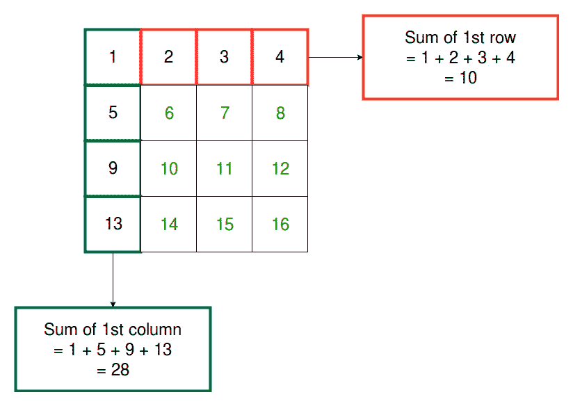

# 求矩阵每行每列之和的程序

> 原文:[https://www . geesforgeks . org/program-to-find-矩阵每行每列之和/](https://www.geeksforgeeks.org/program-to-find-the-sum-of-each-row-and-each-column-of-a-matrix/)

给定一个 m×n 阶的矩阵，任务是求矩阵每行和每列的和。

**示例:**

```
Input: array[4][4] = { {1, 1, 1, 1}, 
                       {2, 2, 2, 2}, 
                       {3, 3, 3, 3}, 
                       {4, 4, 4, 4}};
Output: Sum of the 0 row is = 4
        Sum of the 1 row is = 8
        Sum of the 2 row is = 12
        Sum of the 3 row is = 16
        Sum of the 0 column is = 10
        Sum of the 1 column is = 10
        Sum of the 2 column is = 10
        Sum of the 3 column is = 10
```

**进场:**



每行和每列的总和可以通过遍历矩阵并将元素相加来计算。

下面是上述方法的实现:

## C++

```
// C++ program to find the sum
// of each row and column of a matrix

#include <iostream>
using namespace std;

// Get the size m and n
#define m 4
#define n 4

// Function to calculate sum of each row
void row_sum(int arr[m][n])
{

    int i,j,sum = 0;

    cout << "\nFinding Sum of each row:\n\n";

    // finding the row sum
    for (i = 0; i < m; ++i) {
        for (j = 0; j < n; ++j) {

            // Add the element
            sum = sum + arr[i][j];
        }

        // Print the row sum
        cout
            << "Sum of the row "
            << i << " = " << sum
            << endl;

        // Reset the sum
        sum = 0;
    }
}

// Function to calculate sum of each column
void column_sum(int arr[m][n])
{

    int i,j,sum = 0;

    cout << "\nFinding Sum of each column:\n\n";

    // finding the column sum
    for (i = 0; i < m; ++i) {
        for (j = 0; j < n; ++j) {

            // Add the element
            sum = sum + arr[j][i];
        }

        // Print the column sum
        cout
            << "Sum of the column "
            << i << " = " << sum
            << endl;

        // Reset the sum
        sum = 0;
    }
}

// Driver code
int main()
{

    int i,j;
    int arr[m][n];

    // Get the matrix elements
    int x = 1;
    for (i = 0; i < m; i++)
        for (j = 0; j < n; j++)
            arr[i][j] = x++;

    // Get each row sum
    row_sum(arr);

    // Get each column sum
    column_sum(arr);

    return 0;
}
```

## Java 语言(一种计算机语言，尤用于创建网站)

```
// Java program to find the sum
// of each row and column of a matrix

import java.io.*;

class GFG {

    // Get the size m and n
    static int m = 4;
    static int n = 4;

    // Function to calculate sum of each row
    static void row_sum(int arr[][])
    {

        int i, j, sum = 0;

        System.out.print("\nFinding Sum of each row:\n\n");

        // finding the row sum
        for (i = 0; i < m; ++i) {
            for (j = 0; j < n; ++j) {

                // Add the element
                sum = sum + arr[i][j];
            }

            // Print the row sum
            System.out.println("Sum of the row " + i + " = "
                               + sum);

            // Reset the sum
            sum = 0;
        }
    }

    // Function to calculate sum of each column
    static void column_sum(int arr[][])
    {

        int i, j, sum = 0;

        System.out.print(
            "\nFinding Sum of each column:\n\n");

        // finding the column sum
        for (i = 0; i < m; ++i) {
            for (j = 0; j < n; ++j) {

                // Add the element
                sum = sum + arr[j][i];
            }

            // Print the column sum
            System.out.println("Sum of the column " + i
                               + " = " + sum);

            // Reset the sum
            sum = 0;
        }
    }

    // Driver code
    public static void main(String[] args)
    {
        int i, j;
        int[][] arr = new int[m][n];

        // Get the matrix elements
        int x = 1;
        for (i = 0; i < m; i++)
            for (j = 0; j < n; j++)
                arr[i][j] = x++;

        // Get each row sum
        row_sum(arr);

        // Get each column sum
        column_sum(arr);
    }
}
// This code is contributed by inder_verma..
```

## 蟒蛇 3

```
# Python3 program to find the sum
# of each row and column of a matrix

# import numpy library as np alias
import numpy as np

# Get the size m and n
m , n = 4, 4       

# Function to calculate sum of each row
def row_sum(arr) :

    sum = 0

    print("\nFinding Sum of each row:\n")

    # finding the row sum
    for i in range(m) :
        for j in range(n) :

            # Add the element
            sum += arr[i][j]

        # Print the row sum
        print("Sum of the row",i,"=",sum)

        # Reset the sum
        sum = 0

# Function to calculate sum of each column
def column_sum(arr) :

    sum = 0

    print("\nFinding Sum of each column:\n")

    # finding the column sum
    for i in range(m) :
        for j in range(n) :

            # Add the element
            sum += arr[j][i]

        # Print the column sum
        print("Sum of the column",i,"=",sum)

        # Reset the sum
        sum = 0

# Driver code    
if __name__ == "__main__" :

    arr = np.zeros((4, 4))

    # Get the matrix elements
    x = 1

    for i in range(m) :
        for j in range(n) :
            arr[i][j] = x

            x += 1

    # Get each row sum
    row_sum(arr)

    # Get each column sum
    column_sum(arr)

# This code is contributed by
# ANKITRAI1
```

## C#

```
// C# program to find the sum
// of each row and column of a matrix
using System;

class GFG {

    // Get the size m and n
    static int m = 4;
    static int n = 4;

    // Function to calculate sum of each row
    static void row_sum(int[, ] arr)
    {

        int i, j, sum = 0;

        Console.Write("\nFinding Sum of each row:\n\n");

        // finding the row sum
        for (i = 0; i < m; ++i) {
            for (j = 0; j < n; ++j) {

                // Add the element
                sum = sum + arr[i, j];
            }

            // Print the row sum
            Console.WriteLine("Sum of the row " + i + " = "
                              + sum);

            // Reset the sum
            sum = 0;
        }
    }

    // Function to calculate sum
    // of each column
    static void column_sum(int[, ] arr)
    {

        int i, j, sum = 0;

        Console.Write("\nFinding Sum of each"
                      + " column:\n\n");

        // finding the column sum
        for (i = 0; i < m; ++i) {
            for (j = 0; j < n; ++j) {

                // Add the element
                sum = sum + arr[j, i];
            }

            // Print the column sum
            Console.WriteLine("Sum of the column " + i
                              + " = " + sum);

            // Reset the sum
            sum = 0;
        }
    }

    // Driver code
    public static void Main()
    {
        int i, j;
        int[, ] arr = new int[m, n];

        // Get the matrix elements
        int x = 1;
        for (i = 0; i < m; i++)
            for (j = 0; j < n; j++)
                arr[i, j] = x++;

        // Get each row sum
        row_sum(arr);

        // Get each column sum
        column_sum(arr);
    }
}

// This code is contributed
// by Akanksha Rai(Abby_akku)
```

## 服务器端编程语言（Professional Hypertext Preprocessor 的缩写）

```
<?php
// PHP program to find the sum
// of each row and column of a matrix

// Get the size m and n
$m = 4;
$n = 4;

// Function to calculate sum of each row
function row_sum(&$arr)
{
    $sum = 0;

    echo "Finding Sum of each row:\n\n";

    // finding the row sum
    for ($i = 0; $i < m; ++$i)
    {
        for ($j = 0; $j < n; ++$j)
        {

            // Add the element
            $sum = $sum + $arr[$i][$j];
        }

        // Print the row sum
        echo "Sum of the row " . $i .
             " = " . $sum . "\n";

        // Reset the sum
        $sum = 0;
    }
}

// Function to calculate sum of each column
function column_sum(&$arr)
{
    $sum = 0;

    echo "\nFinding Sum of each column:\n\n";

    // finding the column sum
    for ($i = 0; $i < m; ++$i)
    {
        for ($j = 0; $j < n; ++$j)
        {

            // Add the element
            $sum = $sum + $arr[$j][$i];
        }

        // Print the column sum
        echo "Sum of the column " . $i .
                    " = " . $sum . "\n";

        // Reset the sum
        $sum = 0;
    }
}

// Driver code
$arr = array_fill(0, $m, array_fill(0, $n, NULL));

// Get the matrix elements
$x = 1;
for ($i = 0; $i < $m; $i++)
    for ($j = 0; $j < $n; $j++)
        $arr[$i][$j] = $x++;

// Get each row sum
row_sum($arr);

// Get each column sum
column_sum($arr);

// This code is contributed by ita_c
?>
```

## java 描述语言

```
<script>
// Get the size m and n
var m= 4;
var n= 4;

// Function to calculate sum of each row
function row_sum( arr)
{

    var i,j,sum = 0;

    document.write("<br>"+ "\nFinding Sum of each row:"+"<br>");

    // finding the row sum
    for (i = 0; i < m; ++i) {
        for (j = 0; j < n; ++j) {

            // Add the element
            sum = sum + arr[i][j];
        }

        // Print the row sum
        document.write( "Sum of the row "
            + i + " = " + sum
            +"<br>");

        // Reset the sum
        sum = 0;
    }
}

// Function to calculate sum of each column
function column_sum(arr)
{

    var i,j,sum = 0;

    document.write( "<br>"+"Finding Sum of each column:"+"<br>");

    // finding the column sum
    for (i = 0; i < m; ++i) {
        for (j = 0; j < n; ++j) {

            // Add the element
            sum = sum + arr[j][i];
        }

        // Print the column sum
        document.write( "Sum of the column "
            + i +" = " + sum
            +"<br>");

        // Reset the sum
        sum = 0;
    }
}

    var i,j;
    var arr=new Array(m).fill(0);
    for(var k=0;k<m;k++)
    {
        arr[k]=new Array(n).fill(0);
    }

    // Get the matrix elements
    var x = 1;
    for (i = 0; i < m; i++)
        for (j = 0; j < n; j++)
            arr[i][j]=  x++;

    // Get each row sum
    row_sum(arr);
//document.write(arr[0][0]);
    // Get each column sum
    column_sum(arr);

</script>
```

**Output:** 

```
Finding Sum of each row:

Sum of the row 0 = 10
Sum of the row 1 = 26
Sum of the row 2 = 42
Sum of the row 3 = 58

Finding Sum of each column:

Sum of the column 0 = 28
Sum of the column 1 = 32
Sum of the column 2 = 36
Sum of the column 3 = 40
```