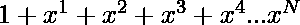

# 求数列 1 + x + x^2+ x^3+之和的程序..+ x^n

> 原文:[https://www . geesforgeks . org/program-to-find-the-sum-series-1-x-x2-x3-xn/](https://www.geeksforgeeks.org/program-to-find-the-sum-of-the-series-1-x-x2-x3-xn/)

给定一个整数 **X** ，任务是打印数列，求数列之和
**示例:**

> **输入:** X = 2，N = 5
> **输出:**总和= 31
> 1 2 4 8 16
> **输入:** X = 1，N = 10
> **输出:**总和= 10
> 1 1 1 1 1 1 1 1 1

**方法:**思路是遍历数列，计算数列 N 项之和。该系列的第 N <sup>项可计算为:</sup> 

> N <sup>第</sup>项= (N-1) <sup>第</sup>项* X

以下是上述方法的实现:

## C++

```
// C++ implementation to find
// sum of series of
// 1 + x^2 + x^3 + ....+ x^n

#include <bits/stdc++.h>

using namespace std;

// Function to find the sum of
// the series and print N terms
// of the given series
double sum(int x, int n)
{
    double i, total = 1.0, multi = x;

    // First Term
    cout << total << " ";

    // Loop to print the N terms
    // of the series and find their sum
    for (i = 1; i < n; i++) {

        total = total + multi;
        cout << multi << " ";
        multi = multi * x;
    }

    cout << "\n";
    return total;
}

// Driver code
int main()
{
    int x = 2;
    int n = 5;
    cout << fixed
         << setprecision(2)
         << sum(x, n);
    return 0;
}
```

## C

```
// C implementation to find the sum
// of series 1 + x^2 + x^3 + ....+ x^n

#include <math.h>
#include <stdio.h>

// Function to print the sum
// of the series
double sum(int x, int n)
{
    double i, total = 1.0, multi = x;

    // First Term of series
    printf("1 ");

    // Loop to find the N
    // terms of the series
    for (i = 1; i < n; i++) {

        total = total + multi;
        printf("%.1f ", multi);
        multi = multi * x;
    }
    printf("\n");
    return total;
}

// Driver Code
int main()
{
    int x = 2;
    int n = 5;
    printf("%.2f", sum(x, n));
    return 0;
}
```

## Java 语言(一种计算机语言，尤用于创建网站)

```
// Java implementation to find
// the sum of series
// 1 + x^2 + x^3 + ....+ x^n

class GFG {

    // Java code to print the sum
    // of the given series
    static double sum(int x, int n)
    {
        double i, total = 1.0, multi = x;

        // First Term
        System.out.print("1 ");

        // Loop to print the N terms
        // of the series and compute
        // their sum
        for (i = 1; i < n; i++) {
            total = total + multi;
            System.out.print(multi);
            System.out.print(" ");
            multi = multi * x;
        }

        System.out.println();
        return total;
    }

    // Driver Code
    public static void main(String[] args)
    {
        int x = 2;
        int n = 5;
        System.out.printf(
            "%.2f", sum(x, n));
    }
}
```

## 蟒蛇 3

```
# Python3 program to find sum of
# series of 1 + x^2 + x^3 + ....+ x^n

# Function to find the sum of
# the series and print N terms
# of the given series
def sum(x, n):

    total = 1.0
    multi = x

    # First Term
    print(1, end = " ")

    # Loop to print the N terms
    # of the series and find their sum
    for i in range(1, n):

        total = total + multi
        print('%.1f' % multi, end = " ")
        multi = multi * x

    print('\n')
    return total;

# Driver code
x = 2
n = 5
print('%.2f' % sum(x, n))

# This code is contributed by Pratik Basu
```

## C#

```
// C# implementation to find
// the sum of series
// 1 + x^2 + x^3 + ....+ x^n
using System;
class GFG{

// C# code to print the sum
// of the given series
static double sum(int x, int n)
{
    double i, total = 1.0, multi = x;

    // First Term
    Console.Write("1 ");

    // Loop to print the N terms
    // of the series and compute
    // their sum
    for (i = 1; i < n; i++)
    {
        total = total + multi;
        Console.Write(multi);
        Console.Write(" ");
        multi = multi * x;
    }
    Console.WriteLine();
    return total;
}

// Driver Code
public static void Main(String[] args)
{
    int x = 2;
    int n = 5;
    Console.Write("{0:F2}", sum(x, n));
}
}

// This code is contributed by Rajput-Ji
```

## java 描述语言

```
<script>
// JavaScript implementation to find
// sum of series of
// 1 + x^2 + x^3 + ....+ x^n

// Function to find the sum of
// the series and print N terms
// of the given series
function sum(x, n)
{
    let i, total = 1.0, multi = x;

    // First Term
    document.write(total + " ");

    // Loop to print the N terms
    // of the series and find their sum
    for (i = 1; i < n; i++) {

        total = total + multi;
        document.write(multi + " ");
        multi = multi * x;
    }

    document.write("<br>");
    return total;
}

// Driver code
    let x = 2;
    let n = 5;
    document.write(sum(x, n).toFixed(2));

// This code is contributed by Surbhi Tyagi.
</script>
```

**Output:** 

```
1 2.0 4.0 8.0 16.0 
31.00
```

时间复杂度:0(n)

辅助空间:0(1)