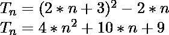
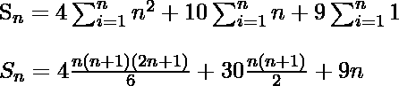

# 程序求数列 23+ 45+ 75+的和…..最新条款

> 原文:[https://www . geesforgeks . org/program-to-find-the-sum-the-series-23-45-75-up-n-terms/](https://www.geeksforgeeks.org/program-to-find-the-sum-of-the-series-23-45-75-upto-n-terms/)

给定一个数字 N，任务是找到下面系列的第 N 项:

> 23 + 45 + 75 + 113 + 159 +……截止条款

**例:**

```
Input: N = 4
Output: 256
Explanation:
Nth term = (2 * N * (N + 1) * (4 * N + 17) + 54 * N) / 6
         = (2 * 4 * (4 + 1) * (4 * 4 + 17) + 54 * 4) / 6
         = 256

Input: N = 10
Output: 2180
```

**方法:**
给定系列的第 n 个术语可以概括为:

这个系列的前 n 个术语之和:

**因此，这个系列的前 n 个术语之和:** 
下面是上述方法的实现:

## C++

```
// CPP program to find sum
// upto N-th term of the series:
// 23, 45, 75, 113...

#include <iostream>
using namespace std;

// calculate Nth term of series
int findSum(int N)
{
    return (2 * N * (N + 1) * (4 * N + 17) + 54 * N) / 6;
}

// Driver Function
int main()
{

    // Get the value of N
    int N = 4;

    // Get the sum of the series
    cout << findSum(N) << endl;

    return 0;
}
```

## Java 语言(一种计算机语言，尤用于创建网站)

```
// Java program to find sum
// upto N-th term of the series:
// 23, 45, 75, 113...
import java.util.*;

class solution
{

static int findSum(int N)
{
    //return the final sum
    return (2 * N * (N + 1) * (4 * N + 17) + 54 * N) / 6;
}

//Driver program
public static void main(String arr[])
{
// Get the value of N
    int N = 4;

// Get the sum of the series
 System.out.println(findSum(N));

}
}
```

## 蟒蛇 3

```
# Python3 program to find sum
# upto N-th term of the series:
# 23, 45, 75, 113...

# calculate Nth term of series
def findSum(N):

    return (2 * N * (N + 1) * (4 * N + 17) + 54 * N) / 6

#Driver Function
if __name__=='__main__':
#Get the value of N
    N = 4

#Get the sum of the series
    print(findSum(N))

#this code is contributed by Shashank_Sharma
```

## C#

```
// C# program to find sum
// upto N-th term of the series:
// 23, 45, 75, 113...
using System;

class GFG
{

static int findSum(int N)
{
    //return the final sum
    return (2 * N * (N + 1) *
           (4 * N + 17) + 54 * N) / 6;
}

// Driver Code
static void Main()
{
    // Get the value of N
    int N = 4;

    // Get the sum of the series
    Console.Write(findSum(N));
}
}

// This code is contributed by Raj
```

## 服务器端编程语言（Professional Hypertext Preprocessor 的缩写）

```
<?php
// PHP program to find sum
// upto N-th term of the series:
// 23, 45, 75, 113...

// calculate Nth term of series
function findSum($N)
{
    return (2 * $N * ($N + 1) *
           (4 * $N + 17) + 54 * $N) / 6;
}

// Driver Code

// Get the value of N
$N = 4;

// Get the sum of the series
echo findSum($N);

// This code is contributed
// by anuj_67
?>
```

## java 描述语言

```
<script>
// javascript program to find sum
// upto N-th term of the series:
// 23, 45, 75, 113...

// calculate Nth term of series
function findSum( N)
{
    return (2 * N * (N + 1) * (4 * N + 17) + 54 * N) / 6;
}

// Driver Function

    // Get the value of N
    let N = 4;

    // Get the sum of the series
    document.write(findSum(N));

// This code is contributed by Rajput-Ji

</script>
```

**Output:** 

```
256
```

**时间复杂度:** O(1)