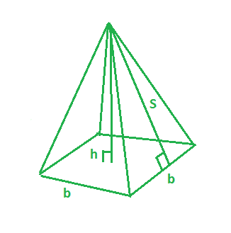
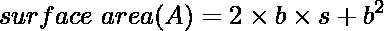

# 程序求方形金字塔的表面积

> 原文:[https://www . geesforgeks . org/program-to-find-the-surface-area-of-the-the-square-棱锥体/](https://www.geeksforgeeks.org/program-to-find-the-surface-area-of-the-square-pyramid/)

给定方形金字塔的基本长度 **(b)** 和倾斜高度 **(s)** 。任务是找到方形金字塔的表面积。有一个正方形底部，4 个三角形面和一个顶点的金字塔是一个正方形金字塔。



**在此图中，**
**b**——方形金字塔的底长。
**s**–方形金字塔的倾斜高度。
**h**–方形金字塔的高度。
**举例:**

```
Input: b = 3, s = 4
Output: 33

Input: b = 4, s = 5
Output: 56
```

**计算曲面的公式**为方形金字塔，其 **(b)** 底长， **(s)** 斜高。



下面是使用上述公式的实现:

## C++

```
// CPP program to find the surface area
// Of Square pyramid
#include <bits/stdc++.h>
using namespace std;

// function to find the surface area
int surfaceArea(int b, int s)
{

    return 2 * b * s + pow(b, 2);
}

// Driver program
int main()
{
    int b = 3, s = 4;

    // surface area of the square pyramid
    cout << surfaceArea(b, s) << endl;
    return 0;
}
```

## Java 语言(一种计算机语言，尤用于创建网站)

```
// Java program to find the surface area
// Of Square pyramid

import java.io.*;

class GFG {

// function to find the surface area
static int surfaceArea(int b, int s)
{

    return 2 * b * s + (int)Math.pow(b, 2);
}

// Driver program

    public static void main (String[] args) {

    int b = 3, s = 4;

    // surface area of the square pyramid
    System.out.println( surfaceArea(b, s));
    }
}
//This code is contributed by anuj_67..
```

## 蟒蛇 3

```
# Python 3 program to find the
# surface area Of Square pyramid

# function to find the surface area
def surfaceArea(b, s):

    return 2 * b * s + pow(b, 2)

# Driver Code
if __name__ == "__main__":
    b = 3
    s = 4

    # surface area of the square pyramid
    print(surfaceArea(b, s))

# This code is contributed
# by ChitraNayal
```

## C#

```
// C# program to find the surface
// area Of Square pyramid
using System;

class GFG
{

// function to find the surface area
static int surfaceArea(int b, int s)
{

    return 2 * b * s + (int)Math.Pow(b, 2);
}

// Driver Code
public static void Main ()
{
    int b = 3, s = 4;

    // surface area of the square pyramid
    Console.WriteLine(surfaceArea(b, s));
}
}

// This code is contributed
// by inder_verma
```

## 服务器端编程语言（Professional Hypertext Preprocessor 的缩写）

```
<?php
// PHP program to find the surface
// area Of Square pyramid

// function to find the surface area
function surfaceArea($b, $s)
{
    return 2 * $b * $s + pow($b, 2);
}

// Driver Code
$b = 3; $s = 4;

// surface area of the
// square pyramid
echo surfaceArea($b, $s);

// This code is contributed
// by anuj_67
?>
```

## java 描述语言

```
<script>
// javascript program to find the surface area
// Of Square pyramid

// function to find the surface area
function surfaceArea(b , s)
{
    return 2 * b * s + parseInt(Math.pow(b, 2));
}

// Driver program
var b = 3, s = 4;

// surface area of the square pyramid
document.write( surfaceArea(b, s));

// This code is contributed by shikhasingrajput
</script>
```

**Output:** 

```
33
```