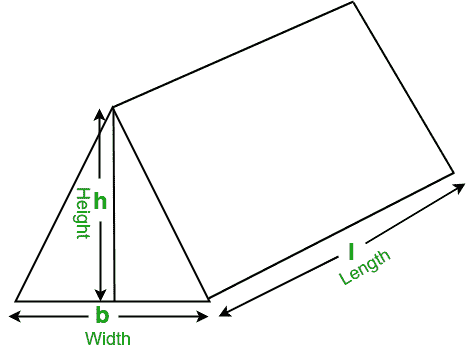

# 计算三棱柱体积的程序

> 原文:[https://www . geeksforgeeks . org/program-to-find-volume-of-a-三棱柱/](https://www.geeksforgeeks.org/program-to-find-the-volume-of-a-triangular-prism/)

给定三棱镜的长度、宽度和高度，任务是找出三棱镜的体积。
示例:

```
Input:  l = 18, b = 12, h = 9
Output: Volume of triangular prism: 972

Input: l = 10, b = 8, h = 6
Output: Volume of triangular prism: 240
```

在数学中，三棱柱是一种三维立体形状，两个相同的末端由相等的平行线连接。三棱柱包含 5 个面、9 条边和 6 个顶点。



求三棱柱体积的公式:

```
Volume = ( l * b * h ) / 2 
```

## C++

```
// CPP program to find the volume
// of the triangular prism
#include <bits/stdc++.h>
using namespace std;

// function to find the Volume
// of triangular prism
float findVolume(float l, float b, float h)
{
    // formula to find Volume
    float volume = (l * b * h) / 2;

    return volume;
}

// Driver Code
int main()
{
    float l = 18, b = 12, h = 9;

    // function calling
    cout << "Volume of triangular prism: "
         << findVolume(l, b, h);

    return 0;
}
```

## Java 语言(一种计算机语言，尤用于创建网站)

```
// Java program to find the volume
// of the triangular prism
import java.io.*;

class GFG {

    // function to find the Volume
    // of triangular prism
    static float findVolume(float l, float b, float h)
    {
        // formula to find Volume
        float volume = (l * b * h) / 2;

        return volume;
    }

    // Driver code
    public static void main(String[] args)
    {
        float l = 18, b = 12, h = 9;

        // function calling
        System.out.println("Volume of triangular prism: "
                           + findVolume(l, b, h));
    }
}
```

## 蟒蛇 3

```
# Python3 program to find the volume
# of the triangular prism

# function to find the Volume
# of triangular prism
def findVolume(l, b, h) :

    # formula to find Volume
    return ((l * b * h) / 2)

# Driver Code
l = 18
b = 12
h = 9

# function calling
print("Volume of triangular prism: ",
                findVolume(l, b, h))
```

## C#

```
// C# program to find the volume
// of the triangular prism
using System;

class GFG {

    // function to find the Volume
    // of triangular prism
    static float findVolume(float l, float b, float h)
    {
        // formula to find Volume
        float volume = (l * b * h) / 2;

        return volume;
    }

    // Driver code
    static public void Main()
    {
        float l = 18, b = 12, h = 9;

        // function calling
        Console.WriteLine("Volume of triangular prism: "
                          + findVolume(l, b, h));
    }
}
```

## 服务器端编程语言（Professional Hypertext Preprocessor 的缩写）

```
<?php
// PHP program to find the volume
// of the triangular prism

// function to find the Volume
// of triangular prism
function findVolume($l, $b, $h)
{
    // formula to find Volume
    $volume = ($l * $b * $h) / 2;

    return $volume;
}

// Driver Code
$l = 18; $b = 12; $h = 9;

// function calling
echo "Volume of triangular prism: "
    . findVolume($l, $b, $h);

?>
```

## java 描述语言

```
<script>
// Javascript program to find the volume
// of the triangular prism

// function to find the Volume
// of triangular prism
function findVolume( l,  b, h)
{

    // formula to find Volume
    let volume = (l * b * h) / 2;

    return volume;
}

// Driver Code
  let l = 18, b = 12, h = 9;

    // function calling
    document.write( "Volume of triangular prism: " + findVolume(l, b, h));

// This code is contributed by todaysgaurav

</script>
```

**Output:** 

```
Volume of triangular prism: 972
```