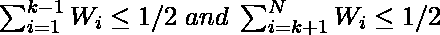
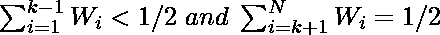

# 计算给定数组加权中值的程序

> 原文:[https://www . geesforgeks . org/program-to-find-加权中值给定数组/](https://www.geeksforgeeks.org/program-to-find-weighted-median-of-a-given-array/)

给定两个[数组](https://www.geeksforgeeks.org/introduction-to-arrays/)**arr【】**的 **N** 整数和**W【】**的 **N** 权重，其中 **W[i]** 是元素 **arr[i]** 的权重。任务是找到给定数组的加权中值。

**注:**所有元素的权重之和永远为 1。

> 让数组 **arr[]** 以递增的顺序排列，并赋予它们相应的权重。
> 
> 如果 N 是奇数，那么只有一个加权中值，比如说**arr【k】**，它满足下面的性质:
> 
> 
> 如果 N 为偶数，则有两个加权中位数，即加权中位数的下限和上限。
> 
> 满足以下条件的元素**arr[k]****下加权中值**:
> 
> 元素 **arr[k]** 上加权中值**满足以下条件:
> **

**示例:**

> **输入:** arr={5，1，3，2，4}，W=[0.25，0.15，0.2，0.1，0.3]
> **输出:**加权中值为元素 4
> **说明:**
> 这里元素个数为奇数，所以只有一个加权中值，因为在 K = 3 时满足上述条件。
> 元素 4 每侧的累计权重分别为 0.45 和 0.25。
> 
> **输入:** arr=[4，1，3，2]，W=[0.25，0.49，0.25，0.01]
> **输出:**
> 下加权中位数为元素 2
> 上加权中位数为元素 3
> **说明:**
> 这里有偶数个元素，所以有两个加权中位数。
> 较低的加权中值位于 K = 2，因为在 K = 2 时，上述条件得到满足，元素 2 每侧的累积权重分别为 0.49 和 0.5。
> 上加权中值位于 K = 3，因为在 K = 3 时，上述条件得到满足，元素 3 每侧的累积权重分别为 0.5 和 0.25。

**方法:**按照以下步骤解决给定问题:

1.  现在来[找到数组的中值](https://www.geeksforgeeks.org/median-of-an-unsorted-array-in-liner-time-on/)**arr【】**以递增的顺序排列它们各自的权重顺序不应该改变。
2.  因此，创建一组[对](https://www.geeksforgeeks.org/sets-of-pairs-in-c/)，其中对的第一个元素将是**arr【I】**，对的第二个元素将是其对应的权重**W【I】**。
3.  然后根据 **arr[]** 值对成对集合进行排序。
4.  如果对的数量是奇数，那么求加权中位数为:
    *   遍历该对集合，并通过添加权重来计算总和。
    *   当总和大于 0.5 时，打印该对的 T2 值。
5.  但是，如果对的数量是偶数，那么找到较低和较高的加权中位数:
    *   对于较低的中间值，从左侧遍历集合对，并通过添加权重来计算总和。
    *   当总和变得**大于或等于 0.5** 时，打印该对的**arr【I】**值。
    *   对于右面集合对上的上中值导线，通过添加权重计算总和。
    *   当总和变得**大于或等于 0.5** 时，打印该对的**arr【I】**值。

下面是上述方法的实现:

## C++14

```
// C++ program for the above approach
#include <bits/stdc++.h>
using namespace std;

// Function to calculate weighted median
void weightedMedian(vector<int> arr,
                    vector<float> W)
{

    // Store pr of arr[i] and W[i]
    vector<pair<int, float>> pr;

    for(int index = 0;
            index < arr.size();
            index++)
        pr.push_back({arr[index],
                        W[index]});

    // Sort the list of pr w.r.t.
    // to their arr[] values
    sort(pr.begin(), pr.end());

    // If N is odd
    if (arr.size() % 2 != 0)
    {

        // Traverse the set pr
        // from left to right
        float sums = 0;
        for(auto element : pr)
        {

            // Update sums
            sums += element.second;

            // If sum becomes > 0.5
            if (sums > 0.5)
                cout << "The Weighted Median is element "
                     << element.first << endl;
        }
    }

    // If N is even
    else
    {

        // For lower median traverse
        // the set pr from left
        float sums = 0;
        for(auto element : pr)
        {

            // Update sums
            sums += element.second;

            // When sum >= 0.5
            if (sums >= 0.5)
            {
                cout << "Lower Weighted Median is element "
                     << element.first << endl;
                break;
            }
        }

        // For upper median traverse
        // the set pr from right
        sums = 0;
        for(int index = pr.size() - 1;
                index >= 0;
                index--)
        {
            int element = pr[index].first;
            float weight = pr[index].second;

            // Update sums
            sums += weight;

            // When sum >= 0.5
            if (sums >= 0.5)
            {
                cout << "Upper Weighted Median is element "
                     << element;
                break;
            }
        }
    }
}

// Driver Code
int main()
{

    // Given array arr[]
    vector<int> arr = { 4, 1, 3, 2 };

    // Given weights W[]
    vector<float> W = { 0.25, 0.49, 0.25, 0.01 };

    // Function Call
    weightedMedian(arr, W);
}

// This code is contributed by mohit kumar 29
```

## Java 语言(一种计算机语言，尤用于创建网站)

```
// Java program for the
// above approach
import java.util.*;
class GFG{

static class Pair implements Comparable<Pair>
{
  int first;
  double second;

  Pair(int f, double s)
  {
    first = f;
    second = s;
  }

  @Override
  public int compareTo(Pair o)
  {
    if(this.second > o.second)
      return 1;
    else if(this.second == o.second)
      return 0;
    return -1;
  }
}

// Function to calculate weighted median
static void weightedMedian(Vector<Integer> arr,
                           Vector<Double> W)
{
  // Store pr of arr[i] and W[i]
  Vector<Pair> pr = new Vector<>();

  for(int index = 0;
      index < arr.size();
      index++)
    pr.add(new Pair(arr.get(index),
                    W.get(index)));

  // Sort the list of pr w.r.t.
  // to their arr[] values
  Collections.sort(pr);

  // If N is odd
  if (arr.size() % 2 != 0)
  {
    // Traverse the set pr
    // from left to right
    float sums = 0;
    for(Pair element : pr)
    {
      // Update sums
      sums += element.second;

      // If sum becomes > 0.5
      if (sums > 0.5)
        System.out.print(
               "The Weighted Median is element " +
                element.first + "\n");
    }
  }

  // If N is even
  else
  {
    // For lower median traverse
    // the set pr from left
    double sums = 0;
    for(Pair element : pr)
    {
      // Update sums
      sums += element.second;

      // When sum >= 0.5
      if (sums <= 0.5)
      {
        System.out.print(
               "Lower Weighted Median is element " +
                element.first + "\n");
        break;
      }
    }

    // For upper median traverse
    // the set pr from right
    sums = 0;
    for(int index = pr.size() - 1;
            index >= 0; index--)
    {
      int element = pr.get(index).first;
      double weight = pr.get(index).second;

      // Update sums
      sums += weight;

      // When sum >= 0.5
      if (sums >= 0.5)
      {
        System.out.print(
               "Upper Weighted Median is element " +
                element);
        break;
      }
    }
  }
}

// Driver Code
public static void main(String[] args)
{   
  // Given array arr[]
  Vector<Integer> arr = new Vector<>();
  arr.add(4);
  arr.add(1);
  arr.add(3);
  arr.add(2);

  // Given weights W[]
  Vector<Double> W =   new Vector<>();
  W.add(0.25);
  W.add(0.49);
  W.add(0.25);
  W.add(0.01);

  // Function Call
  weightedMedian(arr, W);
}
}

// This code is contributed by gauravrajput1
```

## 蟒蛇 3

```
# Python3 program for the above approach

# Function to calculate weighted median
def weightedMedian(arr, W):

    # Store pairs of arr[i] and W[i]
    pairs = []

    for index in range(len(arr)):
        pairs.append([arr[index], W[index]])

    # Sort the list of pairs w.r.t.
    # to their arr[] values
    pairs.sort(key = lambda p: p[0])

    # If N is odd
    if len(arr) % 2 != 0:

        # Traverse the set pairs
        # from left to right
        sums = 0
        for element, weight in pairs:

            # Update sums
            sums += weight

            # If sum becomes > 0.5
            if sums > 0.5:
                print("The Weighted Median", end = ' ')
                print("is element {}".format(element))

    # If N is even
    else:

        # For lower median traverse
        # the set pairs from left
        sums = 0
        for element, weight in pairs:

            # Update sums
            sums += weight

            # When sum >= 0.5
            if sums >= 0.5:
                print("Lower Weighted Median", end = ' ')
                print("is element {}".format(element))
                break

        # For upper median traverse
        # the set pairs from right
        sums = 0
        for index in range(len(pairs)-1, -1, -1):

            element = pairs[index][0]
            weight = pairs[index][1]

            # Update sums
            sums += weight

            # When sum >= 0.5
            if sums >= 0.5:
                print("Upper Weighted Median", end = ' ')
                print("is element {}".format(element))
                break

# Driver Code
if __name__ == "__main__":

    # Given array arr[]
    arr = [4, 1, 3, 2]

    # Given weights W[]
    W = [0.25, 0.49, 0.25, 0.01]

    # Function Call
    weightedMedian(arr, W)
```

## C#

```
// C# program for the above approach
using System;
using System.Collections.Generic;

class GFG{

// Function to calculate weighted median
static void weightedMedian(int[] arr,
                           float[] W)
{

    // Store pr of arr[i] and W[i]
    List<Tuple<int,
               float>> pr = new List<Tuple<int,
                                           float>>();

    for(int index = 0; index < arr.Length; index++)
        pr.Add(new Tuple<int, float>(arr[index], W[index]));

    // Sort the list of pr w.r.t.
    // to their arr[] values
    pr.Sort();

    // If N is odd
    if (arr.Length % 2 != 0)
    {

        // Traverse the set pr
        // from left to right
        float sums = 0;
        foreach(Tuple<int, float> element in pr)
        {

            // Update sums
            sums += element.Item2;

            // If sum becomes > 0.5
            if (sums > 0.5)
                Console.WriteLine("The Weighted Median " +
                                  "is element " + element.Item1);
        }
    }

    // If N is even
    else
    {

        // For lower median traverse
        // the set pr from left
        float sums = 0;
        foreach(Tuple<int, float> element in pr)
        {

            // Update sums
            sums += element.Item2;

            // When sum >= 0.5
            if (sums >= 0.5)
            {
                Console.WriteLine("Lower Weighted Median " +
                                  "is element " + element.Item1);
                break;
            }
        }

        // For upper median traverse
        // the set pr from right
        sums = 0;
        for(int index = pr.Count - 1; index >= 0; index--)
        {
            int element = pr[index].Item1;
            float weight = pr[index].Item2;

            // Update sums
            sums += weight;

            // When sum >= 0.5
            if (sums >= 0.5)
            {
                Console.Write("Upper Weighted Median " + 
                              "is element " + element);
                break;
            }
        }
    }
}

// Driver code
static void Main()
{

    // Given array arr[]
    int[] arr = { 4, 1, 3, 2 };

    // Given weights W[]
    float[] W = { 0.25f, 0.49f, 0.25f, 0.01f };

    // Function Call
    weightedMedian(arr, W);
}
}

// This code is contributed by divyeshrabadiya07
```

## java 描述语言

```
<script>
// Javascript program for the
// above approach

// Function to calculate weighted median
function weightedMedian(arr,W)
{

    // Store pr of arr[i] and W[i]
  let pr = [];

  for(let index = 0;
      index < arr.length;
      index++)
    pr.push([arr[index],
                    W[index]]);

  // Sort the list of pr w.r.t.
  // to their arr[] values
  (pr).sort(function(a,b){return a[1]-b[1];});

  // If N is odd
  if (arr.length % 2 != 0)
  {
    // Traverse the set pr
    // from left to right
    let sums = 0;
    for(let element=0;element< pr.length;element++)
    {
      // Update sums
      sums += pr[element][1];

      // If sum becomes > 0.5
      if (sums > 0.5)
        document.write(
               "The Weighted Median is element " +
                pr[element][0] + "<br>");
    }
  }

  // If N is even
  else
  {
    // For lower median traverse
    // the set pr from left
    let sums = 0;
    for(let element=0;element< pr.length;element++)
    {
      // Update sums
      sums += pr[element][1];

      // When sum >= 0.5
      if (sums <= 0.5)
      {
        document.write(
               "Lower Weighted Median is element " +
                 pr[element][0] + "<br>");
        break;
      }
    }

    // For upper median traverse
    // the set pr from right
    sums = 0;
    for(let index = pr.length - 1;
            index >= 0; index--)
    {
      let element = pr[index][0];
      let weight = pr[index][1];

      // Update sums
      sums += weight;

      // When sum >= 0.5
      if (sums >= 0.5)
      {
        document.write(
               "Upper Weighted Median is element " +
                element);
        break;
      }
    }
  }
}

// Driver Code
// Given array arr[]
let arr = [];
arr.push(4);
arr.push(1);
arr.push(3);
arr.push(2);

// Given weights W[]
let W =  [];
W.push(0.25);
W.push(0.49);
W.push(0.25);
W.push(0.01);

// Function Call
weightedMedian(arr, W);

// This code is contributed by patel2127
</script>
```

**Output:** 

```
Lower Weighted Median is element 2
Upper Weighted Median is element 3
```

***时间复杂度:** O(N log N)*
***辅助空间:** O(N)*