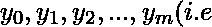
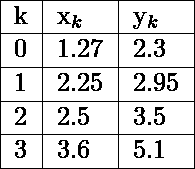
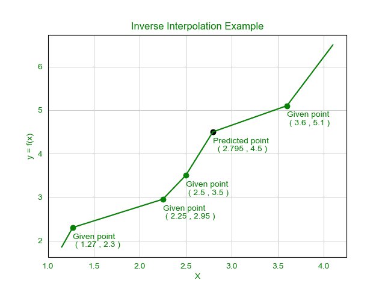

# 使用拉格朗日公式实现逆插值的程序

> 原文:[https://www . geesforgeks . org/program-to-implement-reverse-interpolation-use-lagrange-formula/](https://www.geeksforgeeks.org/program-to-implement-inverse-interpolation-using-lagrange-formula/)

**给定的任务是求未知函数 y = f(x)的给定 y 的 x 值，其中给出了某些点(x，y)对的值。**
设，y = f(x)为未知函数，其中 x 为自变量。
对于不同的 x 值，给出相应的【Tex】y _ k = f(x _ k)，k=0，1，2，3…m)【/Tex】值。
借助未知函数的给定观测值组，为位于两个列表值之间的给定 y 值找到自变量 x 值的过程称为**逆插值**。
这通常用于检查未知函数 f 的输出 y 的正确性，即该输出 y 的自变量 x 与原始输入相差多少。
反插值的问题可以使用 [**拉格朗日公式**](https://www.geeksforgeeks.org/lagranges-interpolation/) 来解决。
**拉格朗日公式:**
逆插值的公式与插值公式相似，但变化不大。
这里为了解决逆插值问题，x 和 y 的位置互换。逆插值的公式是:

这种方法甚至可以在点间距不相等的情况下使用。这里 x 表示为 y 的函数。
**示例:**

> **输入:**求 x 的值，其中 y = 4.5，给定点为:
> 
> 
> 
> **输出:** 2.79501
> **说明:**这里给定的数据点数量= 4，y = 4.5
> 所以，把所有 x 和 y 的值放在上面给定的逆插值公式中，我们得到，
> 
> 从这里我们得到，
> x 的值= 2.79501，其中 y 的值= 4.5

**图形:**



**算法:**
这里，数据是由 x 和 y 组成的点列表，n 是数据点的个数。

> STEP–1:初始化最终值 x = 0
> STEP–2:I = 1 到 n do
> STEP–3:初始化 xi =数据[i]。x
> STEP–4:FOR j = 1 到 n do
> STEP–5:IF I！= j do
> STEP–6:将 xi 乘以(y–数据[j]。y)和除以(数据[i]。y–数据[j]。y)
> ENDIF
> END for
> STEP–7:将 xi 加到 x
> END for
> STEP–8:返回 x
> STEP–9 的最终值:END

**执行:**

## C++

```
// C++ code for solving inverse interpolation

#include <bits/stdc++.h>
using namespace std;

// Consider a structure
// to keep each pair of
// x and y together
struct Data {
    double x, y;
};

// Function to calculate
// the inverse interpolation

double inv_interpolate(Data d[], int n, double y)
{
    // Initialize final x
    double x = 0;

    int i, j;

    for (i = 0; i < n; i++) {

        // Calculate each term
        // of the given formula
        double xi = d[i].x;
        for (j = 0; j < n; j++) {

            if (j != i) {
                xi = xi
                     * (y - d[j].y)
                     / (d[i].y - d[j].y);
            }
        }

        // Add term to final result
        x += xi;
    }

    return x;
}

// Driver Code
int main()
{

    // Sample dataset of 4 points
    // Here we find the value
    // of x when y = 4.5
    Data d[] = { { 1.27, 2.3 },
                 { 2.25, 2.95 },
                 { 2.5, 3.5 },
                 { 3.6, 5.1 } };

    // Size of dataset
    int n = 4;

    // Sample y value
    double y = 4.5;

    // Using the Inverse Interpolation
    // function to find the
    // value of x when y = 4.5
    cout << "Value of x at y = 4.5 : "
         << inv_interpolate(d, n, y);

    return 0;
}
```

## Java 语言(一种计算机语言，尤用于创建网站)

```
// Java code for solving inverse interpolation
class GFG
{

// Consider a structure
// to keep each pair of
// x and y together
static class Data
{
    double x, y;

    public Data(double x, double y)
    {
        super();
        this.x = x;
        this.y = y;
    }

};

// Function to calculate
// the inverse interpolation
static double inv_interpolate(Data []d, int n, double y)
{
    // Initialize final x
    double x = 0;

    int i, j;

    for (i = 0; i < n; i++)
    {

        // Calculate each term
        // of the given formula
        double xi = d[i].x;
        for (j = 0; j < n; j++)
        {

            if (j != i)
            {
                xi = xi
                    * (y - d[j].y)
                    / (d[i].y - d[j].y);
            }
        }

        // Add term to final result
        x += xi;
    }
    return x;
}

// Driver Code
public static void main(String[] args)
{

    // Sample dataset of 4 points
    // Here we find the value
    // of x when y = 4.5
    Data []d = { new Data( 1.27, 2.3 ),
            new Data( 2.25, 2.95 ),
            new Data( 2.5, 3.5 ),
            new Data( 3.6, 5.1 ) };

    // Size of dataset
    int n = 4;

    // Sample y value
    double y = 4.5;

    // Using the Inverse Interpolation
    // function to find the
    // value of x when y = 4.5
    System.out.printf("Value of x at y = 4.5 : %.5f"
        , inv_interpolate(d, n, y));
}
}

// This code is contributed by Rajput-Ji
```

## 蟒蛇 3

```
# Python3 code for solving
# inverse interpolation

# Consider a structure
# to keep each pair of
# x and y together
class Data:
    def __init__(self, x, y):
        self.x = x
        self.y = y

# Function to calculate
# the inverse interpolation
def inv_interpolate(d: list, n: int,
                    y: float) -> float:

    # Initialize final x
    x = 0

    for i in range(n):

        # Calculate each term
        # of the given formula
        xi = d[i].x
        for j in range(n):
            if j != i:
                xi = (xi * (y - d[j].y) /
                      (d[i].y - d[j].y))

        # Add term to final result
        x += xi
    return x

# Driver Code
if __name__ == "__main__":

    # Sample dataset of 4 points
    # Here we find the value
    # of x when y = 4.5
    d = [Data(1.27, 2.3),
         Data(2.25, 2.95),
         Data(2.5, 3.5),
         Data(3.6, 5.1)]

    # Size of dataset
    n = 4

    # Sample y value
    y = 4.5

    # Using the Inverse Interpolation
    # function to find the
    # value of x when y = 4.5
    print("Value of x at y = 4.5 :",
           round(inv_interpolate(d, n, y), 5))

# This code is contributed by
# sanjeev2552
```

## C#

```
// C# code for solving inverse interpolation
using System;

class GFG
{

// Consider a structure to keep
// each pair of x and y together
class Data
{
    public double x, y;

    public Data(double x, double y)
    {
        this.x = x;
        this.y = y;
    }
};

// Function to calculate the
// inverse interpolation
static double inv_interpolate(Data []d,
                       int n, double y)
{
    // Initialize readonly x
    double x = 0;

    int i, j;

    for (i = 0; i < n; i++)
    {

        // Calculate each term
        // of the given formula
        double xi = d[i].x;
        for (j = 0; j < n; j++)
        {
            if (j != i)
            {
                xi = xi * (y - d[j].y) /
                              (d[i].y - d[j].y);
            }
        }

        // Add term to readonly result
        x += xi;
    }
    return x;
}

// Driver Code
public static void Main(String[] args)
{

    // Sample dataset of 4 points
    // Here we find the value
    // of x when y = 4.5
    Data []d = {new Data(1.27, 2.3),
                new Data(2.25, 2.95),
                new Data(2.5, 3.5),
                new Data(3.6, 5.1)};

    // Size of dataset
    int n = 4;

    // Sample y value
    double y = 4.5;

    // Using the Inverse Interpolation
    // function to find the
    // value of x when y = 4.5
    Console.Write("Value of x at y = 4.5 : {0:f5}",
                         inv_interpolate(d, n, y));
}
}

// This code is contributed by Rajput-Ji
```

## java 描述语言

```
<script>
// javascript code for solving inverse interpolation   
// Consider a structure
    // to keep each pair of
    // x and y together
     class Data {

        constructor(x , y) {
            this.x = x;
            this.y = y;
        }

    };

    // Function to calculate
    // the inverse interpolation
    function inv_interpolate( d , n , y)
    {

        // Initialize final x
        var x = 0;

        var i, j;

        for (i = 0; i < n; i++) {

            // Calculate each term
            // of the given formula
            var xi = d[i].x;
            for (j = 0; j < n; j++) {

                if (j != i) {
                    xi = xi * (y - d[j].y) / (d[i].y - d[j].y);
                }
            }

            // Add term to final result
            x += xi;
        }
        return x;
    }

    // Driver Code

        // Sample dataset of 4 points
        // Here we find the value
        // of x when y = 4.5
        var d = [ new Data(1.27, 2.3), new Data(2.25, 2.95), new Data(2.5, 3.5), new Data(3.6, 5.1) ];

        // Size of dataset
        var n = 4;

        // Sample y value
        var y = 4.5;

        // Using the Inverse Interpolation
        // function to find the
        // value of x when y = 4.5
        document.write("Value of x at y = 4.5 : ", inv_interpolate(d, n, y).toFixed(5));

// This code is contributed by gauravrajput1
</script>
```

**Output:** 

```
Value of x at y = 4.5 : 2.79501
```

**复杂度:**给定解的时间复杂度为 **O(n^2)** ，空间复杂度为 **O(1)**