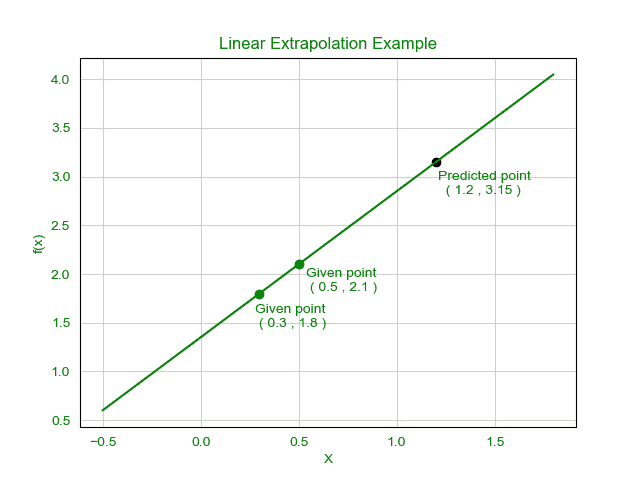

# 实施线性外推的程序

> 原文:[https://www . geesforgeks . org/program-to-implement-linear-extraction/](https://www.geeksforgeeks.org/program-to-implement-linear-extrapolation/)

**什么是外推？**
外推法是数学中的一个过程，在这个过程中，所需值的估计超出了给定变量范围的范围。外推通常用于估计低于或高于给定范围的一些观测数据。外推也称为数学预测，通过观察给定变量之间的关系来预测值。外推有许多过程。这里只讨论**线性外推**。托马斯·d·克拉克森在他的《科学》一书中于 1959 年首次描述了这个过程。他通过理解给定的数据，称之为有意义的预测。
**如何计算线性扩展？**
当给定线性函数时，该方法是有用的。这是通过画一条切线并将其延伸到极限之外来完成的。当要预测的点离其余点不是很远时，线性外推给出了非常好的结果。

```
Extrapolation formula: 
```

这里和是两个给定点，x 是我们要预测 y 值的点
**例:**

> **输入:**T2，，x = 1.2
> T5】输出: y = 3.15



**执行:**

## C++

```
// C++ code for the implementation
// of Linear extrapolation

#include <bits/stdc++.h>
using namespace std;

// Consider a structure
// to keep each pair of x and y together
struct Data {
    double x, y;
};

// Function to calculate
// the linear extrapolation
double extrapolate(Data d[], double x)
{
    double y;
    y = d[0].y
        + (x - d[0].x)
              / (d[1].x - d[0].x)
              * (d[1].y - d[0].y);

    return y;
}

// Driver Code
int main()
{
    // Sample dataset
    Data d[] = { { 1.2, 2.7 }, { 1.4, 3.1 } };

    // Sample x value
    double x = 2.1;

    // Finding the extrapolation
    cout << "Value of y at x = 2.1 : "
         << extrapolate(d, x);

    return 0;
}
```

## Java 语言(一种计算机语言，尤用于创建网站)

```
// Java code for the implementation of
// Linear extrapolation
class GFG
{

// Function to calculate the linear
// extrapolation
static double extrapolate(double[][] d, double x)
{
    double y = d[0][1] + (x - d[0][0]) /
                (d[1][0] - d[0][0]) *
                (d[1][1] - d[0][1]);

    return y;
}

// Driver Code
public static void main (String[] args)
{

// Sample dataset
double[][] d = {{ 1.2, 2.7 },{ 1.4, 3.1 }};

// Sample x value
double x = 2.1;

// Finding the extrapolation
System.out.println("Value of y at x = 2.1 : " +
                    extrapolate(d, x));
}
}

// This code is contributed by chandan_jnu
```

## 蟒蛇 3

```
# Python3 code for the implementation of
# Linear extrapolation

# Function to calculate the linear
# extrapolation
def extrapolate(d, x):
    y = (d[0][1] + (x - d[0][0]) /
        (d[1][0] - d[0][0]) *
        (d[1][1] - d[0][1]));

    return y;

# Driver Code

# Sample dataset
d = [[ 1.2, 2.7 ], [1.4, 3.1 ]];

# Sample x value
x = 2.1;

# Finding the extrapolation
print("Value of y at x = 2.1 :",
             extrapolate(d, x));

# This code is contributed by mits
```

## C#

```
// C# code for the implementation of
// Linear extrapolation
class GFG
{

// Function to calculate the linear
// extrapolation
static double extrapolate(double[,] d, double x)
{
    double y = d[0,1] + (x - d[0,0]) /
                (d[1,0] - d[0,0]) *
                (d[1,1] - d[0,1]);

    return y;
}

// Driver Code
static void Main()
{

// Sample dataset
double[,] d = {{ 1.2, 2.7 },{ 1.4, 3.1 }};

// Sample x value
double x = 2.1;

// Finding the extrapolation
System.Console.WriteLine("Value of y at x = 2.1 : " +
                    extrapolate(d, x));
}
}

// This code is contributed by chandan_jnu
```

## 服务器端编程语言（Professional Hypertext Preprocessor 的缩写）

```
<?php
// PHP code for the implementation of
// Linear extrapolation

// Function to calculate the linear
// extrapolation
function extrapolate($d, $x)
{
    $y = $d[0][1] + ($x - $d[0][0]) /
        ($d[1][0] - $d[0][0]) *
        ($d[1][1] - $d[0][1]);

    return $y;
}

// Driver Code

// Sample dataset
$d = array(array( 1.2, 2.7 ),
           array( 1.4, 3.1 ));

// Sample x value
$x = 2.1;

// Finding the extrapolation
echo "Value of y at x = 2.1 : ",
            extrapolate($d, $x);

// This code is contributed by Ryuga
?>
```

## java 描述语言

```
<script>
    // Javascript code for the implementation of
    // Linear extrapolation

    // Function to calculate the linear
    // extrapolation
    function extrapolate(d, x)
    {
        let y = d[0][1] + (x - d[0][0]) / (d[1][0] - d[0][0]) *
                    (d[1][1] - d[0][1]);

        return y;
    }

    // Sample dataset
    let d = [[ 1.2, 2.7 ],[ 1.4, 3.1 ]];

    // Sample x value
    let x = 2.1;

    // Finding the extrapolation
    document.write("Value of y at x = 2.1 : " +
                        extrapolate(d, x));

// This code is contributed by mukesh07.
</script>
```

**Output:** 

```
Value of y at x = 2.1 : 4.5
```