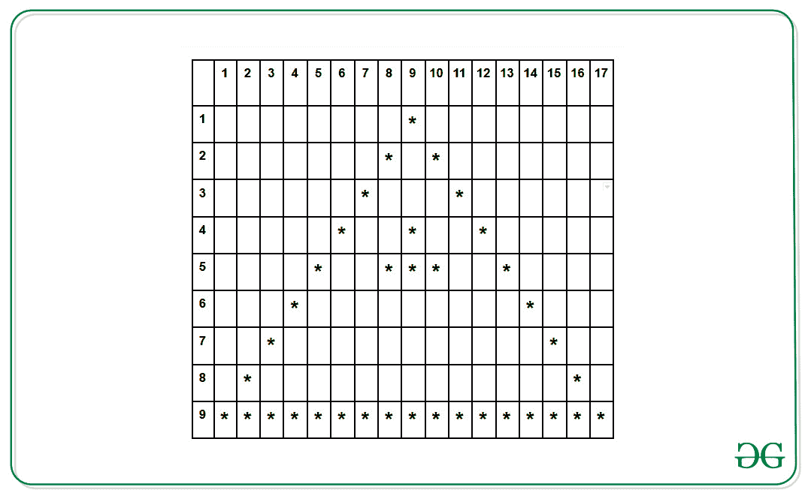

# 在三角形内打印空心三角形的程序

> 原文:[https://www . geeksforgeeks . org/program-to-print-a-a-空心三角形-a-三角形内/](https://www.geeksforgeeks.org/program-to-print-a-hollow-triangle-inside-a-triangle/)

给定一个数字 **N** (≥ 8)，任务是在三角形图案内打印一个空心三角形。
**例:**

```
Input: N = 9
Output:
                *                 
              *   *               
            *       *             
          *     *     *           
        *     * * *     *         
      *                   *       
    *                       *     
  *                           *   
* * * * * * * * * * * * * * * * * 
```

**进场:**



让 **i** 作为行的索引， **j** 作为列的索引。然后:

*   **对于外三角形的边:**
    如果列( **j** )的索引等于(**N–I+1**)或(**N+I–1**)，则为外三角形的等边打印**' ***。

```
if(j == (N - i + 1)
   || j == (N + i - 1) {
  print('*')
}
```

*   **对于内三角形的边:**
    如果(行的索引( **i** )小于(**N–4**)且大于( **4** )且列的索引( **j** )等于(**N–I+4**)或( **N + i + 4** )，则为内三角形的等边打印**' ***。

```
if(  (i >= 4 
     && i <= n - 4) 
  && (j == N - i + 4 
     || j == N + i - 4) ) {
    print('*')
}
```

*   **外三角的底:**
    如果行的索引( **i** )等于 **N** ，那么**' ***被打印为外三角的底。

```
if(i == N) {
   print('*')
}
```

*   **对于内三角的底:**
    如果行的索引( **i** )等于**(N–4)**，列的索引( **j** )必须大于等于(**N –( N–2 * 4)**，j 小于等于(**N+N–2 * 4**，则内三角的底打印**' ***。

```
if( (i == N - 4) 
 && (j >= N - (N - 2 * 4) ) 
 && (j <= n + n - 2 * 4) ) ) {
   print('*')
}
```

以下是上述方法的实现:

## 卡片打印处理机（Card Print Processor 的缩写）

```
// C++ implementation of the above approach

#include <bits/stdc++.h>
using namespace std;

// Function to print the pattern
void printPattern(int n)
{

    int i, j;

    // Loop for rows
    for (i = 1; i <= n; i++) {

        // Loop for column
        for (j = 1; j < 2 * n; j++) {

            // For printing equal sides
            // of outer triangle
            if (j == (n - i + 1)
                || j == (n + i - 1)) {
                cout << "* ";
            }

            // For printing equal sides
            // of inner triangle
            else if ((i >= 4 && i <= n - 4)
                     && (j == n - i + 4
                         || j == n + i - 4)) {

                cout << "* ";
            }

            // For printing base
            // of both triangle
            else if (i == n
                     || (i == n - 4
                         && j >= n - (n - 2 * 4)
                         && j <= n + n - 2 * 4)) {

                cout << "* ";
            }

            // For spacing between the triangle
            else {
                cout << " "
                     << " ";
            }
        }
        cout << "\n";
    }
}

// Driver Code
int main()
{
    int N = 9;

    printPattern(N);
}
```

## Java 语言(一种计算机语言，尤用于创建网站)

```
// Java implementation of the above approach
import java.util.*;

class GFG{

// Function to print the pattern
static void printPattern(int n)
{

    int i, j;

    // Loop for rows
    for (i = 1; i <= n; i++) {

        // Loop for column
        for (j = 1; j < 2 * n; j++) {

            // For printing equal sides
            // of outer triangle
            if (j == (n - i + 1)
                || j == (n + i - 1)) {
                System.out.print("* ");
            }

            // For printing equal sides
            // of inner triangle
            else if ((i >= 4 && i <= n - 4)
                     && (j == n - i + 4
                         || j == n + i - 4)) {

                System.out.print("* ");
            }

            // For printing base
            // of both triangle
            else if (i == n
                     || (i == n - 4
                         && j >= n - (n - 2 * 4)
                         && j <= n + n - 2 * 4)) {

                System.out.print("* ");
            }

            // For spacing between the triangle
            else {
                System.out.print(" "
                    + " ");
            }
        }
        System.out.print("\n");
    }
}

// Driver Code
public static void main(String[] args)
{
    int N = 9;

    printPattern(N);
}
}

// This code is contributed by sapnasingh4991
```

## 蟒蛇 3

```
# Python3 implementation of the above approach

# Function to print the pattern
def printPattern(n):

    # Loop for rows
    for i in range(1, n + 1):

        # Loop for column
        for j in range(1, 2 * n):

            # For printing equal sides
            # of outer triangle
            if (j == (n - i + 1)
                or j == (n + i - 1)):
                print("* ",end="")

            # For printing equal sides
            # of inner triangle
            elif ((i >= 4 and i <= n - 4)
                    and (j == n - i + 4
                        or j == n + i - 4)):

                print("* ",end="")

            # For printing base
            # of both triangle
            elif (i == n
                    or (i == n - 4
                        and j >= n - (n - 2 * 4)
                        and j <= n + n - 2 * 4)):

                print("* ", end="")

            # For spacing between the triangle
            else :
                print(" "+" ", end="")

        print()

# Driver Code
N = 9

printPattern(N)

# This code is contributed by mohit kumar 29
```

## C#

```
// C# implementation of the above approach
using System;

class GFG{

// Function to print the pattern
static void printPattern(int n)
{

    int i, j;

    // Loop for rows
    for (i = 1; i <= n; i++) {

        // Loop for column
        for (j = 1; j < 2 * n; j++) {

            // For printing equal sides
            // of outer triangle
            if (j == (n - i + 1)
                || j == (n + i - 1)) {
                Console.Write("* ");
            }

            // For printing equal sides
            // of inner triangle
            else if ((i >= 4 && i <= n - 4)
                     && (j == n - i + 4
                         || j == n + i - 4)) {

                Console.Write("* ");
            }

            // For printing base
            // of both triangle
            else if (i == n
                     || (i == n - 4
                         && j >= n - (n - 2 * 4)
                         && j <= n + n - 2 * 4)) {

                Console.Write("* ");
            }

            // For spacing between the triangle
            else {
                Console.Write(" "
                    + " ");
            }
        }
        Console.Write("\n");
    }
}

// Driver Code
public static void Main(String[] args)
{
    int N = 9;

    printPattern(N);
}
}

// This code is contributed by 29AjayKumar
```

## java 描述语言

```
<script>

      // JavaScript implementation of the above approach

      // Function to print the pattern
      function printPattern(n) {
        var i, j;

        // Loop for rows
        for (i = 1; i <= n; i++) {
          // Loop for column
          for (j = 1; j < 2 * n; j++) {
            // For printing equal sides
            // of outer triangle
            if (j == n - i + 1 || j == n + i - 1) {
              document.write("* ");
            }

            // For printing equal sides
            // of inner triangle
            else if (
              i >= 4 &&
              i <= n - 4 &&
              (j == n - i + 4 || j == n + i - 4)
            ) {
              document.write("* ");
            }

            // For printing base
            // of both triangle
            else if (
              i == n ||
              (i == n - 4 && j >= n - (n - 2 * 4) && j <= n + n - 2 * 4)
            ) {
              document.write("* ");
            }

            // For spacing between the triangle
            else {
              document.write(" ");
              document.write("  ");
            }
          }
          document.write("<br>");
        }
      }

      // Driver Code

      var N = 9;

      printPattern(N);

    </script>
```

**Output:** 

```
                *                 
              *   *               
            *       *             
          *     *     *           
        *     * * *     *         
      *                   *       
    *                       *     
  *                           *   
* * * * * * * * * * * * * * * * *
```

时间复杂度:O(n <sup>2</sup> )

辅助空间:0(1)