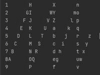
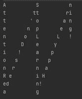

# 以垂直之字形方式打印字符串的程序

> 原文:[https://www . geesforgeks . org/program-to-print-a-string-in-vertical-zigzag-way/](https://www.geeksforgeeks.org/program-to-print-a-string-in-vertical-zigzag-manner/)

给定大小为****的[字符串](https://www.geeksforgeeks.org/string-data-structure/)**S**和若干行 **R** ，任务是相对于给定的行数以垂直之字形打印给定的字符串，如示例所示。****

******示例:******

> ******输入:**S = " 123456789 abcdefghijklmnopqrstuvwxyzabdefghijklmnopqrstuvwxyz "，R = 9
> **输出:******
> 
> ********
> 
>  ******输入:** S = "AttentionReaders！不要忘记学习！快乐学习！”，R = 12
> T3【输出:
> 
> ****

******方法:**为了逐行打印字符，其思想是找到主列之间的间隔和用于打印空格的列间步长值，直到到达字符串的最后一个字符。按照以下步骤解决此问题:****

*   ****初始化一个变量**间隔**为 **2*R-2** 来存储主列之间的间隙。****
*   ****[使用变量 **i** 在范围](https://www.geeksforgeeks.org/range-based-loop-c/)**【0，R-1】**中迭代

    *   将变量**步长**初始化为**间隔-2*i** ，以存储每行的步长值。
    *   [使用变量 **j** 在范围](https://www.geeksforgeeks.org/range-based-loop-c/)**【I，N-1】**中迭代，在每次迭代中将 **j** 递增**间隔**，
        *   打印字符， **S[j]** 。
        *   如果**步**的值在**【1，间隔-1】**和**步+j < N** 的范围内，则打印**(间隔-R-i)** 的空格数，然后打印**s【j+步长】**最后打印 **(i-1)** 空格。
        *   否则打印**(间隔-R)** 的空格数。
    *   [每次外循环迭代后打印换行符](https://www.geeksforgeeks.org/endl-vs-n-in-cpp/)。**** 

****下面是上述方法的实现:****

## ****C++****

```
**// C++ program for the above approach
#include <bits/stdc++.h>
using namespace std;

// Function to print any string
// in zigzag fashion
void zigzag(string s, int rows)
{
    // Store the gap between the major columns
    int interval = 2 * rows - 2;

    // Traverse through rows
    for (int i = 0; i < rows; i++) {

        // Store the step value for each row
        int step = interval - 2 * i;

        // Iterate in the range [1, N-1]
        for (int j = i; j < s.length(); j = j + interval) {

            // Print the character
            cout << s[j];
            if (step > 0 && step < interval
                && step + j < s.length()) {

                // Print the spaces before character
                // s[j+step]
                for (int k = 0; k < (interval - rows - i);
                     k++)
                    cout << " ";

                // Print the character
                cout << s[j + step];

                // Print the spaces after character
                // after s[j+step]
                for (int k = 0; k < i - 1; k++)
                    cout << " ";
            }
            else {

                // Print the spaces for first and last rows
                for (int k = 0; k < (interval - rows); k++)
                    cout << " ";
            }
        }
        cout << endl;
    }
}

// Driver Code
int main()
{
    // Given Input
    string s = "123456789ABCDEFGHIJKLMNOPQRSTUVWXYZabcdefgh"
               "ijklmnopqrstuvwxyz";
    int rows = 9;

    // Function Call
    zigzag(s, rows);
}**
```

## ****Java 语言(一种计算机语言，尤用于创建网站)****

```
**// Java program for the above approach

public class GFG{

// Function to print any string
// in zigzag fashion
static void zigzag(String s, int rows)
{

    // Store the gap between the major columns
    int interval = 2 * rows - 2;

    // Traverse through rows
    for(int i = 0; i < rows; i++)
    {

        // Store the step value for each row
        int step = interval - 2 * i;

        // Iterate in the range [1, N-1]
        for(int j = i; j < s.length(); j = j + interval)
        {

            // Print the character
            System.out.print(s.charAt(j));
            if (step > 0 && step < interval &&
                step + j < s.length())
            {

                // Print the spaces before character
                // s[j+step]
                for(int k = 0; k < (interval - rows - i); k++)
                    System.out.print(" ");

                // Print the character
                System.out.print(s.charAt(j + step));

                // Print the spaces after character
                // after s[j+step]
                for(int k = 0; k < i - 1; k++)
                    System.out.print(" ");
            }
            else
            {

                // Print the spaces for first and last rows
                for(int k = 0; k < (interval - rows); k++)
                    System.out.print(" ");
            }
        }
        System.out.println();
    }
}

// Driver Code
public static void main(String args[])
{

    // Given Input
    String s = "123456789ABCDEFGHIJKLM" +
               "NOPQRSTUVWXYZabcdefghi" +
               "jklmnopqrstuvwxyz";
    int rows = 9;

    // Function Call
    zigzag(s, rows);
}
}

// This code is contributed by SoumikMondal**
```

## ****蟒蛇 3****

```
**# Python3 program for the above approach

# Function to print any string
# in zigzag fashion
def zigzag(s, rows):

    # Store the gap between the major columns
    interval = 2 * rows - 2

    # Traverse through rows
    for i in range(rows):

        # Store the step value for each row
        step = interval - 2 * i

        # Iterate in the range [1, N-1]
        for j in range(i, len(s), interval):

            # Print the character
            print(s[j], end = "")

            if (step > 0 and step < interval and
                         step + j < len(s)):

                # Print the spaces before character
                # s[j+step]
                for k in range((interval - rows - i)):
                    print(end = " ")

                # Print the character
                print(s[j + step], end = "")

                # Print the spaces after character
                # after s[j+step]
                for k in range(i - 1):
                    print(end = " ")
            else:

                # Print the spaces for first and
                # last rows
                for k in range(interval - rows):
                    print(end = " ")

        print()

# Driver Code
if __name__ == '__main__':

    # Given Input
    s = "123456789ABCDEFGHIJKL"\
        "MNOPQRSTUVWXYZabcdefghi"\
        "jklmnopqrstuvwxyz"
    rows = 9

    # Function Call
    zigzag(s, rows)

# This code is contributed by mohit kumar 29**
```

## ****C#****

```
**// C# program for the above approach
using System;
using System.Collections.Generic;

class GFG{

// Function to print any string
// in zigzag fashion
static void zigzag(string s, int rows)
{

    // Store the gap between the major columns
    int interval = 2 * rows - 2;

    // Traverse through rows
    for(int i = 0; i < rows; i++)
    {

        // Store the step value for each row
        int step = interval - 2 * i;

        // Iterate in the range [1, N-1]
        for(int j = i; j < s.Length; j = j + interval)
        {

            // Print the character
            Console.Write(s[j]);
            if (step > 0 && step < interval &&
                step + j < s.Length)
            {

                // Print the spaces before character
                // s[j+step]
                for(int k = 0; k < (interval - rows - i); k++)
                    Console.Write(" ");

                // Print the character
                Console.Write(s[j + step]);

                // Print the spaces after character
                // after s[j+step]
                for(int k = 0; k < i - 1; k++)
                    Console.Write(" ");
            }
            else
            {

                // Print the spaces for first and last rows
                for(int k = 0; k < (interval - rows); k++)
                    Console.Write(" ");
            }
        }
        Console.WriteLine();
    }
}

// Driver Code
public static void Main()
{

    // Given Input
    string s = "123456789ABCDEFGHIJKLM" +
               "NOPQRSTUVWXYZabcdefghi" +
               "jklmnopqrstuvwxyz";
    int rows = 9;

    // Function Call
    zigzag(s, rows);
}
}

// This code is contributed by SURENDRA_GANGWAR**
```

## ****java 描述语言****

```
**<script>

// JavaScript program for the above approach

// Function to print any string
// in zigzag fashion
function zigzag(s,rows)
{
    // Store the gap between the major columns
    let interval = 2 * rows - 2;

    // Traverse through rows
    for(let i = 0; i < rows; i++)
    {

        // Store the step value for each row
        let step = interval - 2 * i;

        // Iterate in the range [1, N-1]
        for(let j = i; j < s.length; j = j + interval)
        {

            // Print the character
            document.write(s[j]);
            if (step > 0 && step < interval &&
                step + j < s.length)
            {

                // Print the spaces before character
                // s[j+step]
                for(let k = 0; k < (interval - rows - i); k++)
                    document.write("  ");

                // Print the character
                document.write(s[j + step]);

                // Print the spaces after character
                // after s[j+step]
                for(let k = 0; k < i - 1; k++)
                    document.write("  ");
            }
            else
            {

                // Print the spaces for first and last rows
                for(let k = 0; k < (interval - rows); k++)
                    document.write("  ");
            }
        }
        document.write("<br>");
    }
}

// Driver Code
// Given Input
let s = "123456789ABCDEFGHIJKLM" +
    "NOPQRSTUVWXYZabcdefghi" +
    "jklmnopqrstuvwxyz";
let rows = 9;

// Function Call
zigzag(s, rows);

// This code is contributed by patel2127

</script>**
```

******Output**

```
1       H       X       n       
2      GI      WY      mo       
3     F J     V Z     l p       
4    E  K    U  a    k  q       
5   D   L   T   b   j   r   z   
6  C    M  S    c  i    s  y    
7 B     N R     d h     t x     
8A      OQ      eg      uw      
9       P       f       v       
```**** 

*******时间复杂度:**O(R<sup>2</sup>* N)*
***辅助空间:** O(1)*****