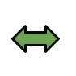

# 程序打印双箭头图案

> 原文:[https://www . geesforgeks . org/program-to-print-双头箭头-pattern/](https://www.geeksforgeeks.org/program-to-print-double-headed-arrow-pattern/)

给定整数 **N** ，即**行**的数量，任务是以**双箭头**的形状绘制数字图案。
**先决条件:**该模式是一种增长和收缩类型的模式，因此需要执行循环的基本知识来理解任何语言的主题和代码。几何形状可以可视化为-



**例:**

```
Input: R = 7
Output:   
                  1
               2 1 1 2
            3 2 1   1 2 3
         4 3 2 1     1 2 3 4
            3 2 1   1 2 3
               2 1 1 2
                  1

Input: R = 9
Output:
                       1
                    2 1 1 2
                 3 2 1   1 2 3
              4 3 2 1     1 2 3 4
           5 4 3 2 1       1 2 3 4 5
              4 3 2 1     1 2 3 4
                 3 2 1   1 2 3
                    2 1 1 2
                       1
```

**进场:**

1.  在给定的例子中，N=7，行数为 7。
2.  垂直方向上，模式增长直到行=N/2，然后收缩。
3.  第 1 行有 4 个" "(空格)字符，然后是一个值。
4.  在每一个连续的行中，空格字符的数量减少，而数字的数量增加。
5.  此外，请注意，每行中数字的第一个值与该行的数字相同。
6.  同样水平方向的图案有数字，然后是空格和数字。

以下是上述方法的实现:

## C++

```
// C++ implementation of the approach
#include <iostream>
using namespace std;

// Function to print the required pattern
void drawPattern(int N)
{
    int n = N;
    int row = 1;

    // 'nst' is the number of values
    int nst = 1;

    // 'nsp' is the number of spaces
    int nsp1 = n - 1;
    int nsp2 = -1;
    int val1 = row;
    int val2 = 1;

    while (row <= n) {

        // Here spaces are printed
        // 'csp' is the count of spaces
        int csp1 = 1;
        while (csp1 <= nsp1) {
            cout << " "
                 << " ";
            csp1 = csp1 + 1;
        }

        // Now, values are printed
        // 'cst' is the count of stars
        int cst1 = 1;
        while (cst1 <= nst) {
            cout << val1 << " ";
            val1 = val1 - 1;
            cst1 = cst1 + 1;
        }

        // Again spaces have to be printed
        int csp2 = 1;
        while (csp2 <= nsp2) {
            cout << " "
                 << " ";
            csp2 = csp2 + 1;
        }

        // Again values have to be printed
        if (row != 1 && row != n) {
            int cst2 = 1;
            while (cst2 <= nst) {
                cout << val2 << " ";
                val2 = val2 + 1;
                cst2 = cst2 + 1;
            }
        }
        cout << endl;

        // Move to the next row
        if (row <= n / 2) {
            nst = nst + 1;
            nsp1 = nsp1 - 2;
            nsp2 = nsp2 + 2;
            val1 = row + 1;
            val2 = 1;
        }
        else {
            nst = nst - 1;
            nsp1 = nsp1 + 2;
            nsp2 = nsp2 - 2;
            val1 = n - row;
            val2 = 1;
        }
        row = row + 1;
    }
}

// Driver code
int main()
{
    // Number of rows
    int N = 7;

    drawPattern(N);

    return 0;
}
```

## Java 语言(一种计算机语言，尤用于创建网站)

```
// Java implementation of the approach
class GFG {

    // Function to print the required pattern
    static void drawPattern(int N)
    {
        int n = N;
        int row = 1;

        // 'nst' is the number of values
        int nst = 1;

        // 'nsp' is the number of spaces
        int nsp1 = n - 1;
        int nsp2 = -1;
        int val1 = row;
        int val2 = 1;

        while (row <= n) {

            // Here spaces are printed
            // 'csp' is the count of spaces
            int csp1 = 1;
            while (csp1 <= nsp1) {
                System.out.print("  ");
                csp1 = csp1 + 1;
            }

            // Now, values are printed
            // 'cst' is the count of stars
            int cst1 = 1;
            while (cst1 <= nst) {
                System.out.print(val1 + " ");
                val1 = val1 - 1;
                cst1 = cst1 + 1;
            }

            // Again spaces have to be printed
            int csp2 = 1;
            while (csp2 <= nsp2) {
                System.out.print("  ");
                csp2 = csp2 + 1;
            }

            // Again values have to be printed
            if (row != 1 && row != n) {
                int cst2 = 1;
                while (cst2 <= nst) {
                    System.out.print(val2 + " ");
                    val2 = val2 + 1;
                    cst2 = cst2 + 1;
                }
            }
            System.out.println();

            // Move to the next row
            if (row <= n / 2) {
                nst = nst + 1;
                nsp1 = nsp1 - 2;
                nsp2 = nsp2 + 2;
                val1 = row + 1;
                val2 = 1;
            }
            else {
                nst = nst - 1;
                nsp1 = nsp1 + 2;
                nsp2 = nsp2 - 2;
                val1 = n - row;
                val2 = 1;
            }
            row = row + 1;
        }
    }

    // Driver code
    public static void main(String args[])
    {
        // Number of rows
        int N = 7;

        drawPattern(N);
    }
}
```

## 蟒蛇 3

```
# Python3 implementation of the approach

# Function to print the required pattern
def drawPattern(N) :

    n = N;
    row = 1;

    # 'nst' is the number of values
    nst = 1;

    # 'nsp' is the number of spaces
    nsp1 = n - 1;
    nsp2 = -1;
    val1 = row;
    val2 = 1;

    while (row <= n) :

        # Here spaces are printed
        # 'csp' is the count of spaces
        csp1 = 1;
        while (csp1 <= nsp1) :
            print(" ",end= " ");
            csp1 = csp1 + 1;

        # Now, values are printed
        # 'cst' is the count of stars
        cst1 = 1;
        while (cst1 <= nst) :
            print(val1,end = " ");
            val1 = val1 - 1;
            cst1 = cst1 + 1;

        # Again spaces have to be printed
        csp2 = 1;
        while (csp2 <= nsp2) :
            print(" ",end = " ");
            csp2 = csp2 + 1;

        # Again values have to be printed
        if (row != 1 and row != n) :
            cst2 = 1;

            while (cst2 <= nst) :
                print(val2,end = " ");
                val2 = val2 + 1;
                cst2 = cst2 + 1;

        print()

        # Move to the next row
        if (row <= n // 2) :
            nst = nst + 1;
            nsp1 = nsp1 - 2;
            nsp2 = nsp2 + 2;
            val1 = row + 1;
            val2 = 1;

        else :
            nst = nst - 1;
            nsp1 = nsp1 + 2;
            nsp2 = nsp2 - 2;
            val1 = n - row;
            val2 = 1;

        row = row + 1;

# Driver code
if __name__ == "__main__" :

    # Number of rows
    N = 7;

    drawPattern(N);

# This code is contributed by AnkitRai01
```

## C#

```
// C# implementation of the approach
using System;

class GFG
{

    // Function to print the required pattern
    static void drawPattern(int N)
    {
        int n = N;
        int row = 1;

        // 'nst' is the number of values
        int nst = 1;

        // 'nsp' is the number of spaces
        int nsp1 = n - 1;
        int nsp2 = -1;
        int val1 = row;
        int val2 = 1;

        while (row <= n)
        {

            // Here spaces are printed
            // 'csp' is the count of spaces
            int csp1 = 1;
            while (csp1 <= nsp1)
            {
                Console.Write(" ");
                csp1 = csp1 + 1;
            }

            // Now, values are printed
            // 'cst' is the count of stars
            int cst1 = 1;
            while (cst1 <= nst)
            {
                Console.Write(val1 + " ");
                val1 = val1 - 1;
                cst1 = cst1 + 1;
            }

            // Again spaces have to be printed
            int csp2 = 1;
            while (csp2 <= nsp2)
            {
                Console.Write(" ");
                csp2 = csp2 + 1;
            }

            // Again values have to be printed
            if (row != 1 && row != n)
            {
                int cst2 = 1;
                while (cst2 <= nst)
                {
                    Console.Write(val2 + " ");
                    val2 = val2 + 1;
                    cst2 = cst2 + 1;
                }
            }
            Console.WriteLine();

            // Move to the next row
            if (row <= n / 2)
            {
                nst = nst + 1;
                nsp1 = nsp1 - 2;
                nsp2 = nsp2 + 2;
                val1 = row + 1;
                val2 = 1;
            }
            else
            {
                nst = nst - 1;
                nsp1 = nsp1 + 2;
                nsp2 = nsp2 - 2;
                val1 = n - row;
                val2 = 1;
            }
            row = row + 1;
        }
    }

    // Driver code
    public static void Main()
    {
        // Number of rows
        int N = 7;

        drawPattern(N);
    }
}

// This code is contributed by AnkitRai01
```

## java 描述语言

```
<script>
      // JavaScript implementation of the approach
      // Function to print the required pattern
      function drawPattern(N) {
        var n = N;
        var row = 1;

        // 'nst' is the number of values
        var nst = 1;

        // 'nsp' is the number of spaces
        var nsp1 = n - 1;
        var nsp2 = -1;
        var val1 = row;
        var val2 = 1;

        while (row <= n) {
          // Here spaces are printed
          // 'csp' is the count of spaces
          var csp1 = 1;
          while (csp1 <= nsp1) {
            document.write("  " + "  ");
            csp1 = csp1 + 1;
          }

          // Now, values are printed
          // 'cst' is the count of stars
          var cst1 = 1;
          while (cst1 <= nst) {
            document.write(val1 + "  ");
            val1 = val1 - 1;
            cst1 = cst1 + 1;
          }

          // Again spaces have to be printed
          var csp2 = 1;
          while (csp2 <= nsp2) {
            document.write("  " + "  ");
            csp2 = csp2 + 1;
          }

          // Again values have to be printed
          if (row != 1 && row != n) {
            var cst2 = 1;
            while (cst2 <= nst) {
              document.write(val2 + "  ");
              val2 = val2 + 1;
              cst2 = cst2 + 1;
            }
          }
          document.write("<br>");

          // Move to the next row
          if (row <= n / 2) {
            nst = nst + 1;
            nsp1 = nsp1 - 2;
            nsp2 = nsp2 + 2;
            val1 = row + 1;
            val2 = 1;
          } else {
            nst = nst - 1;
            nsp1 = nsp1 + 2;
            nsp2 = nsp2 - 2;
            val1 = n - row;
            val2 = 1;
          }
          row = row + 1;
        }
      }

      // Driver code
      // Number of rows
      var N = 7;
      drawPattern(N);
    </script>
```

**Output:** 

```
            1 
        2 1   1 2 
    3 2 1       1 2 3 
4 3 2 1           1 2 3 4 
    3 2 1       1 2 3 
        2 1   1 2 
            1
```

**时间复杂度:**O(N<sup>2</sup>)
T5】空间复杂度: O(1)