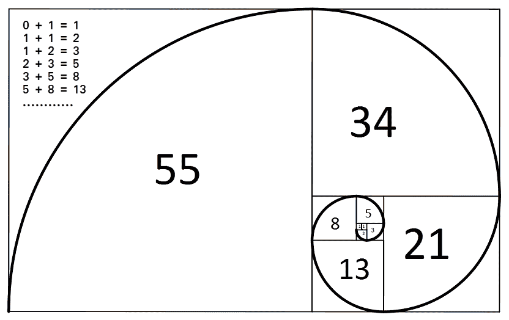

# 程序打印前 n 个斐波那契数|设置 1

> 原文:[https://www . geesforgeks . org/program-to-print-Fibonacci-Fibonacci-numbers/](https://www.geeksforgeeks.org/program-to-print-first-n-fibonacci-numbers/)

下面是一个简单的程序来打印前 n 个[斐波那契数](https://www.geeksforgeeks.org/program-for-nth-fibonacci-number/)。



**示例:**

```
Input : n = 3
Output : 0 1 1

Input : n = 7
Output : 0 1 1 2 3 5 8
```

## C++

```
// C++ program to print
// first n Fibonacci numbers
#include <bits/stdc++.h>
using namespace std;

// Function to print
// first n Fibonacci Numbers
void printFibonacciNumbers(int n)
{
    int f1 = 0, f2 = 1, i;

    if (n < 1)
        return;
    cout << f1 << " ";
    for (i = 1; i < n; i++) {
        cout << f2 << " ";
        int next = f1 + f2;
        f1 = f2;
        f2 = next;
    }
}

// Driver Code
int main()
{
    printFibonacciNumbers(7);
    return 0;
}

// This code is contributed by rathbhupendra
```

## C

```
// C program to print
// first n Fibonacci numbers
#include <stdio.h>

// Function to print
// first n Fibonacci Numbers
void printFibonacciNumbers(int n)
{
    int f1 = 0, f2 = 1, i;

    if (n < 1)
        return;
    printf("%d ", f1);
    for (i = 1; i < n; i++) {
        printf("%d ", f2);
        int next = f1 + f2;
        f1 = f2;
        f2 = next;
    }
}

// Driver Code
int main()
{
    printFibonacciNumbers(7);
    return 0;
}
```

## Java 语言(一种计算机语言，尤用于创建网站)

```
// Java program to print
// first n Fibonacci Numbers

class Test {
    // Method to print
    // first n Fibonacci Numbers
    static void printFibonacciNumbers(int n)
    {
        int f1 = 0, f2 = 1, i;

        if (n < 1)
            return;
        System.out.print(f1 + " ");
        for (i = 1; i < n; i++)
        {
            System.out.print(f2 + " ");
            int next = f1 + f2;
            f1 = f2;
            f2 = next;
        }
    }

    // Driver Code
    public static void main(String[] args)
    {
        printFibonacciNumbers(7);
    }
}
```

## 蟒蛇 3

```
# Python program to print first n
# Fibonacci numbers

# Function to print first n
# Fibonacci Numbers

def printFibonacciNumbers(n):

    f1 = 0
    f2 = 1
    if (n < 1):
        return
    print(f1, end=" ")
    for x in range(1, n):
        print(f2, end=" ")
        next = f1 + f2
        f1 = f2
        f2 = next

# Driven code
printFibonacciNumbers(7)

# This code is contributed by Danish Raza
```

## C#

```
// C# program to print
// first n Fibonacci Numbers
using System;

class Test {
    // Method to print
    // first n Fibonacci Numbers
    static void printFibonacciNumbers(int n)
    {
        int f1 = 0, f2 = 1, i;

        if (n < 1)
            return;
        Console.Write(f1 + " ");
        for (i = 1; i < n; i++) {
            Console.Write(f2 + " ");
            int next = f1 + f2;
            f1 = f2;
            f2 = next;
        }
    }

    // Driver Code
    public static void Main()
    {
         printFibonacciNumbers(7);
    }
}

// This code is contributed by nitin mittal.
```

## 服务器端编程语言（Professional Hypertext Preprocessor 的缩写）

```
<?php
// PHP program to print first
// n Fibonacci numbers

// Function to print first n
// Fibonacci Numbers
function printFibonacciNumbers($n)
{
    $f1 = 0;
    $f2 = 1;
    $i;

    if ($n < 1)
        return;
    echo($f1);
    echo(" ");
    for ($i = 1; $i < $n; $i++)
    {
        echo($f2);
        echo(" ");
        $next = $f1 + $f2;
        $f1 = $f2;
        $f2 = $next;
    }
}

    // Driver Code
    printFibonacciNumbers(7);

// This code is contributed by nitin mittal
?>
```

## java 描述语言

```
<script>

// Javascript program to print
// first n Fibonacci numbers

// Function to print
// first n Fibonacci Numbers
function printFibonacciNumbers(n)
{
    let f1 = 0, f2 = 1, i;

    if (n < 1)
        return;
    document.write(f1 + " ");
    for (i = 1; i < n; i++) {
        document.write(f2 + " ");
        let next = f1 + f2;
        f1 = f2;
        f2 = next;
    }
}

// Driver Code

    printFibonacciNumbers(7);

// This code is contributed by Mayank Tyagi

</script>
```

**Output**

```
0 1 1 2 3 5 8 
```