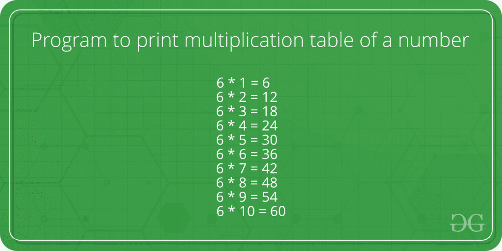

# 程序打印一个数字的乘法表

> 原文:[https://www . geesforgeks . org/program-to-print-乘法-数字表/](https://www.geeksforgeeks.org/program-to-print-multiplication-table-of-a-number/)

给定一个数字 n 作为输入，我们需要打印它的表格。



**例:**

```
Input :  5
Output : 5 * 1 = 5
         5 * 2 = 10
         5 * 3 = 15
         5 * 4 = 20
         5 * 5 = 25
         5 * 6 = 30
         5 * 7 = 35
         5 * 8 = 40
         5 * 9 = 45
         5 * 10 = 50

Input :  8
Output : 8 * 1 = 8
         8 * 2 = 16
         8 * 3 = 24
         8 * 4 = 32
         8 * 5 = 40
         8 * 6 = 48
         8 * 7 = 56
         8 * 8 = 64
         8 * 9 = 72
         8 * 10 = 80
         8 * 11 = 88
         8 * 12 = 96
```

**示例 1:最多显示 10 张乘法表**

## C++

```
// CPP program to print table of a number
#include <iostream>
using namespace std;

int main()
{
    int n = 5;  // Change here to change output
    for (int i = 1; i <= 10; ++i)
        cout << n << " * " << i << " = " 
             << n * i << endl;

    return 0;
}
```

## Java 语言(一种计算机语言，尤用于创建网站)

```
// Java program to print table
// of a number
import java.io.*;

class table
{  
    // Driver code
    public static void main(String arg[])
    {  
        // Change here to change output
        int n = 5;

        for (int i = 1; i <= 10; ++i)
            System.out.println(n + " * " + i +
                               " = " + n * i);
    }
}

// This code is contributed by Anant Agarwal.
```

## 计算机编程语言

```
# Python Program to print table
# of a number upto 10

def table(n):
    for i in range (1, 11):

        # multiples from 1 to 10
        print "%d * %d = %d" % (n, i, n * i)

# number for which table is evaluated
n = 5
table(n)

# This article is contributed by Shubham Rana
```

## C#

```
// C# program to print
// table of a number
using System;

class GFG
{
    // Driver code
    public static void Main()
    {
        // Change here to
        // change output
        int n = 5;

        for (int i = 1; i <= 10; ++i)
            Console.Write(n + " * " + i +
                              " = " + n *
                               i + "\n");
    }
}

// This code is contributed
// by Smitha.
```

## 服务器端编程语言（Professional Hypertext Preprocessor 的缩写）

```
<?php
// PHP program to print
// table of a number

// Driver Code
$n = 5; // Change here to
        // change output
for ($i = 1; $i <= 10; ++$i)
    echo $n , " * " , $i ,
              " = " , $n *
                $i , "\n";

// This code is contributed
// by Smitha
?>
```

## java 描述语言

```
<script>

// Javascript program to print
// table of a number

// Driver Code

// Change here to change output
let n = 5;
for (let i = 1; i <= 10; ++i)
    document.write( n + " * " +i +
            " = " + n *
                i +"<br>");

// This code is contributed
// by bobby

</script>
```

**输出:**

```
5 * 1 = 5
5 * 2 = 10
5 * 3 = 15
5 * 4 = 20
5 * 5 = 25
5 * 6 = 30
5 * 7 = 35
5 * 8 = 40
5 * 9 = 45
5 * 10 = 50
```

上面这个程序计算的乘法表最多只有 10 个。
下面的程序是上面程序的修改，其中也要求用户输入乘法表应该显示到的范围。
**示例 2:在给定范围内显示乘法表**

## C++

```
// CPP program to print table over a range.
#include <iostream>
using namespace std;
int main()
{
    int n = 8;   // Change here to change input number
    int range = 12; // Change here to change result.
    for (int i = 1; i <= range; ++i)
        cout << n << " * " << i << " = "
            << n * i << endl;
    return 0;
}
```

## Java 语言(一种计算机语言，尤用于创建网站)

```
// Java program to print table
// over given range.
import java.io.*;

class table
{  
    // Driver code
    public static void main(String arg[])
    {  
        // Change here to change input number
        int n = 8;

        // Change here to change result
        int range = 12;

        for (int i = 1; i <= range; ++i)
            System.out.println(n + " * " + i
                             + " = " + n * i);
    }
}

// This code is contributed by Anant Agarwal.
```

## 计算机编程语言

```
# Python Program to print table
# of a number given range

def table(n, r):
    for i in range (1, r + 1):

        # multiples from 1 to r (range)
        print "%d * %d = %d" % (n, i, n * i)

# number for which table is evaluated
n = 8

# range upto which multiples are to be calculated
r = 12
table(n,r)

# This article is contributed by Shubham Rana
```

## C#

```
// C# program to print
// table over given range.
using System;

class GFG
{
    // Driver code
    public static void Main()
    {
        // Change here to
        // change input number
        int n = 8;

        // Change here to
        // change result
        int range = 12;

        for (int i = 1; i <= range; ++i)
            Console.Write(n + " * " +
                          i + " = " +
                          n * i + "\n");
    }
}

// This code is contributed
// by Smitha.
```

## 服务器端编程语言（Professional Hypertext Preprocessor 的缩写）

```
<?php
// PHP program to print
// table over a range.

$n = 8; // Change here to
        // change input number
$range = 12; // Change here to
             // change result.
for ($i = 1; $i <= $range; ++$i)
    echo $n , " * " ,
         $i , " = ",
         $n * $i , "\n";

// This code is contributed
// by m_kit
?>
```

## java 描述语言

```
<script>

// Javascript program to print
// table of a number in range

// Driver Code
// Change here to
// change input number

let n = 8;

// Change here to
// change result.
let range = 12;
for (let i = 1; i <= range; ++i)
    document.write( n + " * " +i +
            " = " + n *
                i +"<br>");

// This code is contributed
// by bobby

</script>
```

**输出:**

```
8 * 1 = 8
8 * 2 = 16
8 * 3 = 24
8 * 4 = 32
8 * 5 = 40
8 * 6 = 48
8 * 7 = 56
8 * 8 = 64
8 * 9 = 72
8 * 10 = 80
8 * 11 = 88
8 * 12 = 96
```

本文由 **Anurag Rawat** 供稿。如果你喜欢 GeeksforGeeks 并想投稿，你也可以使用[contribute.geeksforgeeks.org](http://www.contribute.geeksforgeeks.org)写一篇文章或者把你的文章邮寄到 contribute@geeksforgeeks.org。看到你的文章出现在极客博客主页上，帮助其他极客。
如果你发现任何不正确的地方，或者你想分享更多关于上面讨论的话题的信息，请写评论。