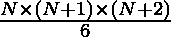
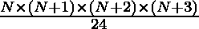

# 打印第 n 个学期之前的五个数字的程序

> 原文:[https://www . geesforgeks . org/program-to-print-penta tope-numbers-up-n-term/](https://www.geeksforgeeks.org/program-to-print-pentatope-numbers-upto-nth-term/)

**先决条件:**

*   [四面体数](https://www.geeksforgeeks.org/tetrahedral-numbers/)
*   [五元数字](https://www.geeksforgeeks.org/pentatope-number/)

给定一个值 n，任务是打印直到第 n <sup>个</sup>项的五元数列。
示例:

```
Input: 5
Output: 1 5 15 35 70

Input: 10
Output: 1 5 15 35 70 126 210 330 495 715 
```

**方法一:使用四面体数数列:**
这个问题很容易用 N <sup>次</sup>五元数等于前 N 个四面体数之和来解决。
我们来看看五元和四面体数系列。

> 对于 n = 5
> 四面体数= 1，4，10，20，35
> **每个术语的四面体数的前缀和:** (1)、(1 + 4)、(1 + 4 + 10)、(1 + 4 + 10 + 20)、(1 + 4 + 10 + 20 + 35)
> 所以，五元数是 1，5，15，35，70

使用公式计算第 N<sup>个四面体数:
因此，通过生成四面体数并将其与之前生成的所有四面体数之和相加来打印五元数系列。
以下是上述方法的实施:</sup> 

## 卡片打印处理机（Card Print Processor 的缩写）

```
// C++ program to generate Pentatope
// Number series
#include <bits/stdc++.h>
using namespace std;

// Function to generate nth tetrahedral number
int findTetrahedralNumber(int n)
{
    return ((n * (n + 1) * (n + 2)) / 6);
}

// Function to print pentatope number
// series upto nth term.
void printSeries(int n)
{
    // Initialize prev as 0\. It store the
    // sum of all previously generated
    // pentatope numbers
    int prev = 0;
    int curr;

    // Loop to print pentatope series
    for (int i = 1; i <= n; i++)
    {
        // Find ith tetrahedral number
        curr = findTetrahedralNumber(i);

        // Add ith tetrahedral number to
        // sum of all previously generated
        // tetrahedral number to get ith
        // pentatope number
        curr = curr + prev;
        cout << curr << " ";

        // Update sum of all previously
        // generated tetrahedral number
        prev = curr;
    }
}

// Driver code
int main()
{
    int n = 10;

    // Function call to print pentatope
    // number series
    printSeries(n);

    return 0;
}
```

## Java 语言(一种计算机语言，尤用于创建网站)

```
// Java program to generate Pentatope
// Number series
import java.io.*;

class GFG {

    // Function to generate nth tetrahedral number
    static int findTetrahedralNumber(int n)
    {
        return ((n * (n + 1) * (n + 2)) / 6);
    }

    // Function to print pentatope number
    // series upto nth term.
    static void printSeries(int n)
    {
        // Initialize prev as 0\. It store the
        // sum of all previously generated
        // pentatope numbers
        int prev = 0;
        int curr;

        // Loop to print pentatope series
        for (int i = 1; i <= n; i++)
        {
            // Find ith tetrahedral number
            curr = findTetrahedralNumber(i);

            // Add ith tetrahedral number to
            // sum of all previously generated
            // tetrahedral number to get ith
            // pentatope number
            curr = curr + prev;
            System.out.print(curr + " ");

            // Update sum of all previously
            // generated tetrahedral number
            prev = curr;
        }
    }

    // Driver code
    public static void main (String[] args)
    {
        int n = 10;

        // Function call to print pentatope
        // number series
        printSeries(n);
    }
}
```

## 蟒蛇 3

```
# Python program to generate Pentatope
# Number series

# Function to generate nth tetrahedral number
def findTetrahedralNumber(n) :
    return (int((n * (n + 1) * (n + 2)) / 6))

# Function to print pentatope number
# series upto nth term.
def printSeries(n) :

    # Initialize prev as 0\. It store the
    # sum of all previously generated
    # pentatope numbers
    prev = 0

    # Loop to print pentatope series
    for i in range(1, n + 1) :

        # Find ith tetrahedral number
        curr = findTetrahedralNumber(i)

        # Add ith tetrahedral number to
        # sum of all previously generated
        # tetrahedral number to get ith
        # pentatope number
        curr = curr + prev;
        print(curr, end=' ')

        # Update sum of all previously
        # generated tetrahedral number
        prev = curr

# Driver code
n = 10

# Function call to print pentatope
# number series
printSeries(n)
```

## C#

```
// C# program to generate Pentatope
// Number series
using System;

public class GFG {

    // Function to generate nth tetrahedral number
    static int findTetrahedralNumber(int n)
    {
        return ((n * (n + 1) * (n + 2)) / 6);
    }

    // Function to print pentatope number
    // series upto nth term.
    static void printSeries(int n)
    {
        // Initialize prev as 0\. It store the
        // sum of all previously generated
        // pentatope numbers
        int prev = 0;
        int curr;

        // Loop to print pentatope series
        for (int i = 1; i <= n; i++)
        {
            // Find ith tetrahedral number
            curr = findTetrahedralNumber(i);

            // Add ith tetrahedral number to
            // sum of all previously generated
            // tetrahedral number to get ith
            // pentatope number
            curr = curr + prev;
            Console.Write(curr + " ");

            // Update sum of all previously
            // generated tetrahedral number
            prev = curr;
        }
    }

    // Driver code
    static public void Main ()
    {
        int n = 10;

        // Function call to print pentatope
        // number series
        printSeries(n);
    }
}
```

## 服务器端编程语言（Professional Hypertext Preprocessor 的缩写）

```
<?php
// PHP program to generate Pentatope
// Number series

// Function to generate nth tetrahedral number
function findTetrahedralNumber($n)
{
    return (($n * ($n + 1) * ($n + 2)) / 6);
}

// Function to print pentatope number
// series upto nth term.
function printSeries($n)
{
    // Initialize prev as 0\. It store the
    // sum of all previously generated
    // pentatope numbers
    $prev = 0;
    $curr;

    // Loop to print pentatope series
    for ($i = 1; $i <= $n; $i++)
    {
        // Find ith tetrahedral number
        $curr = findTetrahedralNumber($i);

        // Add ith tetrahedral number to
        // sum of all previously generated
        // tetrahedral number to get ith
        // pentatope number
        $curr = $curr + $prev;
        echo($curr . " ");

        // Update sum of all previously
        // generated tetrahedral number
        $prev = $curr;
    }
}

// Driver code
$n = 10;

// Function call to print pentatope
// number series
printSeries($n);
?>
```

## java 描述语言

```
<script>

// JavaScript program to generate Pentatope
// Number series

// Function to generate nth tetrahedral number
function findTetrahedralNumber(n)
{
    return ((n * (n + 1) * (n + 2)) / 6);
}

// Function to print pentatope number
// series upto nth term.
function printSeries(n)
{
    // Initialize prev as 0\. It store the
    // sum of all previously generated
    // pentatope numbers
    let prev = 0;
    let curr;

    // Loop to print pentatope series
    for (let i = 1; i <= n; i++)
    {
        // Find ith tetrahedral number
        curr = findTetrahedralNumber(i);

        // Add ith tetrahedral number to
        // sum of all previously generated
        // tetrahedral number to get ith
        // pentatope number
        curr = curr + prev;
        document.write(curr+" ");

        // Update sum of all previously
        // generated tetrahedral number
        prev = curr;
    }
}

// Driver code
let n = 10;

// Function call to print pentatope
// number series
printSeries(n);

// This code is contributed by sravan kumar

</script>
```

**Output:** 

```
1 5 15 35 70 126 210 330 495 715
```

**时间复杂度:** O(n)
**方法二:使用五元数公式:**
该公式求 N <sup>th</sup> 五元数
以下为所需实现:

## 卡片打印处理机（Card Print Processor 的缩写）

```
// C++ program to print Pentatope number series.
#include <bits/stdc++.h>
using namespace std;

// Function to print pentatope series up to nth term
void printSeries(int n)
{

    // Loop to print pentatope number series
    for (int i = 1; i <= n; i++)
    {
        // calculate and print ith pentatope number
        int num = (i * (i + 1) * (i + 2) * (i + 3) / 24);

        cout << num << " ";
    }
}

// Driver code
int main()
{
    int n = 10;

    // Function call to print pentatope number series
    printSeries(n);
    return 0;
}
```

## Java 语言(一种计算机语言，尤用于创建网站)

```
// Java program to print Pentatope number series.
import java.io.*;

class GFG {

    // Function to print pentatope series up to nth term
    static void printSeries(int n)
    {

        // Loop to print pentatope number series
        for (int i = 1; i <= n; i++)
        {
            // calculate and print ith pentatope number
            int num = (i * (i + 1) * (i + 2) * (i + 3) / 24);

            System.out.print(num + " ");
        }
    }

    // Driver code
    public static void main (String[] args)
    {
        int n = 10;

        // Function call to print pentatope number series
        printSeries(n);
    }
}
```

## 蟒蛇 3

```
# Python program to print Pentatope number series.

# Function to print pentatope series up to nth term
def printSeries(n) :

    # Loop to print pentatope number series
    for i in range(1, n + 1) :

        # calculate and print ith pentatope number
        num = int(i * (i + 1) * (i + 2) * (i + 3) // 24)

        print(num, end=' ');

# Driver code
n = 10

# Function call to print pentatope number series
printSeries(n)
```

## C#

```
// C# program to print Pentatope number series.
using System;

public class GFG {

    // Function to print pentatope series up to nth term
    static void printSeries(int n)
    {

        // Loop to print pentatope number series
        for (int i = 1; i <= n; i++)
        {
            // calculate and print ith pentatope number
            int num = (i * (i + 1) * (i + 2) * (i + 3) / 24);

            Console.Write(num + " ");
        }
    }

    // Driver code
    static public void Main ()
    {
        int n = 10;

        // Function call to print pentatope number series
        printSeries(n);
    }
}
```

## 服务器端编程语言（Professional Hypertext Preprocessor 的缩写）

```
<?php
// PHP program to print Pentatope number series.

// Function to print pentatope series up to nth term
function printSeries($n)
{

    // Loop to print pentatope number series
    for ($i = 1; $i <= $n; $i++)
    {
        // calculate and print ith pentatope number
        $num = ($i * ($i + 1) * ($i + 2) * ($i + 3) / 24);

        echo($num . " ");
    }
}

// Driver code
$n = 10;

// Function call to print pentatope number series
printSeries($n);
?>
```

## java 描述语言

```
<script>

// Javascript program to print Pentatope number series.

// Function to print pentatope series up to nth term
function printSeries(n)
{

    // Loop to print pentatope number series
    for (let i = 1; i <= n; i++)
    {
        // calculate and print ith pentatope number
        num = (i * (i + 1) * (i + 2) * (i + 3) / 24);

        document.write(num+" ");
    }
}

// Driver code
let n = 10;

// Function call to print pentatope number series
printSeries(n);

// This code is contributed by sravan kumar

</script>
```

**Output:** 

```
1 5 15 35 70 126 210 330 495 715
```