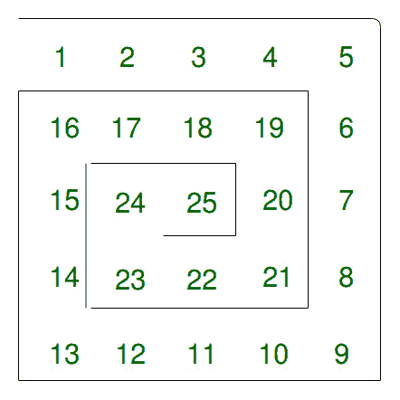

# 打印螺旋图案的程序

> 原文:[https://www . geesforgeks . org/program-to-print-spiral-pattern/](https://www.geeksforgeeks.org/program-to-print-spiral-pattern/)

给定 n 作为矩阵的大小，任务是在 n 大小的 2D 阵列中打印螺旋图案。

**示例:**

```
Input: n = 5
Output:   1   2   3   4   5
          16  17  18  19  6
          15  24  25  20  7
          14  23  22  21  8
          13  12  11  10  9
```

**螺旋图案预览:**



**进场:**

1.  创建一个 n 大小的 2D 数组
2.  将数组的边界存储在边界变量中。最初它将是 n-1，此后它在每次旋转后都会改变。
3.  将螺旋打印的左尺寸存储在可变左尺寸中。最初它将是 n-1，此后每旋转 2 圈，它将减少 1。
4.  创建一个标志来确定 2 次旋转，因为每 2 次旋转后，左尺寸将减小。
5.  创建一个 char 变量 move 来存储螺旋图案的当前运动。它可以有“r”代表右，“l”代表左，“d”代表下，“u”代表上。
6.  重复以下步骤，直到“I”在范围内[1，n^2]:
    *   将 I 的值赋给螺旋图案。
    *   确定图案的下一个移动。
    *   检查图案是否达到边界。如果达到，修改尺寸并旋转螺旋图案。
7.  打印存储在 2D 阵列中的螺旋图案。

下面是上述方法的 Java 实现:

## C++

```
#include <iostream>
using namespace std;

void printSpiral(int size)
{

    // Create row and col
    // to traverse rows and columns
    int row = 0, col = 0;

    int boundary = size - 1;
    int sizeLeft = size - 1;
    int flag = 1;

    // Variable to determine the movement
    // r = right, l = left, d = down, u = upper
    char move = 'r';

    // Array for matrix
    int matrix[size][size] = {0};

    for (int i = 1; i < size * size + 1; i++)
    {

        // Assign the value
        matrix[row][col] = i;

        // switch-case to determine the next index
        switch (move)
        {

            // If right, go right
            case 'r':
                col += 1;
                break;

            // if left, go left
            case 'l':
                col -= 1;
                break;

            // if up, go up
            case 'u':
                row -= 1;
                break;

            // if down, go down
            case 'd':
                row += 1;
                break;
        }

        // Check if the matrix
        // has reached array boundary
        if (i == boundary)
        {

            // Add the left size for the next boundary
            boundary += sizeLeft;

            // If 2 rotations has been made,
            // decrease the size left by 1
            if (flag != 2)
            {

                flag = 2;
            }
            else
            {

                flag = 1;
                sizeLeft -= 1;
            }

            // switch-case to rotate the movement
            switch (move)
            {

                // if right, rotate to down
                case 'r':
                    move = 'd';
                    break;

                // if down, rotate to left
                case 'd':
                    move = 'l';
                    break;

                // if left, rotate to up
                case 'l':
                    move = 'u';
                    break;

                // if up, rotate to right
                case 'u':
                    move = 'r';
                    break;
            }
        }
    }

    // Print the matrix
    for (row = 0; row < size; row++)
    {
        for (col = 0; col < size; col++)
        {

            int n = matrix[row][col];
            if(n < 10)
                cout << n << " ";
            else
                cout << n << " ";
        }

        cout << endl;
    }
}

// Driver Code
int main()
{

    // Get the size of size
    int size = 5;

    // Print the Spiral Pattern
    printSpiral(size);
    return 0;
}

// This code is contributed by 29AjayKumar
```

## Java 语言(一种计算机语言，尤用于创建网站)

```
public class GFG {

    public static void printSpiral(int size)
    {

        // Create row and col
        // to traverse rows and columns
        int row = 0, col = 0;

        int boundary = size - 1;
        int sizeLeft = size - 1;
        int flag = 1;

        // Variable to determine the movement
        // r = right, l = left, d = down, u = upper
        char move = 'r';

        // Array  for matrix
        int matrix[][] = new int[size][size];

        for (int i = 1; i < size * size + 1; i++) {

            // Assign the value
            matrix[row][col] = i;

            // switch-case to determine the next index
            switch (move) {

            // If right, go right
            case 'r':
                col += 1;
                break;

            // if left, go left
            case 'l':
                col -= 1;
                break;

            // if up, go up
            case 'u':
                row -= 1;
                break;

            // if down, go down
            case 'd':
                row += 1;
                break;
            }

            // Check if the matrix
            // has reached array boundary
            if (i == boundary) {

                // Add the left size for the next boundary
                boundary += sizeLeft;

                // If 2 rotations has been made,
                // decrease the size left by 1
                if (flag != 2) {

                    flag = 2;
                }
                else {

                    flag = 1;
                    sizeLeft -= 1;
                }

                // switch-case to rotate the movement
                switch (move) {

                // if right, rotate to down
                case 'r':
                    move = 'd';
                    break;

                // if down, rotate to left
                case 'd':
                    move = 'l';
                    break;

                // if left, rotate to up
                case 'l':
                    move = 'u';
                    break;

                // if up, rotate to right
                case 'u':
                    move = 'r';
                    break;
                }
            }
        }

        // Print the matrix
        for (row = 0; row < size; row++) {
            for (col = 0; col < size; col++) {

                int n = matrix[row][col];
                System.out.print((n < 10)
                                     ? (n + "  ")
                                     : (n + " "));
            }

            System.out.println();
        }
    }

    // Driver Code
    public static void main(String[] args)
    {

        // Get the size of size
        int size = 5;

        // Print the Spiral Pattern
        printSpiral(size);
    }
}
```

## C#

```
// C# implementation of the approach
using System;

class GFG {

    public static void printSpiral(int size)
    {

        // Create row and col
        // to traverse rows and columns
        int row = 0, col = 0;

        int boundary = size - 1;
        int sizeLeft = size - 1;
        int flag = 1;

        // Variable to determine the movement
        // r = right, l = left, d = down, u = upper
        char move = 'r';

        // Array for matrix
        int[, ] matrix = new int[size, size];

        for (int i = 1; i < size * size + 1; i++) {

            // Assign the value
            matrix[row, col] = i;

            // switch-case to determine the next index
            switch (move) {

            // If right, go right
            case 'r':
                col += 1;
                break;

            // if left, go left
            case 'l':
                col -= 1;
                break;

            // if up, go up
            case 'u':
                row -= 1;
                break;

            // if down, go down
            case 'd':
                row += 1;
                break;
            }

            // Check if the matrix
            // has reached array boundary
            if (i == boundary) {

                // Add the left size for the next boundary
                boundary += sizeLeft;

                // If 2 rotations has been made,
                // decrease the size left by 1
                if (flag != 2) {

                    flag = 2;
                }
                else {

                    flag = 1;
                    sizeLeft -= 1;
                }

                // switch-case to rotate the movement
                switch (move) {

                // if right, rotate to down
                case 'r':
                    move = 'd';
                    break;

                // if down, rotate to left
                case 'd':
                    move = 'l';
                    break;

                // if left, rotate to up
                case 'l':
                    move = 'u';
                    break;

                // if up, rotate to right
                case 'u':
                    move = 'r';
                    break;
                }
            }
        }

        // Print the matrix
        for (row = 0; row < size; row++) {
            for (col = 0; col < size; col++) {

                int n = matrix[row, col];
                Console.Write((n < 10)
                                  ? (n + " ")
                                  : (n + " "));
            }

            Console.WriteLine();
        }
    }

    // Driver Code
    public static void Main(String[] args)
    {

        // Get the size of size
        int size = 5;

        // Print the Spiral Pattern
        printSpiral(size);
    }
}

/* This code contributed by PrinciRaj1992 */
```

## java 描述语言

```
<script>

function printSpiral(size)
{

    // Create row and col
    // to traverse rows and columns
    let row = 0, col = 0;

    let boundary = size - 1;
    let sizeLeft = size - 1;
    let flag = 1;

    // Variable to determine the movement
    // r = right, l = left, d = down, u = upper
    let move = 'r';

    // Array for matrix
    let matrix = new Array(size);
    for(let i = 0; i < size; i++)
    {
        matrix[i] = new Array(size).fill(0);
    }

    for(let i = 1; i < size * size + 1; i++)
    {

        // Assign the value
        matrix[row][col] = i;

        // switch-case to determine
        // the next index
        switch (move)
        {

            // If right, go right
            case 'r':
                col += 1;
                break;

            // If left, go left
            case 'l':
                col -= 1;
                break;

            // If up, go up
            case 'u':
                row -= 1;
                break;

            // If down, go down
            case 'd':
                row += 1;
                break;
        }

        // Check if the matrix
        // has reached array boundary
        if (i == boundary)
        {

            // Add the left size for the
            // next boundary
            boundary += sizeLeft;

            // If 2 rotations has been made,
            // decrease the size left by 1
            if (flag != 2)
            {
                flag = 2;
            }
            else
            {
                flag = 1;
                sizeLeft -= 1;
            }

            // switch-case to rotate the movement
            switch (move)
            {

                // If right, rotate to down
                case 'r':
                    move = 'd';
                    break;

                // If down, rotate to left
                case 'd':
                    move = 'l';
                    break;

                // If left, rotate to up
                case 'l':
                    move = 'u';
                    break;

                // If up, rotate to right
                case 'u':
                    move = 'r';
                    break;
            }
        }
    }

    // Print the matrix
    for(row = 0; row < size; row++)
    {
        for(col = 0; col < size; col++)
        {
            let n = matrix[row][col];
            if (n < 10)
                document.write(n + " ");
            else
                document.write(n + " ");
        }
        document.write("<br>");
    }
}

// Driver Code

// Get the size of size
let size = 5;

// Print the Spiral Pattern
printSpiral(size);

// This code is contributed by subham348

</script>
```

**Output:** 

```
1  2  3  4  5  
16 17 18 19 6  
15 24 25 20 7  
14 23 22 21 8  
13 12 11 10 9
```