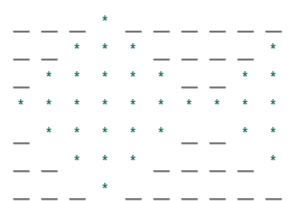

# 打印鱼图案的程序

> 原文:[https://www . geesforgeks . org/program-to-print-the-fish-pattern/](https://www.geeksforgeeks.org/program-to-print-the-fish-pattern/)

给定一个整数 **N** ，任务是打印一个超过 2N+1 行的鱼的图案。

**示例:**

> **输入:** N=3
> **输出:**
> *****
> *** * ***
> *** * * * * * * * ***
> *** * * * * * * * * * * * ***
> *** * * * * * * * * * ***
> T21】* * *
> *
> 
> **输入:** N=5
> **输出:**
> *****
> *** * * * ***
> *** * * * * * * * * ***
> *** * * * * * * * * * * * * * * ***
> *** * * * * * * * * * * * T21】* * * * * * * * * * * * * * * * * * * * T22】
> *** * * * * * * * * * * * * * * * * * * * * T25】
> T27】* * * * * * * T28****

**方法:**鱼由三部分组成:

*   上部:超过 N 行。
*   中间部分:中间单排
*   下部:超过 N 行

现在，让我们试着用一个例子来理解这个模式:
对于 N=3，鱼是:



现在，要解决这个问题，请按照以下步骤操作:

1.  首先，创建上部:
    *   对 **i=0 到 i < N** 运行一个循环，在循环的每次迭代中:
        *   如上图所示，首先出现一串具有 T2 M T3(最初为 T4 M = N T5)空间的 T0 太空 1 T1，然后出现一层恒星，假设 T6 恒星 1 T7 只有一颗恒星，然后出现 2 次太空 1 T9，然后出现另一层恒星，最初为 0 颗恒星。
        *   现在在每次迭代中，**空间 1** 减少一个空间，**恒星 1** 增加 2 颗恒星，**恒星 2** 增加 1 颗恒星。
2.  中间部分，打印**星 1** 和**星 2** ，因为这一行没有空格。
3.  现在，为了得到下部，颠倒上部的算法。
4.  循环结束后，将创建鱼的图案。

下面是上述方法的实现。

## C++

```
// C++ program for the above approach

#include <bits/stdc++.h>
using namespace std;

// Function to print the pattern of a fish
// over N rows
void printFish(int N)
{

    string spaces1 = "", spaces2 = "";
    string stars1 = "*", stars2 = "";
    for (int i = 0; i < N; ++i) {
        spaces1 += ' ';
    }
    spaces2 = spaces1;

    for (int i = 0; i < 2 * N + 1; ++i) {
        // For upper part
        if (i < N) {
            cout << spaces1 << stars1
                 << spaces1 << spaces1
                 << stars2 << endl;
            spaces1.pop_back();
            stars1 += "**";
            stars2 += "*";
        }

        // For middle part
        if (i == N) {
            cout << spaces1 << stars1
                 << spaces1 << spaces1
                 << stars2 << endl;
        }

        // For lower part
        if (i > N) {
            spaces1 += ' ';
            stars1.pop_back();
            stars1.pop_back();
            stars2.pop_back();
            cout << spaces1 << stars1
                 << spaces1 << spaces1
                 << stars2 << endl;
        }
    }
}

// Driver Code
int main()
{
    int N = 5;
    printFish(N);
}
```

## Java 语言(一种计算机语言，尤用于创建网站)

```
// Java program for the above approach
class GFG {

    // Function to print the pattern of a fish
    // over N rows
    public static void printFish(int N) {

        String spaces1 = "";
        String stars1 = "*", stars2 = "";
        for (int i = 0; i < N; ++i) {
            spaces1 += ' ';
        }

        for (int i = 0; i < 2 * N + 1; ++i)
        {

            // For upper part
            if (i < N) {
                System.out.print(spaces1 + stars1 + spaces1 + spaces1);
                System.out.println(stars2);
                spaces1 = spaces1.substring(0, spaces1.length() - 1);
                stars1 += "**";
                stars2 += "*";
            }

            // For middle part
            if (i == N) {
                System.out.print(spaces1 + stars1 + spaces1 + spaces1);
                System.out.println(stars2);
            }

            // For lower part
            if (i > N) {
                spaces1 += ' ';
                stars1 = stars1.substring(0, stars1.length() - 1);
                stars1 = stars1.substring(0, stars1.length() - 1);
                stars2 = stars2.substring(0, stars2.length() - 1);
                System.out.print(spaces1 + stars1 + spaces1 + spaces1);
                System.out.println(stars2);
            }
        }
    }

    // Driver Code
    public static void main(String args[]) {
        int N = 5;
        printFish(N);
    }
}

// This code is contributed by gfgking.
```

## 蟒蛇 3

```
# Python3 program for the above approach

# Function to print the pattern of a fish
# over N rows
def printFish(N) :

    spaces1 = ""; spaces2 = "";
    stars1 = "*"; stars2 = "";
    for i in range(N) :
        spaces1 += ' ';

    spaces2 = spaces1;

    for i in range( 2 * N + 1) :
        # For upper part
        if (i < N) :
            print(spaces1,end="");
            print(stars1,end="");
            print(spaces1,end="");
            print(spaces1,end="");
            print(stars2);
            spaces1 = spaces1[:-1]
            stars1 += "**";
            stars2 += "*";

        # For middle part
        if (i == N) :
            print(spaces1,end="");
            print(stars1,end="");
            print(spaces1,end="");
            print(spaces1,end="");
            print(stars2);

        # For lower part
        if (i > N) :
            spaces1 += ' ';
            stars1 = stars1[:-1];
            stars1 = stars1[:-1];
            stars2 = stars2[:-1];

            print(spaces1,end="");
            print(stars1,end="")
            print(spaces1,end="");
            print(spaces1,end="");
            print(stars2);

# Driver Code
if __name__ == "__main__" :

    N = 5;
    printFish(N);

    # This code is contributed by AnkThon
```

## C#

```
// C# program for the above approach
using System;
class GFG {

    // Function to print the pattern of a fish
    // over N rows
    static void printFish(int N) {

        string spaces1 = "";
        string stars1 = "*", stars2 = "";
        for (int i = 0; i < N; ++i) {
            spaces1 += ' ';
        }

        for (int i = 0; i < 2 * N + 1; ++i)
        {

            // For upper part
            if (i < N) {
                Console.Write(spaces1 + stars1 + spaces1 + spaces1);
                Console.Write(stars2 + "\n");
                spaces1 = spaces1.Substring(0, spaces1.Length - 1);
                stars1 += "**";
                stars2 += "*";
            }

            // For middle part
            if (i == N) {
                Console.Write(spaces1 + stars1 + spaces1 + spaces1);
                Console.Write(stars2 + "\n");
            }

            // For lower part
            if (i > N) {
                spaces1 += ' ';
                stars1 = stars1.Substring(0, stars1.Length - 1);
                stars1 = stars1.Substring(0, stars1.Length - 1);
                stars2 = stars2.Substring(0, stars2.Length - 1);
                Console.Write(spaces1 + stars1 + spaces1 + spaces1);
                Console.Write(stars2 + "\n");
            }
        }
    }

    // Driver Code
    public static void Main() {
        int N = 5;
        printFish(N);
    }
}

// This code is contributed by Samim Hossain Mondal.
```

## java 描述语言

```
<script>
    // JavaScript program for the above approach

    // Function to print the pattern of a fish
    // over N rows
    const printFish = (N) => {

        let spaces1 = "", spaces2 = "";
        let stars1 = "*", stars2 = "";
        for (let i = 0; i < N; ++i) {
            spaces1 += "  ";
        }
        spaces2 = spaces1;

        for (let i = 0; i < 2 * N + 1; ++i) {
            // For upper part
            if (i < N) {
                document.write(`${spaces1}${stars1}${spaces1}${spaces1}${stars2}<br/>`);
                spaces1 = spaces1.substr(0, spaces1.length - 10);
                stars1 += "**";
                stars2 += "*";
            }

            // For middle part
            if (i == N) {
                document.write(`${spaces1}${stars1}${spaces1}${spaces1}${stars2}<br/>`);
            }

            // For lower part
            if (i > N) {
                spaces1 += "  ";
                stars1 = stars1.substr(0, stars1.length - 2);
                stars2 = stars2.substr(0, stars2.length - 1);
                document.write(`${spaces1}${stars1}${spaces1}${spaces1}${stars2}<br/>`);
            }
        }
    }

    // Driver Code
    let N = 5;
    printFish(N);

    // This code is contributed by rakeshsahni

</script>
```

**Output**

```
     *          
    ***        *
   *****      **
  *******    ***
 *********  ****
****************
 *********  ****
  *******    ***
   *****      **
    ***        *
     *          
```

**时间复杂度:**O(N)
T3】辅助空间: O(N)