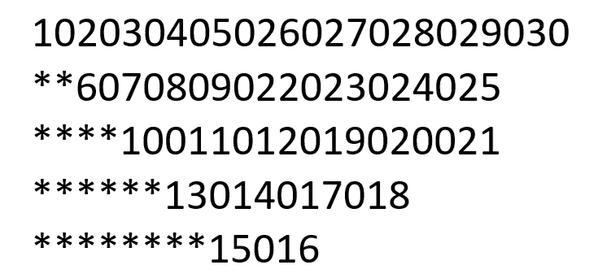
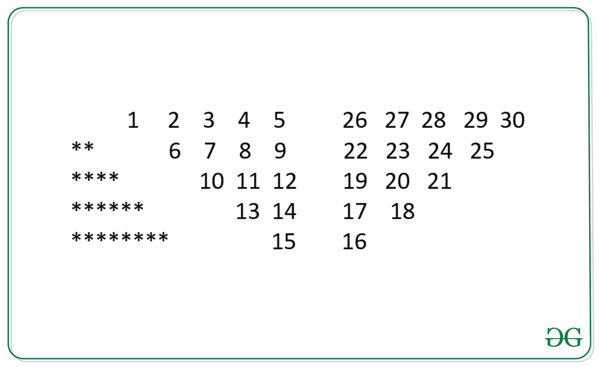

# 程序打印图案 1020304017018019020 * * 50607014015016 * * * * 809012013 * * * * * * 10011……

> 原文:[https://www . geesforgeks . org/program-to-print-the-pattern-1020304017018019020-50607014015016-809012013-10011/](https://www.geeksforgeeks.org/program-to-print-the-pattern-1020304017018019020-50607014015016-809012013-10011/)

给定一个整数 **N** ，任务是为给定值 **N** 打印下面的图案。

> 对于 N = 5，下面是给定的模式:
> 
> [](https://media.geeksforgeeks.org/wp-content/uploads/20200702101318/goldenpattern.png)

**示例:**

> **输入:** N = 4
> **输出:**
> 1020304017018019020
> * * 50607014015016
> * * * * * 809012013
> * * * * * 10011
> 
> **输入:** N = 3
> **输出:**
> 10203010011012
> * * 4050809
> * * * * * 607

**方法:**理解给定模式背后的逻辑的想法陈述如下:

仔细观察，我们会发现通过用空格替换中间的零，可以更清楚地看到模式。该模式进一步分为三种不同的模式。

1.  **情况 1:** 星号(*)字符模式遵循从 0 开始的序列，并在每行中再添加两个星号，其中该行等于 n。
2.  **案例二:**在这部分，模式很简单易懂。即列数和行数将等于 N，并遵循类似 1、2、3、4、5 的序列…
3.  **案例 3:** 跟进或自下而上的顺序是有趣的部分，数字从下往上表示**。**



下面是上述方法的实现:

## C++

```
// C++ implementation to print
// the given pattern
#include <bits/stdc++.h>
using namespace std;

// Function to find the sum of
// N integers from 1 to N
int sum(int n)
{
    return n * (n - 1) / 2;
}

// Function to print the given
// pattern
void BSpattern(int N)
{
    int Val = 0, Pthree = 0,
        cnt = 0, initial;

    string s = "**";

    // Iterate over [0, N - 1]
    for (int i = 0; i < N; i++) {
        cnt = 0;

        // Sub-Pattern - 1
        if (i > 0) {
            cout << s;
            s += "**";
        }

        // Sub-Pattern - 2
        for (int j = i; j < N; j++) {

            // Count the number of element
            // in rows and sub-pattern 2 and 3
            // will have same rows
            if (i > 0) {
                cnt++;
            }
            // Increment Val to print the
            // series 1, 2, 3, 4, 5 ...
            cout << ++Val;
            cout << 0;
        }

        // To get the first element of sub
        // pattern 3 find the sum of first N-1
        // elements first N-1 elements in row1
        // previous of Sub-Pattern 2

        // Finally, add the (N-1)th element
        // i.e., 5 and increment it by 1
        if (i == 0) {
            int Sumbeforelast = sum(Val) * 2;
            Pthree = Val + Sumbeforelast + 1;
            initial = Pthree;
        }

        // Initial is used to give the initial
        // value of the row in Sub-Pattern 3
        initial = initial - cnt;

        Pthree = initial;

        // Sub-Pattern 3
        for (int k = i; k < N; k++) {

            cout << Pthree++;

            // Skip printing zero at the last
            if (k != N - 1) {
                cout << 0;
            }
        }

        cout << "\n";
    }
}

// Driver Code
int main()
{
    // Given N
    int N = 5;

    // Function Call
    BSpattern(N);
    return 0;
}
```

## Java 语言(一种计算机语言，尤用于创建网站)

```
// Java implementation to print
// the given pattern
import java.util.*;

class GFG{

// Function to find the sum of
// N integers from 1 to N
static int sum(int n)
{
    return n * (n - 1) / 2;
}

// Function to print the given
// pattern
static void BSpattern(int N)
{
    int Val = 0, Pthree = 0,
        cnt = 0, initial = -1;

    String s = "**";

    // Iterate over [0, N - 1]
    for(int i = 0; i < N; i++)
    {
        cnt = 0;

        // Sub-Pattern - 1
        if (i > 0)
        {
            System.out.print(s);
            s += "**";
        }

        // Sub-Pattern - 2
        for(int j = i; j < N; j++)
        {

            // Count the number of element
            // in rows and sub-pattern 2
            // and 3 will have same rows
            if (i > 0)
            {
                cnt++;
            }

            // Increment Val to print the
            // series 1, 2, 3, 4, 5 ...
            System.out.print(++Val);
            System.out.print("0");
        }

        // To get the first element of sub
        // pattern 3 find the sum of first N-1
        // elements first N-1 elements in row1
        // previous of Sub-Pattern 2

        // Finally, add the (N-1)th element
        // i.e., 5 and increment it by 1
        if (i == 0)
        {
            int Sumbeforelast = sum(Val) * 2;
            Pthree = Val + Sumbeforelast + 1;
            initial = Pthree;
        }

        // Initial is used to give the initial
        // value of the row in Sub-Pattern 3
        initial = initial - cnt;

        Pthree = initial;

        // Sub-Pattern 3
        for(int k = i; k < N; k++)
        {
            System.out.print(Pthree++);

            // Skip printing zero at the last
            if (k != N - 1)
            {
                System.out.print("0");
            }
        }
        System.out.println();
    }
}

// Driver code
public static void main(String[] args)
{

    // Given N
    int N = 5;

    // Function call
    BSpattern(N);
}
}

// This code is contributed by offbeat
```

## 蟒蛇 3

```
# Python3 implementation to print
# the given pattern

# Function to find the sum of
# N integers from 1 to N
def sum(n):

    return n * (n - 1) // 2

# Function to print the given
# pattern
def BSpattern(N):

    Val = 0
    Pthree = 0,
    cnt = 0 
    initial = -1
    s = "**"

    # Iterate over [0, N - 1]
    for i in range(N):
        cnt = 0

        # Sub-Pattern - 1
        if (i > 0):
            print(s, end = "")
            s += "**"

        # Sub-Pattern - 2
        for j in range(i, N):

            # Count the number of element
            # in rows and sub-pattern 2 and 3
            # will have same rows
            if (i > 0):
                cnt += 1

            # Increment Val to print the
            # series 1, 2, 3, 4, 5 ...
            Val += 1
            print(Val, end = "")
            print(0, end = "")

        # To get the first element of sub
        # pattern 3 find the sum of first N-1
        # elements first N-1 elements in row1
        # previous of Sub-Pattern 2

        # Finally, add the (N-1)th element
        # i.e., 5 and increment it by 1
        if (i == 0):
            Sumbeforelast = sum(Val) * 2
            Pthree = Val + Sumbeforelast + 1
            initial = Pthree

        # Initial is used to give the initial
        # value of the row in Sub-Pattern 3
        initial = initial - cnt

        Pthree = initial

        # Sub-Pattern 3
        for k in range(i, N):
            print(Pthree, end = "")
            Pthree += 1

            # Skip printing zero at the last
            if (k != N - 1):
                print(0, end = "")

        print()

# Driver Code

# Given N
N = 5

# Function call
BSpattern(N)

# This code is contributed by sanjoy_62
```

## C#

```
// C# implementation to print
// the given pattern
using System;
class GFG{

// Function to find the sum of
// N integers from 1 to N
static int sum(int n)
{
    return n * (n - 1) / 2;
}

// Function to print the given
// pattern
static void BSpattern(int N)
{
    int Val = 0, Pthree = 0,
        cnt = 0, initial = -1;

    String s = "**";

    // Iterate over [0, N - 1]
    for(int i = 0; i < N; i++)
    {
        cnt = 0;

        // Sub-Pattern - 1
        if (i > 0)
        {
            Console.Write(s);
            s += "**";
        }

        // Sub-Pattern - 2
        for(int j = i; j < N; j++)
        {

            // Count the number of element
            // in rows and sub-pattern 2
            // and 3 will have same rows
            if (i > 0)
            {
                cnt++;
            }

            // Increment Val to print the
            // series 1, 2, 3, 4, 5 ...
            Console.Write(++Val);
            Console.Write("0");
        }

        // To get the first element of sub
        // pattern 3 find the sum of first N-1
        // elements first N-1 elements in row1
        // previous of Sub-Pattern 2

        // Finally, add the (N-1)th element
        // i.e., 5 and increment it by 1
        if (i == 0)
        {
            int Sumbeforelast = sum(Val) * 2;
            Pthree = Val + Sumbeforelast + 1;
            initial = Pthree;
        }

        // Initial is used to give the initial
        // value of the row in Sub-Pattern 3
        initial = initial - cnt;

        Pthree = initial;

        // Sub-Pattern 3
        for(int k = i; k < N; k++)
        {
            Console.Write(Pthree++);

            // Skip printing zero at the last
            if (k != N - 1)
            {
                Console.Write("0");
            }
        }
        Console.WriteLine();
    }
}

// Driver code
public static void Main(String[] args)
{

    // Given N
    int N = 5;

    // Function call
    BSpattern(N);
}
}

// This code is contributed by shikhasingrajput
```

## java 描述语言

```
<script>
//Javascript implementation to print
// the given pattern

// Function to find the sum of
// N integers from 1 to N
function sum( n)
{
    return n * parseInt((n - 1) / 2);
}

// Function to print the given
// pattern
function BSpattern( N)
{
    var Val = 0, Pthree = 0,
        cnt = 0, initial;

    var s = "**";

    // Iterate over [0, N - 1]
    for (var i = 0; i < N; i++) {
        cnt = 0;

        // Sub-Pattern - 1
        if (i > 0) {
            document.write( s);
            s += "**";
        }

        // Sub-Pattern - 2
        for (var j = i; j < N; j++) {

            // Count the number of element
            // in rows and sub-pattern 2 and 3
            // will have same rows
            if (i > 0) {
                cnt++;
            }
            // Increment Val to print the
            // series 1, 2, 3, 4, 5 ...
            document.write( ++Val);
            document.write( 0);
        }

        // To get the first element of sub
        // pattern 3 find the sum of first N-1
        // elements first N-1 elements in row1
        // previous of Sub-Pattern 2

        // Finally, add the (N-1)th element
        // i.e., 5 and increment it by 1
        if (i == 0) {
            var Sumbeforelast = sum(Val) * 2;
            Pthree = Val + Sumbeforelast + 1;
            initial = Pthree;
        }

        // Initial is used to give the initial
        // value of the row in Sub-Pattern 3
        initial = initial - cnt;

        Pthree = initial;

        // Sub-Pattern 3
        for (var k = i; k < N; k++) {

            document.write(Pthree++);

            // Skip printing zero at the last
            if (k != N - 1) {
                document.write( 0);
            }
        }

        document.write( "<br>");
    }
}

// Given N
var N = 5;
// Function Call
BSpattern(N);

// This code is contributed by SoumikMondal
</script>
```

**Output:** 

```
102030405026027028029030
**6070809022023024025
****10011012019020021
******13014017018
********15016
```

**时间复杂度:***O(N<sup>2</sup>)*
**辅助空间:** *O(1)*