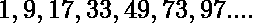

# 程序打印系列 1、9、17、33、49、73、97…直到 N 个术语

> 原文:[https://www . geesforgeks . org/program-to-print-the-series-1-9-17-33-49-73-97-till-n-terms/](https://www.geeksforgeeks.org/program-to-print-the-series-1-9-17-33-49-73-97-till-n-terms/)

给定一个数字 **N** ，任务是打印该系列的第一个 **N** 术语:

> 

**例:**

> **输入:** N = 7
> **输出:** 1、9、17、33、49、73、97
> **输入:** N = 3
> **输出:** 1、9、17

**方法:**从给定的序列中，找到第 n 项的公式:

```
1st term = 1
2nd term = 9 = 2 * 4 + 1
3rd term = 17 = 2 * 9 - 1
4th term = 33 = 2 * 16 + 1
5th term = 49 = 2 * 25 - 1
6th term = 73 = 2 * 36 + 1
.
.
Nth term = (2 * N2 + (-1)N)
```

因此:

> **该系列的第 n 项**
> 
> ```
> *** QuickLaTeX cannot compile formula:
>  
> 
> *** Error message:
> Error: Nothing to show, formula is empty
> 
> ```

然后在**【1，N】**范围内的数字上迭代，使用上面的公式找到所有的术语并打印出来。
以下是上述办法的实施情况:

## 卡片打印处理机（Card Print Processor 的缩写）

```
// C++ implementation of the above approach

#include "bits/stdc++.h"
using namespace std;

// Function to print the series
void printSeries(int N)
{

    int ith_term = 0;

    // Generate the ith term and
    // print it
    for (int i = 1; i <= N; i++) {

        ith_term = i % 2 == 0
                       ? 2 * i * i + 1
                       : 2 * i * i - 1;
        cout << ith_term << ", ";
    }
}

// Driver Code
int main()
{
    int N = 7;

    printSeries(N);
    return 0;
}
```

## Java 语言(一种计算机语言，尤用于创建网站)

```
// Java implementation of the above approach
import java.util.*;

class GFG{

// Function to print the series
static void printSeries(int N)
{

    int ith_term = 0;

    // Generate the ith term and
    // print it
    for (int i = 1; i <= N; i++) {

        ith_term = i % 2 == 0
                       ? 2 * i * i + 1
                       : 2 * i * i - 1;
        System.out.print(ith_term+ ", ");
    }
}

// Driver Code
public static void main(String[] args)
{
    int N = 7;

    printSeries(N);
}
}

// This code is contributed by PrinciRaj1992
```

## 蟒蛇 3

```
# Python implementation of the above approach

# Function to print series
def printSeries(N):

    ith_term = 0;

    # Generate the ith term and
    # print
    for i in range(1,N+1):

        ith_term = 0;
        if(i % 2 == 0):
            ith_term = 2 * i * i + 1;
        else:
            ith_term = 2 * i * i - 1;
        print(ith_term,end= ", ");

# Driver Code
if __name__ == '__main__':
    N = 7;

    printSeries(N);

# This code is contributed by Princi Singh
```

## C#

```
// C# implementation of the above approach
using System;

class GFG{

// Function to print the series
static void printSeries(int N)
{

    int ith_term = 0;

    // Generate the ith term and
    // print it
    for (int i = 1; i <= N; i++) {

        ith_term = i % 2 == 0? 2 * i * i + 1:
                                2 * i * i - 1;
        Console.Write(ith_term+ ", ");
    }
}

// Driver Code
public static void Main()
{
    int N = 7;

    printSeries(N);
}
}

// This code is contributed by AbhiThakur
```

## java 描述语言

```
<script>
// javascript implementation of the above approach

// Function to print the series
function printSeries( N)
{
    let ith_term = 0;

    // Generate the ith term and
    // print it
    for (let i = 1; i <= N; i++)
    {
        ith_term = i % 2 == 0
                       ? 2 * i * i + 1
                       : 2 * i * i - 1;
        document.write( ith_term + ", ");
    }
}

// Driver Code
    let N = 7;

    printSeries(N);

    // This code is contributed by gauravrajput1

</script>
```

**Output:** 

```
1, 9, 17, 33, 49, 73, 97,
```

时间复杂度:0(N)

辅助空间:0(1)