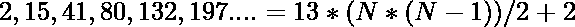

# 程序打印系列 2、15、41、80、132、197…直到 N 个术语

> 原文:[https://www . geesforgeks . org/program-to-print-the-series-2-15-41-80-132-197-till-n-terms/](https://www.geeksforgeeks.org/program-to-print-the-series-2-15-41-80-132-197-till-n-terms/)

给定一个数字 **N** ，任务是打印以下系列的第一个 **N** 术语:

```
2 15 41 80 132 197 275 366 470 587…
```

**示例:**

> **输入:** N = 7
> 
> **产量:** 2 15 41 80 132 197 275
> 
> **输入:** N = 3
> 
> **输出:** 2 15 41

**方法:**从给定的级数中，我们可以找到第 n 项的公式:

> 第一项= 2
> 第二项= 15 = 13 * 1 + 2
> 第三项= 41 = 13 * 2 + 15 = 13 * 3 + 2
> 第四项= 80 = 13 * 3 + 41 = 13 * 6 + 2
> 第五项= 132 = 13 * 4 + 80 = 13 * 10 + 2
> 。
> 。
> 第 N 项=(13 * N *(N–1))/2+2

因此:

> **该系列的第 n 项**
> 
> 

然后在**【1，N】**范围内的数字上迭代，使用上面的公式找到所有的术语并打印出来。

下面是上述方法的实现:

## C++

```
// C++ implementation to print the
// given with the given Nth term

#include "bits/stdc++.h"
using namespace std;

// Function to print the series
void printSeries(int N)
{

    int ith_term = 0;

    // Generate the ith term and
    for (int i = 1; i <= N; i++) {

        ith_term = (13 * i * (i - 1)) / 2 + 2;
        cout << ith_term << ", ";
    }
}

// Driver Code
int main()
{
    int N = 7;

    printSeries(N);
    return 0;
}
```

## Java 语言(一种计算机语言，尤用于创建网站)

```
// Java implementation to print the
// given with the given Nth term
import java.util.*;

class GFG{

// Function to print the series
static void printSeries(int N)
{
    int ith_term = 0;

    // Generate the ith term and
    for(int i = 1; i <= N; i++)
    {
       ith_term = (13 * i * (i - 1)) / 2 + 2;
       System.out.print(ith_term + ", ");
    }
}

// Driver Code
public static void main(String[] args)
{
    int N = 7;

    printSeries(N);
}
}

// This code is contributed by Rajput-Ji
```

## 蟒蛇 3

```
# Python3 implementation to print the
# given with the given Nth term

# Function to print the series
def printSeries(N):

    ith_term = 0;

    # Generate the ith term and
    for i in range(1, N + 1):
        ith_term = (13 * i * (i - 1)) / 2 + 2;
        print(int(ith_term), ", ", end = "");

# Driver Code
if __name__ == '__main__':

    N = 7;

    printSeries(N);

# This code is contributed by amal kumar choubey
```

## C#

```
// C# implementation to print the
// given with the given Nth term
using System;

class GFG{

// Function to print the series
static void printSeries(int N)
{
    int ith_term = 0;

    // Generate the ith term and
    for(int i = 1; i <= N; i++)
    {
       ith_term = (13 * i * (i - 1)) / 2 + 2;
       Console.Write(ith_term + ", ");
    }
}

// Driver Code
public static void Main(String[] args)
{
    int N = 7;

    printSeries(N);
}
}

// This code is contributed by Rajput-Ji
```

## java 描述语言

```
<script>
// javascript implementation to print the
// given with the given Nth term

// Function to print the series
function printSeries( N)
{

    let ith_term = 0;

    // Generate the ith term and
    for (let i = 1; i <= N; i++)
    {
        ith_term = (13 * i * (i - 1)) / 2 + 2;
       document.write( ith_term + ", ");
    }
}

// Driver Code
    let N = 7;
    printSeries(N);

    // This code is contributed by gauravrajput1

</script>
```

**Output:** 

```
2, 15, 41, 80, 132, 197, 275,
```