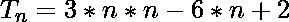

# 程序打印系列之和-1 + 2 + 11 + 26 + 47 +…..

> 原文:[https://www . geesforgeks . org/program-to-print 系列之和-1-2-11-26-47/](https://www.geeksforgeeks.org/program-to-print-the-sum-of-series-1-2-11-26-47/)

给定一个数 N，任务是求数列的前 N 个数之和:

> -1, 2, 11, 26, 47, 74, … ..

**例:**

```
Input: N = 3
Output: 12
Explanation:
Sum = (N * (N + 1) * (2 * N - 5) + 4 * N) / 2
    = (3 * (3 + 1) * (2 * 3 - 5) + 4 * 3) / 2
    = 12

Input: N = 9
Output: 603
```

**方法:**
给定系列的第 n 个术语可以概括为:
系列的第 n 个术语

下面是上述方法的实现:

## C++

```
// CPP program to find SUM
// upto N-th term of the series:
// -1, 2, 11, 26, 47, 74, .....

#include <iostream>
using namespace std;

// calculate Nth term of series
int findSum(int N)
{
    return (N * (N + 1) * (2 * N - 5) + 4 * N) / 2;
}

// Driver Function
int main()
{

    // Get the value of N
    int N = 3;

    // Get the sum of the series
    cout << findSum(N) << endl;

    return 0;
}
```

## Java 语言(一种计算机语言，尤用于创建网站)

```
// Java program to find SUM
// upto N-th term of the series:
// -1, 2, 11, 26, 47, 74, .....
import java.util.*;

class solution
{
 static int findSum(int N)
{
 return (N * (N + 1) * (2 * N - 5) + 4 * N) / 2;
}

//driver function
public static void main(String arr[])
{
  // Get the value of N
    int N = 3;

 // Get the sum of the series
   System.out.println(findSum(N));

}
}
//THis code is contributed by
//Surendra_Gangwar
```

## 蟒蛇 3

```
# Python3 program to find sum
# upto N-th term of the series:
# -1, 2, 11, 26, 47, 74, .....

# calculate Nth term of series
def findSum(N):

    return ((N * (N + 1) *
           (2 * N - 5) + 4 * N) / 2)

#Driver Function
if __name__=='__main__':

    #Get the value of N
    N = 3

    #Get the sum of the series
    print(findSum(N))

#this code is contributed by Shashank_Sharma
```

## C#

```
// C# program to find SUM
// upto N-th term of the series:
// -1, 2, 11, 26, 47, 74, .....
using System;

class GFG
{
static int findSum(int N)
{
    return (N * (N + 1) *
           (2 * N - 5) + 4 * N) / 2;
}

// Driver Code
static public void Main ()
{
    // Get the value of N
    int N = 3;

    // Get the sum of the series
    Console.Write(findSum(N));
}
}

// This code is contributed by Raj
```

## 服务器端编程语言（Professional Hypertext Preprocessor 的缩写）

```
<?php
// PHP program to find SUM
// upto N-th term of the series:
// -1, 2, 11, 26, 47, 74, .....

// calculate Nth term of series
function findSum($N)
{
    return ($N * ($N + 1) *
             (2 * $N - 5) + 4 * $N) / 2;
}

// Driver Code

// Get the value of N
$N = 3;

// Get the sum of the series
echo findSum($N) . "\n";

// This code is contributed
// by Akanksha Rai(Abby_akku)
?>
```

## java 描述语言

```
<script>
// javascript program to find SUM
// upto N-th term of the series:
// -1, 2, 11, 26, 47, 74, .....

function findSum(N)
{
    return (N * (N + 1) * (2 * N - 5) + 4 * N) / 2;
}

//driver function

  // Get the value of N
    var N = 3;

 // Get the sum of the series
   document.write(findSum(N));

// This code is contributed by 29AjayKumar

</script>
```

**Output:** 

```
12
```

**时间复杂度:** O(1)