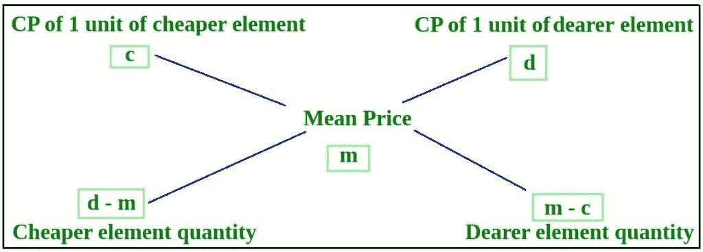

# 解决结盟问题的程序

> 原文:[https://www . geesforgeks . org/program-to-solution-the-alligion-problem/](https://www.geeksforgeeks.org/program-to-solve-the-alligation-problem/)

写一个程序，找出店主将两种价值为卢比的大米混合的比例。 kg 和 Rs。公斤，这样混合物的平均成本就是 Rs。公斤。
T4 举例:

```
Input : X = 50, Y = 70, Z = 65
Output : Ratio = 1:3

Input : X = 1000, Y = 2000, Z = 1400
Output : Ratio = 3:2
```

根据[关联规则](https://www.geeksforgeeks.org/placements-qa-mixture-and-alligation/)，混合的两个项目的权重之比将与这两个项目的属性与所得混合物的平均属性的偏差成反比。

```
w1 / w2 = (d - m) / (m - c)
```



下面的程序说明了上述方法:

## C++

```
#include <bits/stdc++.h>
using namespace std;

// Function to find the ratio of two mixtures
void alligation(float x, float y, float m)
{
    // Find the cheaper among x and y
    float c = (x <= y) ? x : y;
    // Find the dearer among x and y
    float d = (x >= y) ? x : y;

    // Find ratio r1:r2
    int r1 = d - m;
    int r2 = m - c;

    // Convert the ration into simpler form
    int gcd = __gcd(r1, r2);

    cout << r1 / gcd << ":" << r2 / gcd;
}

// Driver code
int main()
{
    float x, y, z;
    x = 50;
    y = 70;
    z = 65;

    alligation(x, y, z);

    return 0;
}
```

## Java 语言(一种计算机语言，尤用于创建网站)

```
// Java implementation of the
// above approach.
import java.util.*;

class solution
{

static float __gcd(float a, float b)
{
    float dividend,divisor;

    // a is greater or equal to b
    if(a>=b)
    dividend = a;
    else
    dividend = b;

    // b is greater or equal to a
    if(a<=b)
    divisor = a;
    else
    divisor = b;

while(divisor>0)
{
float remainder = dividend % divisor;
dividend = divisor;
divisor = remainder;

}
return dividend;
}
// Function to find the ratio of two mixtures
static void alligation(float x, float y, float m)
{
    // Find the cheaper among x and y
    float c;
    if (x <= y)
    c = x;
    else
    c = y;
    // Find the dearer among x and y
    float d ;
    if (x >= y)
    d = x;
    else
    d = y;

    // Find ratio r1:r2
    float r1 = d - m;
    float r2 = m - c;

    // Convert the ration into simpler form
    float gcd = __gcd(r1, r2);

    System.out.println((int)(r1 / gcd)+":"+(int)(r2 / gcd));
}

// Driver code
public static void main(String args[])
{
    float x, y, z;
    x = 50;
    y = 70;
    z = 65;

    alligation(x, y, z);
}
}

// This code is contributed by
// Shashank_sharma
```

## 蟒蛇 3

```
# Python 3 implementation of the
# above approach.
from math import gcd

# Function to find the ratio
# of two mixtures
def alligation(x, y, m):

    # Find the cheaper among x and y
    if (x <= y):
        c = x
    else:
        c = y

    # Find the dearer among x and y
    if (x >= y):
        d = x
    else:
        d = y

    # Find ratio r1:r2
    r1 = d - m
    r2 = m - c

    # Convert the ration into simpler form
    __gcd = gcd(r1, r2)

    print(r1 // __gcd, ":", r2 // __gcd)

# Driver code
if __name__ == '__main__':
    x = 50
    y = 70
    z = 65

    alligation(x, y, z)

# This code is contributed by
# Surendra_Gangwar
```

## C#

```
// C# implementation of the
// above approach.
using System;

class GFG
{
    // Recursive function to return
    // gcd of a and b
    static int __gcd(int a, int b)
    {
        // Everything divides 0
        if (a == 0)
            return b;
        if (b == 0)
            return a;

        // base case
        if (a == b)
            return a;

        // a is greater
        if (a > b)
            return __gcd(a - b, b);
        return __gcd(a, b - a);
    }

    // Function to find the ratio of
    // two mixtures
    static void alligation(float x,
                           float y, float m)
    {
        // Find the cheaper among x and y
        float c = (x <= y) ? x : y;

        // Find the dearer among x and y
        float d = (x >= y) ? x : y;

        // Find ratio r1:r2
        int r1 = (int)(d - m);
        int r2 = (int)(m - c);

        // Convert the ration into
        // simpler form
        int gcd = __gcd(r1, r2);

        Console.Write(r1 / gcd + ":" +
                      r2 / gcd);
    }

    // Driver code
    public static void Main()
    {
        float x, y, z;
        x = 50;
        y = 70;
        z = 65;

        alligation(x, y, z);
    }
}

// This code is contributed
// by Akanksha Rai
```

## 服务器端编程语言（Professional Hypertext Preprocessor 的缩写）

```
<?php
// PHP implementation of the
// above approach.
function __gcd($a, $b)
{
    $dividend; $divisor;

    // a is greater or equal to b
    if($a >= $b)
        $dividend = $a;
    else
        $dividend = $b;

    // b is greater or equal to a
    if($a <= $b)
        $divisor = $a;
    else
        $divisor = $b;

    while($divisor > 0)
    {
        $remainder = $dividend % $divisor;
        $dividend = $divisor;
        $divisor = $remainder;
    }
    return $dividend;
}

// Function to find the ratio of
// two mixtures
function alligation($x, $y, $m)
{
    // Find the cheaper among x and y
    if ($x <= $y)
        $c = $x;
    else
        $c = $y;

    // Find the dearer among x and y
    if ($x >= $y)
        $d = $x;
    else
        $d = $y;

    // Find ratio r1:r2
    $r1 = $d - $m;
    $r2 = $m - $c;

    // Convert the ration into
    // simpler form
    $gcd = __gcd($r1, $r2);

    echo (int)($r1 / $gcd) . ":" .
         (int)($r2 / $gcd);
}

// Driver code
$x = 50;
$y = 70;
$z = 65;

alligation($x, $y, $z);

// This code is contributed by
// Mukul Singh
?>
```

## java 描述语言

```
<script>
    // Javascript implementation of the above approach.

    // Recursive function to return
    // gcd of a and b
    function __gcd(a, b)
    {
        // Everything divides 0
        if (a == 0)
            return b;
        if (b == 0)
            return a;

        // base case
        if (a == b)
            return a;

        // a is greater
        if (a > b)
            return __gcd(a - b, b);
        return __gcd(a, b - a);
    }

    // Function to find the ratio of
    // two mixtures
    function alligation(x, y, m)
    {
        // Find the cheaper among x and y
        let c = (x <= y) ? x : y;

        // Find the dearer among x and y
        let d = (x >= y) ? x : y;

        // Find ratio r1:r2
        let r1 = (d - m);
        let r2 = (m - c);

        // Convert the ration into
        // simpler form
        let gcd = __gcd(r1, r2);

        document.write(parseInt(r1 / gcd, 10) + ":" + parseInt(r2 / gcd, 10));
    }

    let x, y, z;
    x = 50;
    y = 70;
    z = 65;

    alligation(x, y, z);

// This code is contributed by mukesh07.
</script>
```

**Output:** 

```
1:3
```