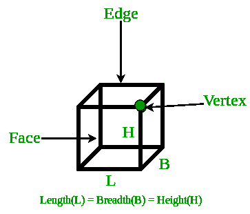

# 立方体体积和表面积程序

> 原文:[https://www . geesforgeks . org/program-volume-surface-area-cube/](https://www.geeksforgeeks.org/program-volume-surface-area-cube/)

立方体是在三维平面中表示的三维盒状图形。立方体有 6 个正方形的相等面。每个面与另一个面成 90 度角。立方体的三条边在同一个顶点相交。



示例:

```
Input : Side of a cube = 2
Output : Area = 8
         Total surface area = 24

Input : Side of a cube = 3
Output : Area = 27
         Total surface area = 54
```

> 体积:一*一*一
> 总表面积:6 *一*一

## C++

```
// CPP program to find area
// and total surface area of cube
#include <bits/stdc++.h>
using namespace std;

// utility function
double areaCube(double a)
{
    return (a * a * a);
}

double surfaceCube(double a)
{
    return (6 * a * a);
}

// driver function
int main()
{
    double a = 5;
    cout << "Area = " << areaCube(a) << endl;
    cout << "Total surface area = " << surfaceCube(a);
    return 0;
}
```

## Java 语言(一种计算机语言，尤用于创建网站)

```
// Java program to find area
// and total surface area of cube

class GFG
{
    // utility function
    static double areaCube(double a)
    {
        return (a * a * a);
    }

    static double surfaceCube(double a)
    {
        return (6 * a * a);
    }

    // Driver code
    public static void main (String[] args)
    {
        double a = 5;
        System.out.println("Area = "+areaCube(a));
        System.out.println("Total surface area = "
                           +surfaceCube(a));
    }
}

// This code is contributed by Anant Agarwal.
```

## 蟒蛇 3

```
# Python3 code to find area
# and total surface area of cube

# utility function
def areaCube( a ):
    return (a * a * a)

def surfaceCube( a ):
    return (6 * a * a)

# driver function
a = 5
print("Area =", areaCube(a))
print("Total surface area =", surfaceCube(a))

# This code is contributed by "Sharad_Bhardwaj".
```

## C#

```
// C# program to find area
// and total surface area of cube
using System;

class GFG {

    // utility function
    static double areaCube(double a)
    {
        return (a * a * a);
    }

    static double surfaceCube(double a)
    {
        return (6 * a * a);
    }

    // Driver code
    public static void Main()
    {
        double a = 5;

        Console.WriteLine("Area = " + areaCube(a));
        Console.WriteLine("Total surface area = "
                        + surfaceCube(a));
    }
}

// This code is contributed by vt_m.
```

## 服务器端编程语言（Professional Hypertext Preprocessor 的缩写）

```
<?php
// PHP program to find area
// and total surface area of cube

// utility function
function areaCube($a)
{
    return ($a * $a * $a);
}

function surfaceCube( $a)
{
    return (6 * $a * $a);
}

// driver function

    $a = 5;
    echo ("Area = ");
    echo(areaCube($a));
    echo("\n");
    echo("Total surface area = ");
    echo(surfaceCube($a));

// This code is contributed by vt_m.
?>
```

## java 描述语言

```
<script>
// javascript program to find area
// and total surface area of cube

// utility function
function areaCube( a)
{
    return (a * a * a);
}

function surfaceCube( a)
{
    return (6 * a * a);
}

// Driver function
   let a = 5;
     document.write( "Area = " + areaCube(a) +"<br/>");
    document.write( "Total surface area = " + surfaceCube(a));

// This code is contributed by gauravrajput1
</script>
```

输出:

```
Area = 125
Total surface area = 150
```

本文由**萨洛尼·古普塔**供稿。如果你喜欢 GeeksforGeeks 并想投稿，你也可以使用[contribute.geeksforgeeks.org](http://www.contribute.geeksforgeeks.org)写一篇文章或者把你的文章邮寄到 contribute@geeksforgeeks.org。看到你的文章出现在极客博客主页上，帮助其他极客。
如果你发现任何不正确的地方，或者你想分享更多关于上面讨论的话题的信息，请写评论。