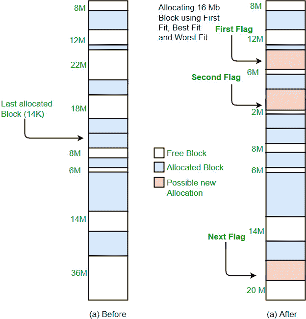

# 内存管理中最差拟合算法的程序

> 原文:[https://www . geesforgeks . org/program-最坏情况-算法-内存-管理/](https://www.geeksforgeeks.org/program-worst-fit-algorithm-memory-management/)

先决条件:[分区分配方法](https://www.geeksforgeeks.org/partition-allocation-methods-in-memory-management/)
最差拟合将进程分配给主存储器中可用的自由可用分区中最大的分区。如果一个大的进程出现在较晚的阶段，那么内存将没有空间容纳它。

**示例:**

```
Input : blockSize[]   = {100, 500, 200, 300, 600};
        processSize[] = {212, 417, 112, 426};
Output:
Process No.    Process Size    Block no.
   1        212        5
   2        417        2
   3        112        5
   4        426        Not Allocated
```



```
Implementation:
1- Input memory blocks and processes with sizes.
2- Initialize all memory blocks as free.
3- Start by picking each process and find the
   maximum block size that can be assigned to
   current process i.e., find max(bockSize[1], 
   blockSize[2],.....blockSize[n]) > 
   processSize[current], if found then assign 
   it to the current process.
5- If not then leave that process and keep checking
   the further processes.
```

下面是上述步骤的实现。

## C++

```
// C++ implementation of worst - Fit algorithm
#include<bits/stdc++.h>
using namespace std;

// Function to allocate memory to blocks as per worst fit
// algorithm
void worstFit(int blockSize[], int m, int processSize[],
                                                 int n)
{
    // Stores block id of the block allocated to a
    // process
    int allocation[n];

    // Initially no block is assigned to any process
    memset(allocation, -1, sizeof(allocation));

    // pick each process and find suitable blocks
    // according to its size ad assign to it
    for (int i=0; i<n; i++)
    {
        // Find the best fit block for current process
        int wstIdx = -1;
        for (int j=0; j<m; j++)
        {
            if (blockSize[j] >= processSize[i])
            {
                if (wstIdx == -1)
                    wstIdx = j;
                else if (blockSize[wstIdx] < blockSize[j])
                    wstIdx = j;
            }
        }

        // If we could find a block for current process
        if (wstIdx != -1)
        {
            // allocate block j to p[i] process
            allocation[i] = wstIdx;

            // Reduce available memory in this block.
            blockSize[wstIdx] -= processSize[i];
        }
    }

    cout << "\nProcess No.\tProcess Size\tBlock no.\n";
    for (int i = 0; i < n; i++)
    {
        cout << "   " << i+1 << "\t\t" << processSize[i] << "\t\t";
        if (allocation[i] != -1)
            cout << allocation[i] + 1;
        else
            cout << "Not Allocated";
        cout << endl;
    }
}

// Driver code
int main()
{
    int blockSize[] = {100, 500, 200, 300, 600};
    int processSize[] = {212, 417, 112, 426};
    int m = sizeof(blockSize)/sizeof(blockSize[0]);
    int n = sizeof(processSize)/sizeof(processSize[0]);

    worstFit(blockSize, m, processSize, n);

    return 0 ;
}
```

## Java 语言(一种计算机语言，尤用于创建网站)

```
// Java implementation of worst - Fit algorithm

public class GFG
{
    // Method to allocate memory to blocks as per worst fit
    // algorithm
    static void worstFit(int blockSize[], int m, int processSize[],
                                                     int n)
    {
        // Stores block id of the block allocated to a
        // process
        int allocation[] = new int[n];

        // Initially no block is assigned to any process
        for (int i = 0; i < allocation.length; i++)
            allocation[i] = -1;

        // pick each process and find suitable blocks
        // according to its size ad assign to it
        for (int i=0; i<n; i++)
        {
            // Find the best fit block for current process
            int wstIdx = -1;
            for (int j=0; j<m; j++)
            {
                if (blockSize[j] >= processSize[i])
                {
                    if (wstIdx == -1)
                        wstIdx = j;
                    else if (blockSize[wstIdx] < blockSize[j])
                        wstIdx = j;
                }
            }

            // If we could find a block for current process
            if (wstIdx != -1)
            {
                // allocate block j to p[i] process
                allocation[i] = wstIdx;

                // Reduce available memory in this block.
                blockSize[wstIdx] -= processSize[i];
            }
        }

        System.out.println("\nProcess No.\tProcess Size\tBlock no.");
        for (int i = 0; i < n; i++)
        {
            System.out.print("   " + (i+1) + "\t\t" + processSize[i] + "\t\t");
            if (allocation[i] != -1)
                System.out.print(allocation[i] + 1);
            else
                System.out.print("Not Allocated");
            System.out.println();
        }
    }

    // Driver Method
    public static void main(String[] args)
    {
         int blockSize[] = {100, 500, 200, 300, 600};
         int processSize[] = {212, 417, 112, 426};
         int m = blockSize.length;
         int n = processSize.length;

         worstFit(blockSize, m, processSize, n);
    }
}
```

## 蟒蛇 3

```
# Python3 implementation of worst - Fit algorithm

# Function to allocate memory to blocks as
# per worst fit algorithm
def worstFit(blockSize, m, processSize, n):

    # Stores block id of the block
    # allocated to a process

    # Initially no block is assigned
    # to any process
    allocation = [-1] * n

    # pick each process and find suitable blocks
    # according to its size ad assign to it
    for i in range(n):

        # Find the best fit block for
        # current process
        wstIdx = -1
        for j in range(m):
            if blockSize[j] >= processSize[i]:
                if wstIdx == -1:
                    wstIdx = j
                elif blockSize[wstIdx] < blockSize[j]:
                    wstIdx = j

        # If we could find a block for
        # current process
        if wstIdx != -1:

            # allocate block j to p[i] process
            allocation[i] = wstIdx

            # Reduce available memory in this block.
            blockSize[wstIdx] -= processSize[i]

    print("Process No. Process Size Block no.")
    for i in range(n):
        print(i + 1, "         ",
              processSize[i], end = "     ")
        if allocation[i] != -1:
            print(allocation[i] + 1)
        else:
            print("Not Allocated")

# Driver code
if __name__ == '__main__':
    blockSize = [100, 500, 200, 300, 600]
    processSize = [212, 417, 112, 426]
    m = len(blockSize)
    n = len(processSize)

    worstFit(blockSize, m, processSize, n)

# This code is contributed by PranchalK
```

## C#

```
// C# implementation of worst - Fit algorithm
using System;

class GFG
{
    // Method to allocate memory to blocks 
    // as per worst fit algorithm
    static void worstFit(int []blockSize, int m,
                        int []processSize, int n)
    {
        // Stores block id of the block allocated to a
        // process
        int []allocation = new int[n];

        // Initially no block is assigned to any process
        for (int i = 0; i < allocation.Length; i++)
            allocation[i] = -1;

        // pick each process and find suitable blocks
        // according to its size ad assign to it
        for (int i = 0; i < n; i++)
        {
            // Find the best fit block for current process
            int wstIdx = -1;
            for (int j = 0; j < m; j++)
            {
                if (blockSize[j] >= processSize[i])
                {
                    if (wstIdx == -1)
                        wstIdx = j;
                    else if (blockSize[wstIdx] < blockSize[j])
                        wstIdx = j;
                }
            }

            // If we could find a block for current process
            if (wstIdx != -1)
            {
                // allocate block j to p[i] process
                allocation[i] = wstIdx;

                // Reduce available memory in this block.
                blockSize[wstIdx] -= processSize[i];
            }
        }

        Console.WriteLine("\nProcess No.\tProcess Size\tBlock no.");
        for (int i = 0; i < n; i++)
        {
            Console.Write(" " + (i+1) + "\t\t\t" + processSize[i] + "\t\t\t");
            if (allocation[i] != -1)
                Console.Write(allocation[i] + 1);
            else
                Console.Write("Not Allocated");
            Console.WriteLine();
        }
    }

    // Driver code
    public static void Main(String[] args)
    {
        int []blockSize = {100, 500, 200, 300, 600};
        int []processSize = {212, 417, 112, 426};
        int m = blockSize.Length;
        int n = processSize.Length;

        worstFit(blockSize, m, processSize, n);
    }
}

// This code has been contributed by 29AjayKumar
```

## java 描述语言

```
<script>

// Javascript implementation of
// worst - Fit algorithm

// Method to allocate memory to
// blocks as per worst fit
// algorithm
function worstFit(blockSize, m,
                  processSize, n)
{

    // Stores block id of the block allocated
    // to a process
    let allocation = new Array(n);

    // Initially no block is assigned
    // to any process
    for(let i = 0; i < allocation.length; i++)
        allocation[i] = -1;

    // Pick each process and find suitable blocks
    // according to its size ad assign to it
    for(let i = 0; i < n; i++)
    {

        // Find the best fit block
        // for current process
        let wstIdx = -1;
        for(let j = 0; j < m; j++)
        {
            if (blockSize[j] >= processSize[i])
            {
                if (wstIdx == -1)
                    wstIdx = j;
                else if (blockSize[wstIdx] <
                         blockSize[j])
                    wstIdx = j;
            }
        }

        // If we could find a block for
        // current process
        if (wstIdx != -1)
        {

            // Allocate block j to p[i] process
            allocation[i] = wstIdx;

            // Reduce available memory in this block.
            blockSize[wstIdx] -= processSize[i];
        }
    }

    document.write("<br>Process No.  " +
                   " Process Size  " +
                   " Block no.<br>");
    for(let i = 0; i < n; i++)
    {
        document.write("   " + (i + 1) +
                       "     " +
                       "    " +
                       processSize[i] +
                       "      ");
        if (allocation[i] != -1)
            document.write(allocation[i] + 1);
        else
            document.write("Not Allocated");

        document.write("<br>");
    }
}

// Driver code
let blockSize = [ 100, 500, 200, 300, 600 ];
let processSize = [ 212, 417, 112, 426 ];
let m = blockSize.length;
let n = processSize.length;

worstFit(blockSize, m, processSize, n);

// This code is contributed by rag2127

</script>
```

**输出:**

```
Process No.    Process Size    Block no.
   1        212        5
   2        417        2
   3        112        5
   4        426        Not Allocated
```

本文由 [**萨希尔·查布拉(akku)**](https://www.facebook.com/sahil.chhabra.965) 供稿。如果你喜欢 GeeksforGeeks 并想投稿，你也可以使用[write.geeksforgeeks.org](https://write.geeksforgeeks.org)写一篇文章或者把你的文章邮寄到 review-team@geeksforgeeks.org。看到你的文章出现在极客博客主页上，帮助其他极客。
如果发现有不正确的地方，或者想分享更多关于上述话题的信息，请写评论。