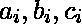
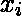
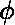
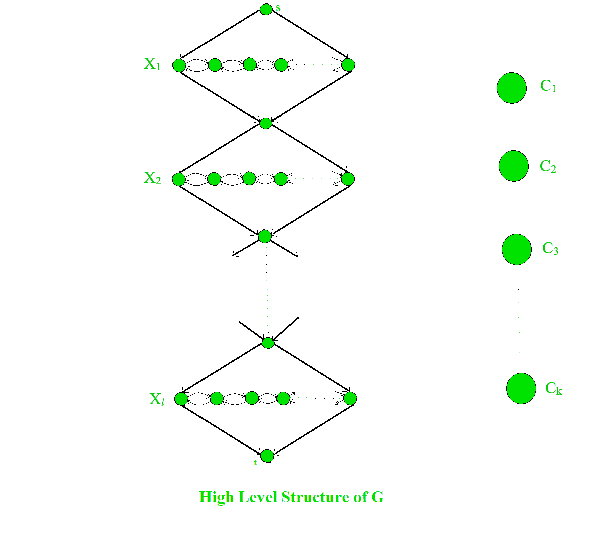
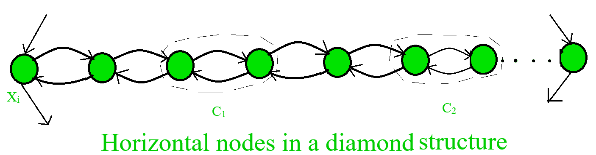
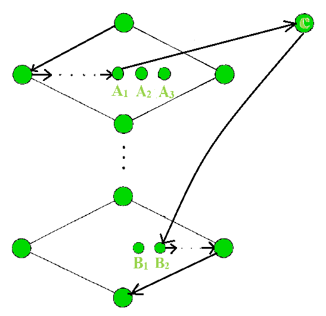
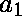
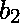
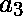

# 哈密顿路径是 NP 完全的证明

> 原文:[https://www . geesforgeks . org/proof-Hamiltonian-path-NP-complete/](https://www.geeksforgeeks.org/proof-hamiltonian-path-np-complete/)

先决条件:[NP-completion](https://www.geeksforgeeks.org/np-completeness-set-1/)
成员资格可以被*确定的语言类*很快落入 **P** 类，成员资格可以被*验证的语言类*很快落入 **NP** 类(*代表多项式时间内非确定性图灵机解决的问题*)。
直白的说，每个 NP 问题都有自己的多项式时间验证器。语言 A 的验证器是算法 V，其中

```
A = {w | V accepts (w, c) for some string c}
where c is certificate or proof that w is a member of A.

```

我们对 NP 完全问题感兴趣。NP-完全问题的定义如下:

```
(1)The problem itself is in NP class.
(2)All other problems in NP class can be polynomial time reducible to that.
(B is polynomial time reducible to C is denoted as )

```

如果仅满足第二个条件，则问题称为 NP-Hard。
但不可能把每一个 NP 问题都化为另一个 NP 问题来一直展示它的 NP-完全性。这就是为什么如果我们想证明一个问题是 NP-Complete，我们只需要证明这个问题是在 NP 中，并且任何 NP-Complete 问题都可以简化为这个问题，那么我们就完成了，也就是说，如果 B 是 NP-Complete，而是 NP 中的 C，那么 C 就是 NP-Complete。
我们必须证明哈密顿路径是 NP 完全的。有向图 G 中的**哈密顿路径**或**哈密顿路径**是一条恰好经过每个节点一次的有向路径。我们考虑测试有向图是否包含连接两个指定节点的哈密顿路径的问题，即

```
*HAMPATH* = {(G, s, t) | G is directed graph with a Hamiltonian path from s to t}
```

为了证明 HAMPATH 是 NP 完全的，我们必须证明 HAMPATH 在 NP 中。为了证明 HAMPATH 在 NP 中，我们必须有一个多项式时间验证器。即使我们没有快速的多项式时间算法来确定一个图是否包含 HAMPATH，如果以某种方式发现了这样一条路径(可能是用指数时间强力搜索)，我们也可以很容易地在多项式时间内计算出这条路径是否是 HAMPATH。在这里，如果存在，证书将是从 s 到 t 本身的哈密顿路径。所以 HAMPATH 是在 NP 中证明的。
所以，现在我们要证明到 NP 类的每一个问题都是多项式时间可约化到 HAMPATH 的，以证明它的 NP-完全性。相反，我们将证明 3SAT(先前从 SAT(电路可满足性问题)证明的一个 NP 完全问题)是多项式时间可约化为 HAMPATH 的。我们将给定的 *cnf* (合取范式)形式转换成一个图形，其中小工具(模拟变量和子句的结构)将模拟变量和子句(与连接的几个文字或变量)。我们现在必须证明
对于每个 3-cnf 公式我们将展示如何用 s 和 t 构建图 G，其中如果是可满足的，则在 s 和 t 之间存在哈密顿路径。
我们从一个包含 k 个子句的 3-cnf 公式开始，

其中每个是字面上的或。让成为的 *l* 变量。现在我们展示如何将转换为图 G。我们构建的图 G 有不同的部分来表示出现在中的变量和子句。
我们用菱形结构表示每个变量，该结构包含一行水平节点，如下图所示。我们指定稍后出现在水平行中的节点数。

下图描绘了 G 的全局结构，它显示了 G 的所有元素及其关系，除了表示变量与包含它们的子句的关系的边。

每个菱形结构都包含一行水平的节点，这些节点由双向延伸的边连接。水平行包含 2k 个节点(作为每个子句的 2 个节点)plus，对于一个子句 plus，每两个节点之间有 k-1 个额外节点，在属于菱形的末端有 2 个节点；总共 3k+1 个节点。下图给出了一幅清晰的画面。

如果变量出现在子句中，我们从第 ith diamoond 中的 jth 对向 jth 子句节点添加以下两条边。

如果出现在子句 c_j 中，我们将第 ith 菱形中的 jth 对的两条边添加到 jth 子句节点，如下图所示。

我们在每个子句中添加或每次出现对应的所有边后，G 的构造就完成了。为了证明它的正确性，我们将证明如果是可满足的，则从 s 到 t 存在一个哈密顿路径，反之，如果这样的路径存在是可满足的。
假设可满足。为了演示从 s 到 t 的哈密顿路径，我们首先忽略子句节点。这条路径从 s 开始，依次穿过每个菱形，最后到达 t。这条路或者从左向右曲折，或者从右向左曲折；对的满意赋值决定了分别被赋值为真还是假。下图显示了这两种情况。

到目前为止这条路径覆盖了 G 中除子句节点以外的所有节点。我们可以通过在水平节点添加弯路来轻松地包含它们。在每个子句中，我们通过满足赋值来选择一个赋值为真的文本。
如果我们在第条中选择，我们可以在第七颗钻石中的第一对绕行。这样做是可能的，因为必须为真，所以路径从左向右曲折穿过相应的菱形。因此节点的边缘是正确的，以允许绕行和返回。
同样，如果我们在条款中选择，我们可以在第 ith 颗钻石中的 JT 对处绕行，因为必须为 FALSE，所以路径从右向左曲折穿过对应的钻石。因此节点的边缘再次处于正确的顺序，以允许绕行和返回。如果子句中的每个文字都提供了绕行选项，则每次都会绕行一次。因此，每个节点只被访问一次，从而构造了哈密尔顿路径。
对于反方向，如果 G 具有从 s 到 t 的哈密顿路径，我们证明的一个令人满意的赋值。如果哈密尔顿路径是正常的，即除了闭合节点的迂回之外，它从顶部节点到底部节点依次通过菱形；我们很容易得到满意的作业。如果路径在菱形中曲折，我们将变量赋值为真，如果它曲折，则赋值为假。因为每个节点都出现在路径上，通过观察绕行的方式，我们可以确定相应的真变量。
剩下要说明的是，哈密顿路径必须是正常的，这意味着路径从一个菱形进入一个子句，但返回到另一个子句，如下图所示。

路径从节点到 c；但它并没有在同一个钻石中返回，而是在不同的钻石中返回。如果出现这种情况，则或必须是一个分隔符节点。如果是一个分隔符节点，进入的唯一边将来自或。如果是一个分隔符节点，那么和将在同一个子句中，那么从、和 c 进入的边。在这两种情况下，路径都不能从进入，因为是指向的唯一可用节点，所以路径必须通过退出。因此哈密顿路径必须是正常的。这种归约显然是在多项式时间内进行的，因此 HAMPATH 是 NP 完全的证明是完全的。

图片参考:https://tr . m . Wikipedia . org/wiki/Hamilton _ yolu