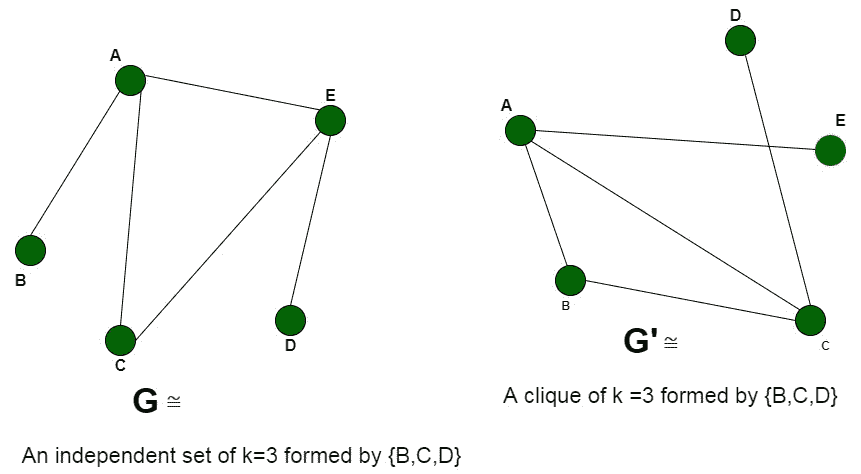

# 团决策问题是 NP 完全的证明|集合 2

> 原文:[https://www . geesforgeks . org/proof-the-clique-decision-problem-is-NP-complete-set-2/](https://www.geeksforgeeks.org/proof-that-clique-decision-problem-is-np-complete-set-2/)

**先决条件:**[NP-完全性](https://www.geeksforgeeks.org/np-completeness-set-1/)[小团体问题](https://en.wikipedia.org/wiki/Clique_problem)。

图中的团是一组顶点，其中每个顶点与其他顶点共享一条边。因此，图中的团是一个完全图的子图。
**问题:**给定一个图 G(V，E)和一个整数 K，问题是确定该图是否包含一个大小为 **K** 的团。

**解释:**
问题的一个实例是指定给问题的输入。团问题的一个例子是图 G (V，E)和正整数 K，问题是检查 G 中是否存在大小为 K 的团。由于 NP-Complete 问题，顾名思义，是一个同时存在于 NP 和 NP-hard 中的问题，所以证明问题是 NP-Complete 的陈述由两部分组成:

> 1.  The problem itself is in NP class.
> 2.  All other problems in NP class can be reduced to that by polynomial time.
>     (b is a polynomial time reducible to c, expressed as )

如果仅满足第二个条件，则问题称为 **NP-Hard** 。

但是不可能把每一个 NP 问题都化为另一个 NP 问题来一直展示它的 NP 完全性。这就是为什么如果我们想显示一个问题是 NP-Complete 我们只需要显示问题在 **NP** 中，任何 **NP-Complete** 问题都可以简化为这个，那么我们就完成了，即如果 **B** 是 **NP-Complete** 而是 **NP** 中的 **C** ，那么 **C** 就是 **NP-Complete**

在本文中，我们将借助[独立集](https://www.geeksforgeeks.org/proof-that-independent-set-in-graph-theory-is-np-complete/)问题，证明团检测问题是 NP-完全的。借助[布尔可满足性问题](https://www.geeksforgeeks.org/2-satisfiability-2-sat-problem/)的证明，参见[证明团决策问题是 NP-Complete](https://www.geeksforgeeks.org/proof-that-clique-decision-problem-is-np-complete/) 。

1.  **Clique Problem is in NP**
    If any problem is in NP, then, given a *‘certificate’*, which is a solution to the problem and an instance of the problem (a graph G and a positive integer K, in this case), we will be able to verify (check whether the solution given is correct or not) the certificate in polynomial time.

    证书是顶点的**子集 V’**，其包括属于团的顶点。我们可以通过检查属于该解决方案的每对顶点是否相邻来验证该解决方案，只需验证它们彼此共享一条边。这可以在多项式时间内完成，即 **O(V +E)** 使用以下策略进行图 **G(V，E)** :

    ```
    flag=true
    For every pair {u, v} in the subset V’:
        Check that these two
             vertices {u, v} share an edge
        If there is no edge,
          set flag to false and break
    If flag is true:
        Solution is correct
    Else:
        Solution is incorrect 

    ```

2.  **Clique Problem is NP-Hard**
    To prove that the clique problem is NP-Hard, we take the help of a problem that is already NP-Hard and show that this problem can be reduced to the Clique problem.
    For this, we consider the ***Independent Set problem***, which is **NP-Complete** (and hence **NP-Hard**). Every instance of the independent set problem consisting of the graph **G (V, E)** and an integer **K** can be converted to the required graph **G’ (V’, E’)** and **K’** of the Clique problem. We will construct the graph G’ by the following modifications:
    **V’ =V,** that is all the vertices of graph G are a part of the graph G’
    **E’** = complement of the edges E, that is, the edges not present in the original graph G.
    The graph **G’** is the complementary graph of G. The time required to compute the complementary graph **G’** requires a traversal over all the vertices and edges.
    ***Time complexity:** O (V+E)*

    我们现在将证明计算团的问题确实归结为独立集的计算。这种简化可以通过以下两个命题来证明:

    *   让我们假设图 G 包含一个大小为 **K** 的团。团的存在意味着在 **G** 中有 **K** 个顶点，其中每个顶点通过一条边与其余顶点相连。这进一步表明，由于这些边包含在 **G** 中，因此它们不能出现在**G’**中。因此，这 K 个顶点在**G’**中并不相邻，因此形成了*独立的尺寸组 **K*** 。
    *   我们假设互补图**G’**有一组独立的大小为**K’**的顶点。这些顶点都不与任何其他顶点共享一条边。当我们补充图以获得 **G，**时，这些 **K** 顶点将共享一条边，并因此变得彼此相邻。所以图 **G** 会有一个大小为 **K** 的团。

[](https://media.geeksforgeeks.org/wp-content/uploads/20200514000635/Untitled-Diagram-103.jpg)

因此，如果在 **G'** (补集图)中有一个独立的大小集 **K** ，我们可以说在图 **G** 中有一个大小集 **K** 的小团体。因此，团问题的任何实例都可以简化为独立集问题的实例。由此可见，嫡系问题是 **NP-Hard。**

**结论:**

> 因此，团决策问题是 NP 完全的