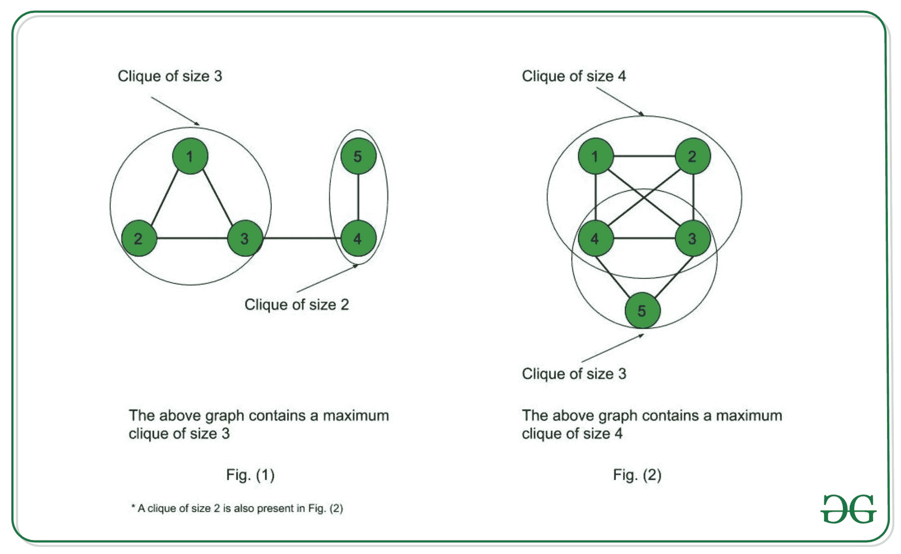
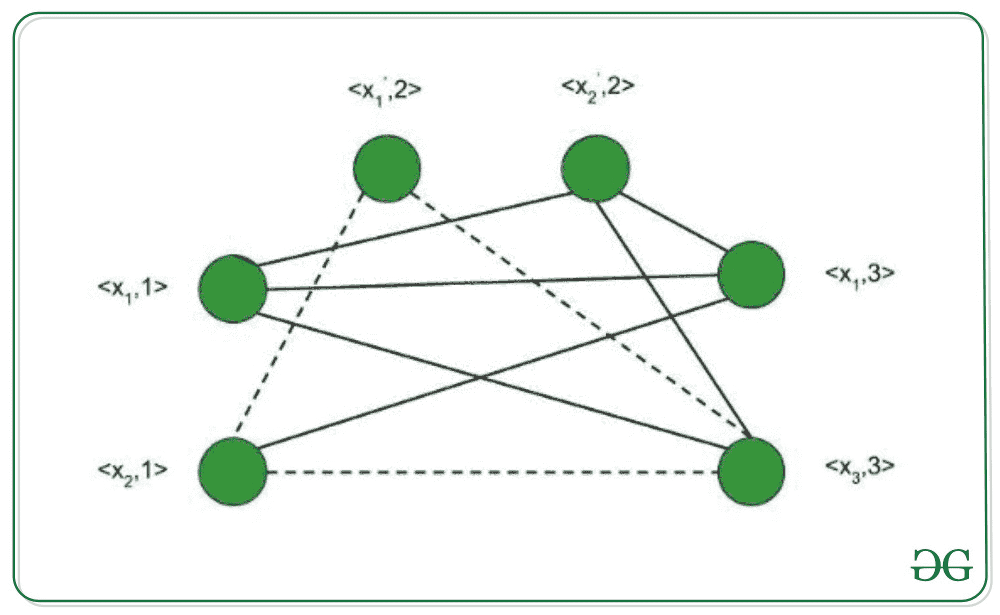

# 团决策问题是 NP 完全的证明

> 原文:[https://www . geesforgeks . org/proof-the-clique-decision-problem-is-NP-complete/](https://www.geeksforgeeks.org/proof-that-clique-decision-problem-is-np-complete/)

**先决条件:**[NP-完全性](https://www.geeksforgeeks.org/np-completeness-set-1/)

团是一个图的子图，使得这个子图中的所有顶点都相互连接，也就是说这个子图是一个完整的图。最大团问题是求给定图 G 的最大团，即 G 的子图中包含最大顶点数的完全图。这是一个优化问题。相应地，团决策问题是寻找给定图中是否存在大小为 k 的团。
 
为了证明一个问题是 NP-Complete，我们必须证明它同时属于 NP 和 NP-Hard 类。(因为 NP 完全问题是 NP 难问题，也属于 NP)

**团决策问题属于 NP**–如果一个问题属于 NP 类，那么它应该具有多项式时间的可验证性，也就是给定一个证书，我们应该能够在多项式时间内验证它是否是问题的解。

**证明:**

1.  <u>证书</u>–让证书为团内节点组成的集合 S，S 为 g 的子图
2.  <u>验证</u>–我们必须检查图中是否存在大小为 k 的团。因此，验证 S 中的节点数是否等于 k 需要 O(1)个时间。验证每个顶点是否有(k-1)的出度需要 O(k 2 )时间。(因为在一个完整的图中，每个顶点都通过一条边与每隔一个顶点相连。因此，一个完整图形的边总数= k C 2 = k*(k-1)/2。因此，要检查 S 中 k 个节点构成的图是否完整，需要 O(k 2 ) = O(n 2 )时间(因为 k < =n，其中 n 是 G 中的顶点数)。

因此，团决策问题具有多项式时间的可验证性，因此属于 NP 类。

**团决策问题属于 NP-Hard**–如果每个 NP 问题在多项式时间内可约化为 L，则问题 L 属于 NP-Hard。现在，让 C 来处理团决策问题。为了证明 C 是 NP-Hard，我们采用一个已知的 NP-Hard 问题，比如 S，并将其简化为 C。如果这个约简可以在多项式时间内完成，那么 C 也是一个 NP-Hard 问题。布尔可满足性问题是一个由[库克定理](https://en.wikipedia.org/wiki/Cook–Levin_theorem)证明的 NP 完全问题。因此，NP 中的每一个问题都可以在多项式时间内化为 S。因此，如果 S 在多项式时间内可约化为 C，那么每个 NP 问题都可以在多项式时间内约化为 C，从而证明 C 是 NP-Hard。

<u>证明布尔可满足性问题简化为团决策问题</u>
让布尔表达式为–f =(x1v x2)^(x1' v x2')^(x1v x3，其中 x 1 ，x 2 ，x 因此我们有三个条款–C1、C 2 和 C 3 。将顶点视为–<x1，1>；< x 2 ，1>；< x 1 '，2>；< x 2 '，2>；< x 1 ，3>；< x 3 ，3 >其中每个顶点中的第二个术语表示它们所属的子句编号。我们将这些顶点连接起来

1.  不连接属于同一子句的两个顶点。
2.  没有变量与其补码相连。

因此，图 G (V，E)被构造为–V = {

因此，团决策问题是 NP 难的。

<u>结论</u>
团决策问题是 NP 和 NP 难的。因此，团决策问题是 NP 完全的。